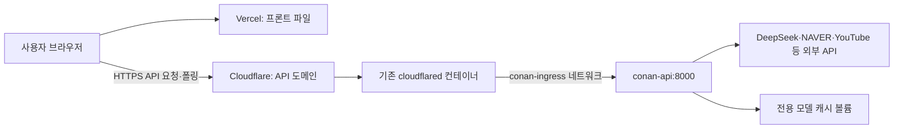

# M4 맥미니 배포 인수인계

상태: 2026-09-11 맥미니 conan-staging 내부 기동과 얼굴·ViT·Whisper 모델 로딩을 확인했다. 키 입력·실제 영상·Tunnel·FE 연결은 대기 중이다. 실제 운영 명령은 [배포 점검 기록](deployment-log.md)의 -p conan-staging을 사용한다. 아래 기본 예시의 conan-home과 구분한다.

사용자 확인 환경은 M4·16GB·OrbStack이다. 기존 cloudflared·Laravel·모니터링 컨테이너가 있으므로 Conan을 별도 Compose 프로젝트로 실행한다. 프론트는 Vercel 예정이며 실제 주소는 미정이다. 개발 맥의 Docker 컨텍스트를 원격 맥미니로 간주하지 않는다.

## 연결 구조



브라우저가 백엔드 API를 직접 호출한다. 장시간 분석을 Vercel 함수가 기다리는 구조가 아니다. API는 job ID를 즉시 반환하고 브라우저가 폴링한다.

## 배포를 맡은 에이전트가 먼저 확인할 것

1. [handoff.md](handoff.md)의 브랜치·기준 커밋을 확인하고 필요한 커밋이 원격에 있는지 확인한다. 작업 중인 변경을 덮어쓰거나 `.venv`를 복사하지 않는다.
2. 맥미니에서 `docker context show`, `docker version`, `docker compose version`, `docker ps --format '{{.Names}}\t{{.Image}}'`, `docker stats --no-stream`을 실행한다. Compose 2.24.4 이상이 필요하다.
3. 기존 cloudflared 컨테이너 이름·Compose 파일 위치·연결 네트워크만 확인한다. 전체 inspect나 환경변수를 출력하면 터널 토큰이 노출될 수 있다.
4. API 도메인, Tunnel 관리 방식(대시보드/설정 파일), Vercel 오리진과 내부 검증 시 접근 정책을 확인한다. 미정인 것을 임의로 생성하지 않는다.

## 환경과 빌드

아래 명령은 be 저장소 루트에서 실행한다. 운영 파일은 `compose.home.yml` 단독으로 사용한다. 개발용 `docker-compose.yml`과 `-f`로 합치지 않는다.

```bash
cp .env.home.example .env.home
chmod 600 .env.home
```

`.env.home`에 DeepSeek 키·NAVER Client ID/Secret을 넣는다. 비밀값을 Git·작업 로그·프론트에 넣지 않는다. 이 값들이 비어 있어도 API의 health는 성공할 수 있으므로 실제 분석에서 외부 제공자가 활성화됐는지 확인해야 한다. 이 배포 예시는 기존 전문기관 판정 경로를 켜지 않는다.

Vercel 주소가 정해지면 `DEEPCHECK_CORS_ORIGINS`에 정확한 `https://...` 오리진을 넣는다. 여러 개는 쉼표로 구분한다. 경로나 마지막 `/`를 넣지 않는다. 예제의 `http://localhost:3000`은 내부 연동용이다.

`CONAN_IMAGE`는 배포할 Git 커밋을 구분하는 태그(예: `conan-be:<실제짧은SHA>`)로 설정한다. dirty 작업 트리는 재현 가능한 배포 기준이 아니므로 먼저 커밋한다. Dockerfile은 CPU torch index를 사용하고, Linux ARM64로 빌드한다. Docker 안에서 macOS MPS를 사용하는 구성은 아니다.

```bash
docker compose --env-file .env.home -f compose.home.yml config --quiet
docker compose --env-file .env.home -f compose.home.yml build deepcheck-api
```

`config`를 일반 출력하면 환경 비밀값이 보일 수 있어 `--quiet`를 쓴다. 이미지 빌드 시 얼굴 모델 다운로드 실패는 빌드 실패로 처리한다. Whisper·ViT 모델은 최초 분석에서 내려받을 수 있으므로 첫 분석과 캐시가 준비된 후 분석의 시간을 따로 측정한다. 의존성이 범위 지정이므로 기존 이미지와 새 빌드가 완전히 같다고 가정하지 않는다. 검증한 이미지 ID·설치 버전·커밋·설정값(비밀값 제외)을 배포 로그에 남긴다.

## 전용 네트워크와 기동

`CONAN_NETWORK` 기본값은 `conan-ingress`다. 동일 이름이 이미 존재하면 용도를 확인하고 새로 만들지 않는다. 신규 구성이라면 다음 명령으로 생성한다.

```bash
docker network create conan-ingress
docker compose --env-file .env.home -f compose.home.yml up -d --no-build deepcheck-api
docker compose --env-file .env.home -f compose.home.yml ps
docker compose --env-file .env.home -f compose.home.yml exec -T deepcheck-api python -c "import urllib.request; print(urllib.request.urlopen('http://127.0.0.1:8000/health', timeout=5).read().decode())"
docker compose --env-file .env.home -f compose.home.yml exec -T deepcheck-api python -c "from deepcheck.face import _get_detector; assert _get_detector() is not None; print('face detector ready')"
```

호스트 포트는 열지 않는다. 별칭은 `conan-api`, 컨테이너 내부 API 포트는 8000이다. 기본 CPU 2개·메모리 3GB는 다른 서비스와 공존하기 위한 시작값이며 실측 최적값이 아니다. `.env.home`의 `CONAN_CPUS`·`CONAN_MEMORY`로 조정한다. OrbStack VM 전체 메모리 제한과 기존 서비스 여유도 함께 확인한다. 단일 uvicorn 프로세스, 분석 영상 1건, 주장 3건 병렬을 유지한다.

## 기존 Tunnel 연결

실제 컨테이너 이름을 확인한 뒤 기존 cloudflared만 `conan-ingress`에도 연결한다. 다음은 자리표시자가 있는 명령 형식이며 그대로 실행하지 않는다.

```text
docker network connect conan-ingress <확인한-cloudflared-컨테이너>
```

이 연결은 컨테이너 재생성 때 없어질 수 있다. 검증 후 cloudflared를 관리하는 기존 Compose 정의에도 external `conan-ingress` 네트워크를 추가해 영속화한다. 기존 서비스·네트워크 설정을 보존하며, 변경으로 cloudflared 재생성이 필요하면 기존 서비스도 영향을 받을 수 있음을 확인한다. Conan Compose는 cloudflared를 재정의하거나 재시작하지 않는다.

기존 Tunnel에 Conan용 API 도메인의 서비스 주소를 `http://conan-api:8000`으로 추가한다. cloudflared 컨테이너 안의 `localhost:8000`은 Conan 주소가 아니다. 다른 서비스의 호스트명 라우트를 수정하지 않는다. [Docker의 외부 네트워크 연결](https://docs.docker.com/compose/how-tos/networking/), [Cloudflare Tunnel 설정](https://developers.cloudflare.com/tunnel/setup/)을 따른다.

Tunnel 공개 라우트와 Access 인증 정책은 별도다. 내부 연동 단계에서는 제한된 접근으로 점검한다. Vercel 브라우저가 직접 API를 호출할 때 Access 로그인 정책이 있으면 쿠키·사전 OPTIONS 요청에 맞는 설정이 필요하다. CORS만으로 API 접근을 제한할 수 없고, Access 서비스 토큰을 프론트 코드에 넣어서는 안 된다. [Cloudflare CORS 안내](https://developers.cloudflare.com/cloudflare-one/access-controls/applications/http-apps/authorization-cookie/cors/)를 확인한다. 공개 운영은 [남은 확인](handoff.md#다음-우선순위와-공개-전-남은-확인)을 해결한 뒤 전환한다.

## 인수 검증과 복구

- 컨테이너 내부 `/health`·얼굴 모델 초기화 → Tunnel API `/health` → 실제 Vercel Origin의 OPTIONS·POST·GET 폴링 순으로 검증한다. `/health` 성공은 모델·외부 API·영상 분석 성공을 보장하지 않는다.
- 허용한 한국어 공개 Shorts 1건으로 메타데이터·준비 단계·주장별 갱신·최종 집계를 확인한다. 최초/재실행 시간을 분리하고, 모델·NAVER·DeepSeek 사용 여부와 실패를 job ID로 확인한다.
- `docker stats --no-stream`으로 Conan과 기존 서비스의 CPU·메모리를 함께 확인한다. 현재 개발 기기의 Docker 검증을 맥미니 부하 검증으로 대신하지 않는다.
- backend job은 메모리에만 있어 재시작하면 사라진다. 모델 캐시 볼륨은 작업 결과 저장소가 아니다. FE는 재시작 후 job 404를 처리해야 한다.
- 중지는 이 프로젝트의 `docker compose --env-file .env.home -f compose.home.yml stop deepcheck-api`로 한정한다. 시스템 전체 prune이나 기존 서비스의 down을 실행하지 않는다.
- 롤백할 이미지를 보존하고, `.env.home`의 `CONAN_IMAGE`를 직전 검증 태그로 되돌린 뒤 `up -d --no-build deepcheck-api`로 재기동한다. 모델 캐시를 지우는 `down -v`는 사용하지 않는다.

배포 완료 기록에는 실제 맥미니 커밋·이미지 ID·배포 시각·API/FE 도메인·전용 네트워크·테스트 영상 ID·처리 시간·피크 메모리·기존 서비스 영향·복구 태그를 남긴다. 인증키나 Tunnel 토큰은 기록하지 않는다.
