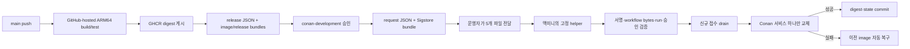

# 개발계 CI/CD 보안 런북

기준일: 2026-09-13
상태: 코드 구현 및 로컬 모의 검증 완료, GitHub·맥미니 활성화 미실행

이 런북의 결론은 **GitHub Actions는 GitHub-hosted runner에서 빌드·테스트·서명까지만 하고, 맥미니에는 범용 self-hosted runner를 설치하지 않는다**는 것이다. 맥미니에는 검토한 배포 helper와 대상별 고정 설정만 둔다. Helper는 승인된 다섯 파일을 확인하고 기존 Docker daemon의 한 서비스만 교체한다.

이번 작업에서는 맥미니, Docker daemon, 실행 중인 Conan·cloudflared·Laravel·모니터링, DNS/Tunnel, 실제 환경 파일을 조회하거나 변경하지 않았다. GitHub 공개 REST API는 읽기 전용으로 조회해 main에 기존 backend CI workflow 하나만 있고 environment는 0개이며 새 deployment workflow는 아직 main에 없음을 확인했지만, repository·Actions·environment 설정은 변경하지 않았다. 예제 설정은 `enabled=false`이며 실제 경로와 현재 image identity도 채우지 않았다.

현재 완성 범위는 **CI + 승인형 Continuous Delivery**다. GitHub가 검증·승인된 배포 요청 artifact를 만들고, 맥미니의 고정 helper를 운영자가 유지보수 창에서 실행한다. GitHub에서 맥미니까지 자동 호출하는 Continuous Deployment는 아직 연결하지 않았다. 분석 결과가 메모리에만 남는 현재 구조에서 이 자동 호출을 먼저 켜면 사용자가 아직 조회하지 않은 완료 결과를 잃을 수 있기 때문이다.

## 왜 이 구조인가

앱 호스트에 Docker socket 권한을 가진 GitHub runner를 설치하면 workflow에서 실행되는 코드가 사실상 호스트 전체 Docker 권한을 갖는다. 저장소·Action·dependency 중 하나가 침해되면 Conan뿐 아니라 같은 맥미니의 다른 프로젝트까지 영향받는다. 프로젝트 수가 늘수록 이 blast radius도 커진다.

그래서 빌드 실행 권한과 배포 권한을 나눈다.



GitHub는 서버 주소·SSH key·Docker context·Compose 경로를 모른다. 반대로 맥미니 helper는 저장소 코드를 checkout하거나 build하지 않고 `repo@sha256:<digest>`만 실행한다.

## 구현된 파일

- `.github/workflows/backend-ci.yml`: ARM64 build/test, 테스트한 동일 image 게시, image와 release manifest attestation
- `.github/workflows/dev-deployment.yml`: 성공한 exact `push/main` CI 검증, `conan-development` environment gate, 1시간 request와 attestation 생성
- `scripts/release_manifest.py`: canonical release schema v2/request schema v3, immutable repository ID, exact run/attempt/SHA/actor ID, 만료 검증
- `scripts/attestation.py`: 고정 GitHub CLI로 Sigstore bundle 검증 후 인증서 필드를 로컬 정책과 대조
- `scripts/github_approval.py`: exact backend CI attempt와 exact first-attempt deployment run, 두 reviewed workflow bytes, 현재 environment 보호 설정과 실제 approval history를 GitHub API에서 대조
- `scripts/dev_deploy.py`: host allowlist, drain, 단일 서비스 교체, rollback, replay/downgrade 방지, `initialize`/`recover`
- `scripts/deployment_state.py`: schema v2의 target-bound state와 target+transaction-bound journal 검증, 0600 atomic state/journal/image.env, symlink·owner·permission 검사와 fsync
- `backend/app.py`, `backend/harness.py`: loopback 전용 drain/resume와 접수 fencing
- `deploy/compose.development.yml`: include/extends 없는 단일 CD용 Compose 계약
- `deploy/dev-host-config.example.json`: 비활성 host-config schema v4 예제

## GitHub 쪽 계약

### CI

`backend-ci.yml`은 PR·main push·수동 실행에서 build/test를 하지만, GHCR publish는 `push`의 `refs/heads/main`에서만 한다. Publish job은 앞 job이 저장한 테스트 완료 image를 다시 build하지 않고 게시한다. `packages: write` publish와 `id-token`/`attestations: write` signer는 별도 job이며 둘 다 repository를 checkout하거나 repository Python을 실행하지 않는다. Release JSON은 host가 hash로 고정하는 workflow 본문의 `python -I` 코드가 만든다.

배포 가능한 결과는 다음 identity의 조합이다.

- repository 이름과 immutable repository ID `1355990630`
- owner immutable ID `324487638`
- source SHA
- backend CI run ID와 run attempt
- `ghcr.io/dynamic-juo/be@sha256:<digest>`
- workflow `.github/workflows/backend-ci.yml`, event `push`, ref `refs/heads/main`

CI는 image digest 자체와 canonical `conan-release.json`을 각각 `actions/attest`로 서명한다. CD는 두 bundle을 모두 전달하고, host는 같은 exact CI run/attempt 정책으로 manifest와 `oci://ghcr.io/...@sha256:...` image subject를 각각 검증한다. Host는 image tag를 배포 기준으로 사용하지 않는다.

### 승인 요청

`dev-deployment.yml`은 수동 dispatch만 받는다. 입력 SHA는 dispatch 시점의 `github.sha`와 정확히 같아야 하며, 입력한 backend CI run이 성공한 `push/main` run인지 API record와 release manifest로 확인한다.

`approve` job은 고정 `conan-development` environment를 통과한 뒤 다음 다섯 파일만 한 artifact에 넣는다.

1. `conan-development-request.json`
2. `conan-development-request.sigstore.json`
3. `conan-release.json`
4. `conan-release.sigstore.json`
5. `conan-image.sigstore.json`

Request는 최대 1시간만 유효하다. 승인 뒤 request를 서명하는 job도 repository를 checkout하거나 repository Python을 실행하지 않고, 고정 workflow 본문의 `python -I` 생성기만 사용한다. GitHub workflow는 여기서 끝나며 서버 명령, SSH, self-hosted runner, Docker context를 사용하지 않는다.
Approval history API는 attempt별 기록을 제공하지 않으므로 배포 request는 workflow run attempt 1만 허용한다. 실패한 run을 rerun해 만든 artifact는 쓰지 않고 새 workflow run으로 다시 승인한다.

### 활성화할 GitHub 보호 설정

저장소 관리자가 직접 다음을 확인한 뒤에만 두 marker를 설정한다.

- `conan-development` required reviewer는 1~6명의 개별 GitHub User만 사용
- prevent self-review 활성화
- 관리자 우회 비활성화
- deployment branch/tag rule을 `main`으로 제한
- `main`은 PR과 필수 CI를 거쳐야 하고 force push·branch 삭제·관리자 bypass를 허용하지 않음
- `.github/workflows/**`, `Dockerfile*`, dependency/lock 파일, 테스트, `scripts/release_manifest.py`는 CODEOWNERS의 독립 승인을 요구하고 새 commit에는 stale approval을 폐기함
- repository variable `CONAN_DEV_DEPLOY_ENABLED=true`
- environment variable `CONAN_DEV_ENVIRONMENT_CONFIGURED=true`

Marker는 보호 규칙의 암호학적 증명이 아니다. 관리자가 규칙을 감사했다는 activation fence다. Host는 environment ID, 현재 required-reviewer User ID set, `prevent_self_review=true`와 실제 승인 기록을 API로 다시 확인하지만, 관리자 우회 비활성화와 branch/CODEOWNERS rule 전체는 API 응답만으로 증명하지 못하므로 activation 때 수동으로 감사한다. Workflow bytes pin은 workflow 자체의 테스트 생략 변조를 막지만, 허가된 workflow가 빌드하는 악성 source·Dockerfile·dependency·테스트 변경까지 판별하지는 못한다. 따라서 위 main 보호와 독립 code review가 activation blocker다. 여러 reviewer를 등록해도 GitHub environment는 일반적으로 그중 한 명의 승인으로 진행되므로 reviewer 구성을 그 전제로 정한다.

## Host가 독립 검증하는 내용

`apply`는 owner-only 임시 디렉터리에 다섯 artifact의 byte snapshot을 먼저 만든다. 같은 snapshot의 request/release canonical JSON과 equality를 검사하고 request·release 파일 및 release가 가리키는 exact image digest를 각 bundle로 `gh attestation verify --bundle` 검증한다. Image subject는 반드시 `oci://ghcr.io/...@sha256:...` 형식이며 release와 image bundle은 같은 exact CI policy에 묶인다. 따라서 검증 직후 원본 경로만 바꾸는 TOCTOU 공격이나 manifest만 서명하고 다른 image를 넣는 공격으로 실행 입력을 교체할 수 없다. Local bundle은 attestation API 조회를 대체하지만 OCI subject 확인은 여전히 registry를 조회한다. 이 image 검증 명령에만 owner-only Docker config와 GHCR pull/read-only credential을 주고 request/release 및 GitHub API 명령에는 registry credential을 전달하지 않는다. 이어서 검증된 인증서에서 다음을 모두 exact match한다.

- GitHub OIDC issuer
- repository 이름, repository ID, owner ID
- `refs/heads/main`과 source SHA
- signer workflow path와 signer commit digest
- `github-hosted` runner
- `push` 또는 `workflow_dispatch` trigger
- exact run ID와 attempt의 invocation URI

그 뒤 Docker 명령 전에 GitHub REST API를 fail-closed로 조회한다.

- release가 가리키는 exact `actions/runs/{ci_run_id}/attempts/{ci_run_attempt}`의 run/repository/owner/backend CI workflow ID/path/main/SHA/`push`/completed/success
- release source commit의 `.github/workflows/backend-ci.yml` bytes SHA-256과 host의 reviewed pin
- exact `actions/runs/{request_run_id}/attempts/1`의 run/repository/owner/deployment workflow ID/path/main/SHA/`workflow_dispatch`/completed/success/dispatch actor immutable ID
- request source commit의 `.github/workflows/dev-deployment.yml` bytes SHA-256과 host의 reviewed pin
- 현재 environment ID/name, required-reviewer rule 한 개, `prevent_self_review=true`, 1~6개 User reviewer ID set과 host allowlist의 exact equality
- run-level approval history가 exact environment에 대해 정확히 한 건이고 `approved`이며 승인자가 allowlist User이고 dispatch actor와 다른지
- 승인 조회 뒤 current run을 다시 읽어 attempt가 여전히 1이고 위 identity와 성공 상태가 그대로인지

API/network/JSON 불일치는 모두 배포를 중단한다. Host의 GitHub credential은 대상 repository의 Actions read와 Contents read만 갖고 write 권한은 주지 않는다. 별도 Docker registry credential도 GHCR pull에 필요한 `read:packages`만 허용한다. Admin-bypass 비활성화는 위 API 응답에 포함되지 않으므로 별도 수동 감사 항목이다.

Workflow가 작성할 수 있는 attestation predicate 값은 권한 판단에 사용하지 않는다. 인증서에 들어간 GitHub identity만 사용한다. `gh`, Docker, 독립 Compose binary는 절대 경로와 SHA-256을 설정에 고정하고, 호출자의 `HOME`, `GH_TOKEN`, `DOCKER_HOST`, `DOCKER_CONTEXT`, `XDG_CONFIG_HOME`, `DEEPCHECK_*` 환경을 상속하지 않는다.

모든 host 신뢰 경로는 `/`부터 leaf parent까지 `openat` + `O_DIRECTORY` + `O_NOFOLLOW`로 component별로 연다. 각 디렉터리는 root 또는 helper 실행 계정 소유이고 group/world non-writable이어야 한다. Root-owned sticky 공유 디렉터리(`/private/tmp`, Linux의 `/tmp`)는 중간 ancestor로만 허용하며 그 아래 owner 전용/non-writable parent가 반드시 있어야 한다. macOS `/var`처럼 symlink인 별칭은 사용하지 않고 `/private/var/...` 같은 실제 canonical 경로를 설정한다. Darwin에서는 mode bits 밖에서 권한을 넓히는 extended `allow` ACL도 descriptor 기준으로 거부한다. macOS가 home directory에 기본으로 두는 deny-only ACL은 authority를 넓히지 않으므로 허용한다.

Host 설정은 다음을 로컬 allowlist로 고정한다.

- target/environment와 repository immutable IDs
- backend CI/deployment workflow immutable ID, environment immutable ID
- reviewed backend CI/deployment workflow bytes SHA-256와 현재 허용 reviewer User immutable ID allowlist
- Docker unix endpoint와 audit용 context (`DOCKER_CONTEXT`는 실행 환경에서 제거하고 고정 `DOCKER_HOST`만 사용)
- Compose project·service·env file과 독립 Compose binary의 절대 경로·SHA-256
- `include`/`extends`가 없는 단일 flattened `compose.development.yml`의 SHA-256
- owner-only Docker/GitHub CLI config directory. Docker credential은 GHCR pull/read-only다
- 모든 프로젝트가 공유하는 global deployment lock
- 대상별 owner-only state directory
- 최초 한 번 사용할 현재 image/source/image-ID와 request/CI replay watermark bootstrap

Request JSON의 값으로 path, service, project, command, Docker endpoint를 선택할 수 없다.

### Durable target·transaction binding

State/journal schema v2는 설정을 하나의 넓은 hash로 묶지 않고, 결정적 canonical JSON의 SHA-256 지문 두 개로 나눈다.

- `target_fingerprint`는 명시적 migration 없이 바꾸면 안 되는 장기 target identity다. Target ID, environment, repository 이름·immutable repository/owner ID, immutable backend CI/deployment workflow/environment ID, Docker endpoint, Compose project/service, global lock/state directory, `admission_control`/필수 admission protocol을 포함한다. State와 journal 둘 다 exact match해야 하며, 불일치하면 Docker를 조회·변경하기 전에 닫힌다. 자동 rebind는 없다.
- `transaction_fingerprint`는 진행 중 교체를 같은 계약으로 복구하기 위한 journal-only identity다. Docker/Compose binary 절대 경로·SHA-256, Docker config directory/context, Compose 경로와 신뢰하는 모든 Compose 파일의 경로·SHA-256, env file 경로를 포함한다.
- `enabled`, timeout/poll/settle 값, bootstrap, request에만 있는 값은 두 지문에서 제외한다. GitHub CLI binary 경로·hash·config directory와 회전 가능한 reviewed backend CI/deployment workflow SHA-256/reviewer ID allowlist도 이미 시작한 Docker transaction의 복구 target을 결정하지 않으므로 durable 지문에서 제외한다. 다만 이 값들은 여전히 host allowlist이며 새 `apply`의 attestation·API 승인 검증 전에 매번 독립 검증한다. Workflow/reviewer를 정상 회전할 때는 reviewed host config를 원자 교체하며 state/journal을 다시 bind하거나 initialize하지 않는다.

이 분리로 Docker/Compose binary와 Compose 파일을 정상 업그레이드해도 이미 state에 반영된 완료 transaction이 영구 lockout을 만들지 않는다. 반면 어떤 설정 drift도 진행 중 transaction을 새 계약으로 묵시적으로 이어갈 권한을 주지는 않는다. 정확한 복구 경계는 아래와 같다.

## 배포 transaction

Helper는 `down`, `prune`, `rm`, `remove-orphans`, volume/network/Tunnel/DNS 명령을 실행하지 않는다. 지정 서비스에 대해서만 다음을 수행한다.

1. Global non-blocking lock을 잡고 Docker context endpoint를 확인한다.
2. 이전 journal이 있으면 먼저 `recover`와 같은 방식으로 수렴시킨다.
3. request replay와 이전 CI run으로의 downgrade를 거부한다.
4. 현재 컨테이너 image ID가 durable state와 같은지 확인한다. State가 없으면 `apply`는 거부하며 명시적 `initialize`만 허용한다.
5. 대상 digest를 pull하고 `linux/arm64`, OCI revision label, Compose image 해석을 확인한다.
6. 이전 image ID에 rollback tag를 만들고 `prepared` journal을 fsync한다.
7. 컨테이너 내부 loopback API로 신규 접수를 원자적으로 drain한다.
8. `inflight_urls=0`, `backlog_size=0`을 설정 횟수만큼 연속 확인한다. Timeout 전에는 기다리며 새 접수는 429다.
9. `switching` journal 뒤 대상 서비스만 stop하고 새 컨테이너를 **startup-drained** 상태로 `up -d --force-recreate --no-build --no-deps --pull never` 기동한다.
10. 신규 접수가 막힌 상태에서 Docker health, `/health`, `/ready`, 실행 image ID를 확인한다.
11. `image.env`에 immutable digest를 원자 기록하고 `committed` journal을 commit point로 fsync한 뒤 state를 갱신한다.
12. Commit/state 뒤 같은 image가 exact durable protocol의 accepting이면 그대로 종료한다. Exact durable draining이 확인된 경우에만 startup fence 없이 한 번 재생성하고 image·health·protocol·accepting을 검증한다. Accepting 성공 직후에는 외부 job이 들어올 수 있으므로 추가 settle/probe/변경을 하지 않고 이 검증을 terminal step으로 끝낸다. 모호함·closed·probe 오류는 파괴적 recreate 없이 fail-closed한다.
13. Commit 전 실패는 이전 image를 startup-drained로 검증하고 `rolled_back`을 durable하게 만든 뒤 12의 같은 accepting 수렴 규칙을 적용한다. Commit 뒤 실패는 rollback하지 않고 `recover`가 target으로 수렴한다.

Compose/Docker CLI timeout 뒤 daemon 작업이 늦게 끝날 수 있으므로 다음 rollback/recover mutation 전에는 container ID와 image ID가 설정 시간 동안 안정적인지 확인한다. 다만 성공한 accepting start·health·image·protocol 검증 후에는 추가 settle/probe를 실행하지 않는다. CLI process group은 timeout에 종료하고 외부 명령 출력은 1 MiB로 제한한다.

State·journal·image.env는 0600, state directory는 owner-only다. State/journal은 모든 키가 고정된 exact schema v2이고 host config는 schema v4다. 원자 임시 파일 → file fsync → replace → directory fsync 순서를 사용한다. Symlink ancestor/leaf, 비정상 hard link, 다른 owner, group/world writable 파일과 디렉터리, 비-canonical path alias, hash가 달라진 binary/Compose는 fail-closed다. Private env/config/state 파일의 leaf parent도 owner-only여야 한다. Docker endpoint leaf도 no-follow `S_ISSOCK`인지 확인하며 root/helper 계정 소유와 world-write 금지를 강제한다. Group-write socket은 helper 프로세스가 실제 구성원인 그룹만 허용하고, 그 그룹의 모든 구성원은 동일한 Docker host-admin authority를 가진 것으로 취급한다.

Root 또는 helper EUID 소유를 신뢰한다는 것은 같은 UID의 모든 프로세스가 같은 authority에 있다는 뜻이다. 개인 macOS 로그인 계정으로 OrbStack과 helper를 함께 실행하면 그 계정으로 실행되는 기존 앱·서비스의 침해를 경로 검사로 격리할 수 없다. 가능하면 전용 service account와 별도 Docker daemon/VM을 사용한다. OrbStack의 user-owned socket을 그대로 써야 한다면 같은 로그인 UID 전체와 OrbStack daemon을 신뢰하는 잔여 위험을 명시적으로 수용해야 하며, root helper는 user-owned socket을 이 정책상 거부한다.

현재 Docker image는 컨테이너 내부에서 root로 실행한다. 따라서 앱의 0700/0600 marker는 다른 일반 사용자 프로세스와 실수로 공유되는 것을 막지만, 같은 컨테이너의 root 침해를 격리하는 경계는 아니다. `cap_drop: ALL`과 `no-new-privileges`는 적용했지만, non-root image 전환은 모델 cache·미디어 도구·상태 경로 권한을 실제 ARM64 컨테이너에서 재검증한 뒤 별도 hardening으로 진행한다.

### Crash recovery 기준

| 마지막 durable phase | `recover` 결과 |
| --- | --- |
| `prepared`, `draining` | 이전 서비스가 살아 있으면 admission을 resume하고 `aborted`로 종료 |
| `switching`, `verifying`, `rolling_back` | commit 전이므로 rollback tag의 이전 image로 수렴 |
| `committed` | target digest와 state로 forward 수렴한 뒤 exact durable accepting을 변경 없이 확인하거나, confirmed draining일 때만 fence 없이 수렴 |
| `aborted`, `rolled_back` | 이전 image와 accepting 상태를 다시 확인하고 state를 완성 |

실행 image가 journal의 이전/대상 어느 쪽도 아니거나 rollback tag가 사라졌으면 임의 추측하지 않고 수동 확인을 요구한다.

Fingerprint drift는 다음과 같이 처리한다.

- State 또는 journal의 `target_fingerprint`가 현재 config와 다르면 phase와 무관하게 Docker 접근 전에 거부한다. 의도한 target 변경은 별도 explicit migration이다.
- Non-terminal journal이거나 state보다 앞선 journal은 target과 transaction 지문 둘 다 현재 config와 exact match해야 한다. Docker/Compose binary, context, Compose hash, env path 등이 달라졌다면 변경 전에 중단하고 원래 transaction 계약을 복원해야 한다.
- State에 이미 동일 세대·outcome·active identity로 반영된 terminal journal은 transaction 지문만 오래된 예외를 둔다. 현재 config로 `image.env`가 있으면 state active와 같은지 확인하고, Compose 해석 image, image reference ID, 실행 image ID, Docker/HTTP health, exact durable protocol과 accepting을 모두 **읽기 전용**으로 증명해야 한다. 이 경로에서는 resume/recreate/state·journal 기록을 하지 않으며, 이후 새 `apply`가 현재 transaction 지문의 새 journal로 덮어쓴다.

## Drain API 보안 계약

내부 endpoint는 OpenAPI에 노출하지 않는다.

- `POST /internal/deployment/drain`
- `POST /internal/deployment/resume`
- body `{"deployment_id":"..."}`
- `Authorization: Bearer <DEEPCHECK_DEPLOYMENT_TOKEN>`

직접 ASGI peer가 loopback이어야 하고 forwarded client header가 없어야 한다. 토큰은 32~512자 printable ASCII만 유효하며 Config repr·응답·요청 ID·로그에 넣지 않는다. 미설정, 약한/오류 token, 비-loopback은 이유를 구분하지 않는 404다. Drain 전이와 job submit은 동일 lock에서 직렬화되어 drain 반환 뒤 신규 job이 queue로 들어가는 경쟁을 막는다.

Drain owner는 컨테이너 writable layer의 owner-only 파일에 atomic+fsync로 먼저 기록한다. 앱 프로세스가 drain과 stop 사이에 죽어도 같은 컨테이너 재시작은 이 marker를 읽어 draining을 복원한다. Resume은 같은 deployment ID만 명시적 accepting tombstone을 기록할 수 있다. 이 파일은 외부 volume이 아니므로 검증용 `force-recreate` 때 새 컨테이너로 전달되지 않으며, 새 target은 별도의 startup fence를 사용한다.

`/ready.harness.admission_protocol`은 marker가 이 내구성 계약을 제공하는지 증명한다. Durable store가 있을 때만 exact `durable-api-drain-v1`이고, 없으면 `unavailable`이다. Controller의 `initialize`·start·verify·recover는 exact `durable-api-drain-v1`만 인정하며 missing·legacy·`unavailable`을 거부한다. Top-level `/ready.status=saturated`는 이미 job을 받은 정상 accepting 상태일 수 있으므로, `admission_state=accepting`과 `accepting_jobs=true`가 같이 확인되면 `ready`와 동일하게 성공으로 처리하고 recreate 이유로 삼지 않는다.

## 다중 프로젝트로 확장하는 방법

맥미니에 공통 runner 하나를 설치하는 방식으로 확장하지 않는다. 신뢰도가 같은 내부 프로젝트라면 가능한 한 전용 배포 service account/daemon 아래 검토한 helper binary/code는 공용으로 두고 다음만 target별로 분리한다.

- config, state directory, request inbox
- repository/owner immutable IDs와 workflow identity
- Compose project/service와 단일 flattened Compose hash
- app 전용 drain token과 Docker registry credential

모든 target은 host-wide global lock 하나를 공유해 Docker daemon mutation이 겹치지 않게 한다. 외부 기여 코드나 신뢰 수준이 다른 프로젝트는 같은 Docker socket 사용자로 합치지 말고 별도 VM/host 또는 별도 Docker daemon으로 분리한다. Docker socket 접근은 사실상 host 관리자 권한에 준하는 trust boundary로 취급한다.

## 활성화 절차와 승인 경계

코드가 준비됐다는 것과 실제 배포가 활성화됐다는 것은 다르다. 다음 순서를 지킨다.

1. 이 변경을 review/merge한다.
2. GitHub environment 보호 규칙과 관리자 우회 비활성화, 위의 protected-main/CODEOWNERS 정책을 감사하고 marker를 설정한다. Backend CI/deployment workflow immutable ID, environment immutable ID, 현재 reviewer User immutable ID 목록을 기록한다.
3. Merge 뒤 새 `push/main` CI를 성공시킨다. 과거 artifact는 schema·attestation 계약이 달라 사용하지 않는다.
4. 서버 조회도 사전 승인받은 뒤 실제 Docker binary/context/socket, Compose project/file dependency, service, env path, 현재 image/source/image ID를 확인한다. 비밀값은 출력하지 않는다.
5. 별도 승인으로 reviewed helper/config/flattened Compose, 0700 state·inbox·env parent·CLI config directories를 설치하고 Docker·Compose·gh binary 및 Compose SHA-256, reviewed backend CI/deployment workflow bytes SHA-256, GitHub immutable IDs/reviewer allowlist와 bootstrap identity/watermark를 기록한다. GitHub CLI credential은 대상 repository의 Actions/Contents read만 허용하고 Docker config에는 GHCR `read:packages` pull-only credential만 둔다. Helper 코드 자체는 검사 코드보다 먼저 Python이 읽는 root of trust이므로 reviewed 고정 복사본의 전체 ancestor를 root/helper 계정 소유·non-writable·no-symlink canonical 경로로 설치하고 launchd도 그 경로만 실행한다.
6. 실제 `.env.home`에 충분히 긴 무작위 `DEEPCHECK_DEPLOYMENT_TOKEN`을 비밀로 넣는다.
7. **현재 배포 image가 exact `durable-api-drain-v1`을 `/ready`로 증명하지 못하면**, `unavailable`을 포함해 controller bootstrap을 실패시킨다. 첫 전환은 edge maintenance 또는 별도 접수 차단 아래 수동으로 durable drain-capable image를 올린 뒤 initialize해야 한다. 구버전의 endpoint나 volatile drain을 helper가 내구적이라고 가정하지 않는다.
8. `enabled=false` 상태에서 `initialize`를 한 번 실행해 현재 실행 image와 bootstrap을 대조하고 durable replay watermark를 만든다.
9. Staging에서 정상 교체, drain 중 앱 재시작, target health 실패, 각 journal phase의 helper 강제 종료 뒤 `recover`를 fault-injection으로 검증한다.
10. 검증 후에만 host config의 `enabled=true`를 적용한다.

이번 세션에서는 4~10을 실행하지 않았다. 특히 실제 env token 추가, helper 설치, current image bootstrap, 컨테이너 recreate는 모두 서버 변경이므로 정확한 대상과 영향에 대한 사용자 승인 뒤 별도 수행한다.

## 사용 형태

`plan`은 JSON 계약만 표시하고 외부 명령을 전혀 실행하지 않는다. Attestation과 GitHub API 승인 검증은 `apply`에서 수행하므로 plan 출력의 `artifact_attestations_verified`와 `github_environment_approval_verified`는 false다.

```bash
/approved/runtime/python3 -I /approved/trusted-helper/scripts/dev_deploy.py \
  --config /approved/config/conan-development.json \
  plan \
  --request /approved/inbox/conan-development-request.json \
  --request-attestation /approved/inbox/conan-development-request.sigstore.json \
  --release /approved/inbox/conan-release.json \
  --release-attestation /approved/inbox/conan-release.sigstore.json \
  --image-attestation /approved/inbox/conan-image.sigstore.json
```

최초 durable state 초기화(`enabled=false`에서도 명시적 명령으로 가능):

```bash
/approved/runtime/python3 -I /approved/trusted-helper/scripts/dev_deploy.py \
  --config /approved/config/conan-development.json \
  initialize
```

검증과 배포:

```bash
/approved/runtime/python3 -I /approved/trusted-helper/scripts/dev_deploy.py \
  --config /approved/config/conan-development.json \
  apply \
  --request /approved/inbox/conan-development-request.json \
  --request-attestation /approved/inbox/conan-development-request.sigstore.json \
  --release /approved/inbox/conan-release.json \
  --release-attestation /approved/inbox/conan-release.sigstore.json \
  --image-attestation /approved/inbox/conan-image.sigstore.json
```

중단 transaction 수렴:

```bash
/approved/runtime/python3 -I /approved/trusted-helper/scripts/dev_deploy.py \
  --config /approved/config/conan-development.json \
  recover
```

`enabled=false`는 새 `apply` mutation만 막는다. 초기 검증을 위한 `initialize`와 이미 시작된 transaction을 안전한 terminal 상태로 돌려놓는 `recover`는 비활성 상태에서도 허용한다. 사고 중 `enabled=false`로 바꿨다는 이유만으로 필요한 복구까지 멈추지 않는다.

서버용 helper는 PR worktree에서 직접 실행하지 않고 review한 commit의 고정 복사본으로 설치한다. Helper와 import되는 `scripts/`는 자기 코드가 실행되기 전에 스스로를 검증할 수 없으므로 OS 설치 권한이 root of trust다. 고정 Python runtime과 helper tree를 canonical 절대 경로에 두고, 루트부터 모든 ancestor가 symlink 없이 root 소유·group/world non-writable인지 감사한다. 실행은 고정 interpreter의 isolated mode(`-I`)로 하며 ambient `PYTHONPATH`·user site를 신뢰하지 않는다.

향후 완전 자동화를 추가한다면 이 exact interpreter/helper/config만 호출하고 환경을 비우는 전용 launchd service 또는 forced command를 별도 승인·검토한다. GitHub workflow가 자유로운 shell을 호스트에서 실행하게 만들지 않는다.

## 남은 가용성 한계

Drain은 신규 접수를 막고 queued/running 분석이 끝날 때까지 기다린다. 그러나 완료 결과는 현재 프로세스 메모리에만 있으며, FE가 마지막 poll로 결과를 받았다는 acknowledgment는 서버가 알지 못한다. 따라서 **모든 교체에서** 작업 수가 0이어도 방금 끝난 미조회 결과는 재시작 때 사라질 수 있다.

첫 활성화뿐 아니라 이 위험을 수용하지 않는 동안의 각 배포는 사용자가 없는 유지보수 창에서 수행한다. 완전 자동 CD를 켜기 전 job/result 영속 저장소 또는 결과 acknowledgment/유예 정책을 구현해야 한다. 현재 구현을 “완전 무손실 배포”라고 표현하지 않는다.

## 검증 범위

로컬 검증은 fake Docker/GitHub runner와 filesystem/ACL fault injection을 사용했다. 격리 가상환경에서 최종 전체 `pytest -q` 결과는 **687 passed, 2 warnings (14.07초)**였고, Python `py_compile`, workflow/Compose YAML 및 host-config JSON 파싱, `git diff --check`도 통과했다. 실제 수행한 명령과 한계는 `docs/worklog.md`에 기록한다. 다음은 로컬 테스트가 의미하지 않는 범위다.

- 실제 GitHub Actions·environment approval·GHCR publish
- 실제 `gh attestation verify`와 GitHub가 생성한 request/release/image bundle 호환성 및 OCI subject의 GHCR 조회
- 맥미니 Docker/OrbStack·Compose·GHCR pull-only registry login
- 실행 중 다른 서비스와의 자원 경합
- Cloudflare/Vercel/실영상/외부 provider E2E

이 항목은 활성화 단계에서 별도 증거로 남긴다.
