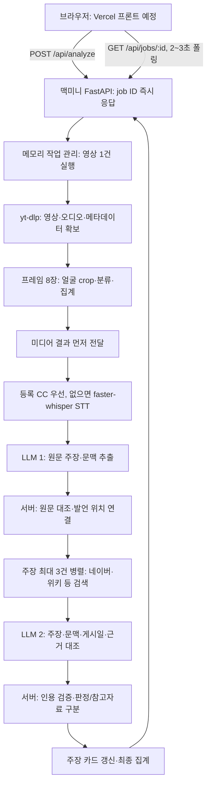

# 다음 기기·에이전트를 위한 현재 상태

## 2026-09-15 GitHub 인증 검수·서명 이미지 다운로드 완료

- 사용자 입력 GitHub API/GHCR 토큰 파일의 owner·mode 600을 확인했고 main/artifact 조회와 private GHCR manifest 읽기가 성공했다. `ops-secrets/registry-staging/config.json`은 GHCR 전용 임시 배포 인증 설정이며 mode 600이다. 인증정보를 출력하거나 Git에 넣지 않는다.
- gh 2.98.0이 `--cert-identity`와 `--signer-workflow` 동시 사용을 거부하는 실제 오류를 발견했다. 중복 옵션 제거 및 회귀 검증은 `fix/attestation-cli-options` a66c795, [BE PR #7](https://github.com/Dynamic-Juo/be/pull/7)에 올렸다. 배포·서명 관련 180개 테스트가 통과했다. 이 수정은 아직 main 병합 완료로 취급하지 않는다.
- 맥미니 `ops-staging/eef15c8/attestation.py`에 수정 helper를 두고 release·OCI bundle 검증 및 전체 인증서 정책 대조를 통과했다. 앞서 기록한 정확한 eef15c8 이미지 digest 다운로드도 완료했다. 서명 확인 기준을 완화하지 않았다.
- 네트워크 없는 일회용 컨테이너에서 UID 10001·`참새 AI API` 제목·캐시 및 상태 경로 쓰기가 통과했다. 시험 컨테이너는 자동 삭제됐다. 실제 API는 여전히 `conan-be:472aff7` healthy이고 기존 다른 7개 컨테이너도 계속 Up이다. 운영 교체·격리망 적용·controller 활성화·공개 전환은 아직이다.
- `ops-tools/store-cloudflare-credentials.py`를 준비했다. 사용자가 Apple Passwords에 보관한 Service Token Client ID/Secret을 숨김 입력하면 `ops-secrets/cloudflare-gateway.json`에 mode 600·덮어쓰기 금지로 저장한다. 아직 저장·Service Auth 실검수를 완료한 것으로 취급하지 않는다. CF 토큰 결과 페이지 읽기 거부를 우회하지 않는다.
- 다음 순서: PR #7 CI 확인 및 수정 반영, CF 인증정보 인수와 Service Auth·Turnstile 설정, 격리·볼륨/결과 이관·실영상 검수 후 운영 전환이다. FE/Vercel은 수정하지 않는다.

## 2026-09-15 설치 범위·인증정보 인수 확인

- 사용자가 Cloudflare Client ID/Secret을 직접 보관했다고 확인했다. 비밀값은 채팅·저장소로 받지 않았다. Service Auth 연결과 실제 인증 검수는 아직이다.
- Homebrew 영수증에서 gh 설치는 2026-09-15 00:32 KST다. Python 3.14는 3월 23일 UTC, 호스트 cloudflared는 1월 3일 UTC, Node는 7월 12일 UTC, Node 22는 5월 10일 UTC 설치 기록이다. 이번 명령으로 직접 추가한 호스트 패키지는 gh 2.98.0 하나다.
- GitHub Actions는 GitHub-hosted ubuntu-24.04-arm에서 Docker 빌드·테스트·게시·서명을 한다. 맥미니에는 self-hosted Actions runner를 설치하지 않았다. 사용자 LaunchAgents에서 conan/chamsae/deepcheck/github 이름의 plist는 0개다. 배포 helper의 launchd 활성화도 아직이다.
- 격리 시험 잔여물은 `chamsae-egress:review-20260914` 이미지와 isolation-lab의 Dockerfile·squid.conf·verify_egress.py다. 시험 컨테이너는 남아 있지 않다. 기존 Hermes/Wowtalk 중지 컨테이너와 기존 다른 서비스는 삭제하지 않았다.
- 운영 이미지의 GHCR 익명 pull 확인은 401이었다. GitHub 메타데이터용 fine-grained Actions/Contents read 토큰과 이미지 pull용 classic read:packages 토큰을 구분해 준비한다. 현재 개발용 gh 인증도 packages 조회 scope가 없어 403이었으며 권한을 임의로 넓히지 않았다.

## 2026-09-15 배포 진행 — PR 병합과 호스트 도구 설치

- 사용자가 프론트 연결을 제외한 백엔드 배포 완료를 요청했다. 프론트·Vercel은 다음 날 팀장이 연결하며, 해당 저장소와 관리 설정은 수정하지 않는다.
- BE PR #5는 `b716552`의 ARM64 CI 성공 후 main에 병합됐다. merge SHA는 `eef15c86d26abad2ac11be9458533f29df6e6f36`이다. main [CI 34862555149](https://github.com/Dynamic-Juo/be/actions/runs/34862555149)의 test-build·publish·attest-release가 모두 성공했다. 배포 후보는 `ghcr.io/dynamic-juo/be@sha256:bc7c3199cda29ed4468d371e464a03344dae4df6eda73e4b46eff241f5bd3083`이다. 릴리스 artifact ID는 `10356242194`다. 개발 기기에서 `gh attestation verify`로 release JSON의 저장소·signer workflow·main ref·정확한 source SHA·GitHub hosted runner 조건을 검증해 exit 0을 확인했다. OCI 이미지와 호스트 controller의 전체 검증 완료를 의미하지 않는다. PR CI의 publish skipped를 게시 성공으로 오해하지 않는다.
- 맥미니에 Homebrew로 GitHub CLI 2.98.0을 설치했다. 자동 Homebrew 갱신은 끄고 gh만 설치했다. `/opt/homebrew/bin/gh auth status`는 미인증이다. 전용 Actions/Contents read 인증과 GHCR pull 인증이 준비되기 전 자동 배포 controller를 켜지 않는다.
- 기존 유일한 모델 볼륨은 `conan-staging_model-cache` → `/root/.cache`이며 소유권 `0:0`, mode `755`다. 새 UID 10001 이미지에 붙이기 전 별도 복사·권한 이관 검증이 필요하다. 결과 볼륨은 현재 운영 컨테이너에 없다.
- 실제 앱은 여전히 root·writable rootfs·PID 상한 없음, ingress `internal=false`다. 새 main 코드와 실제 운영 격리 완료를 구분한다. 운영 컨테이너 재생성·이미지 교체·공개 활성화는 아직 하지 않았다.
- 사용자 진행 지시 후 `Chamsae AI Vercel Gateway` 토큰 생성 버튼을 눌렀다. 이후 결과 화면 읽기·출력은 비밀값 노출 위험으로 자동 승인 검토가 거부했다. 재시도해 비밀값을 읽거나 우회 추출하지 않았다. 브라우저 결과 화면을 보존했고 사용자가 직접 발급 결과 확인·비밀 보관을 해야 한다. 토큰 생성 상태를 확인하기 전 중복 발급하지 않는다. 앱의 Service Auth 정책 연결은 아직 하지 않았다.
- 다음 실행에는 사용자 보관 CF 인증정보, Turnstile 설정, 호스트 전용 GitHub 읽기 인증이 필요하다. 인증정보와 함께 새 상태 볼륨·UID/cache 전환, 전용 Tunnel/출구·내부망 차단, 실제 제공자·실영상·강제 시간 제한 검수를 완료해야 한다. 프론트가 준비됐다는 이유만으로 이 항목들을 생략하지 않는다.

## 2026-09-15 현재 우선 상태 — 최종 API 주소 연결

- 사용자가 최종 이름 `참새 AI API`, 주소 `https://chamsae-ai-api.dotseven.cloud`를 확정했다. `dev` 없는 주소다. 코드 API 제목과 README·공개 계약·FE 인수 문서를 반영했다. 운영 이미지의 표시명 변경은 새 이미지 배포 때 적용된다.
- Cloudflare 앱 `9d3fc410-551b-46dc-be20-518dd9f41f98` 이름은 `참새 AI API`다. 보호 대상은 `conan-api-dev.dotseven.cloud`, `chamsae-ai-api.dotseven.cloud` 두 개다. 잠시 추가했던 `chamsae-api-dev`는 최종 주소로 수정했고 해당 임시 이름의 Tunnel/DNS는 만들지 않았다.
- 이메일 정책 `7185f119-9529-462e-b802-33fcb922b0aa` 이름을 `Chamsae AI Team Only`로 바꾸고 기존 두 이메일·Allow·세션 설정을 유지했다. Everyone/Bypass 공개·Service Auth 추가는 하지 않았다.
- 공유 `dotseven-server` Tunnel에 새 호스트 → `http://conan-staging-deepcheck-api-1:8000`을 추가했다. UI에서 DNS 생성·Tunnel 저장 성공과 기존 네 경로 보존을 확인했다. 새 호스트 미인증 `/health` HTTP 302, 새 FE Origin OPTIONS는 백엔드 `400 Disallowed CORS origin`이다. 후자는 원본 연결 증거이며 CORS 완료가 아니다.
- 서버 `conan-be:472aff7`은 Up 33 hours healthy이고 다른 7개 컨테이너도 계속 Up이다. 컨테이너 교체·네트워크 격리 운영 반영·새 CORS 반영은 아직 하지 않았다. 기존 네트워크 위험은 아래 9월 14일 검사와 동일하게 미해결로 취급한다.
- 공개 계약은 브라우저 → Vercel Function → Service Token으로 Cloudflare → 전달 키로 백엔드다. 앞서 “프론트 API base만 바꾸면 연결”이라고 전달한 안내는 공개 구조에 불충분해 FE 인수 문서에서 정정했다. CORS는 서버 인증이 아니다. FE/Vercel은 계속 팀장 담당이다.
- `Chamsae AI Vercel Gateway` Service Token 생성 화면을 준비했다. UI의 최소 선택 기간은 1년이며 생성은 미실행이다. 브라우저 도구의 실행 시점 확인 후 발급·참새 앱 전용 정책 연결이 필요하다. Turnstile, 호스트 전용 GitHub Actions/Contents 읽기 인증과 GHCR pull 인증, 새 이미지·상태 볼륨·격리망 전환도 남는다. 백엔드 전체 완료나 공개 가능 상태로 보고하지 않는다.
- API·OpenAPI·공개 보호 관련 테스트는 `python -m pytest`로 70 passed, 2 warnings다. 처음 pytest 실행 파일로 실행했을 때 모듈 경로 누락으로 collection 오류가 있었고 모듈 실행으로 바로잡았다. 실영상·실제 Vercel·Service Auth 검수가 아니다.

## 2026-09-14 현재 우선 상태

- **프론트·Vercel은 팀장 담당이며 변경하지 않는다.** 이번에 범위를 넘어 작성했던 로컬 FE 수정은 사용자 지적 후 전부 회수했다. FE는 main cf97357의 clean 상태이며 FE 커밋·push·PR·배포는 하지 않았다. Vercel은 로그인된 사용자 계정의 목록까지만 조회했고 참새 프로젝트는 없었다. 설정·팀 권한·환경변수는 변경하지 않았다. BE의 API 계약·전달 문서까지만 진행한다.
- docs #9·#10은 병합됐고 #7은 f109806에서 main 충돌 없이 push됐다. #11은 별도 열린 변경이다. 서비스명 참새는 팀장 FE #13에서 확인했고 BE README·API 제목에 반영한다. 프론트 브랜치는 수정하지 않는다.
- BE는 `feat/public-api-protection`, [초안 PR #5](https://github.com/Dynamic-Juo/be/pull/5)다. ddbfa55의 실제 ARM64 CI가 성공했다. 731 passed, 2 skipped, gateway 6 passed와 비특권 실행·실제 번들 얼굴 모델 초기화·쓰기 경로 검사를 확인했다.
- 운영은 여전히 conan-be:472aff7이다. [9월 14일 네트워크 검사](deployment-isolation-audit-2026-09-14.md)에서 Laravel·Redis·맥미니 SSH 접근이 가능했다. 별도 internal 네트워크에서는 직접 연결이 차단됐고 전용 출구 시험에서 허용 API 연결과 사설 IP·미허용 도메인·허용 이름의 사설 IP 해석 거부를 확인했다. 운영 네트워크·컨테이너·볼륨은 변경하지 않았다.
- [출구 구성](../deploy/egress/README.md)은 검증용이며 운영 서명 이미지가 아니다. 검증 컨테이너·네트워크는 정리했고 서버의 격리 시험 디렉터리·이미지만 남겼다. 새 캐시 경로와 UID 10001 전환, 결과 복원, 전용 Tunnel, 하드 타임아웃과 실제 영상 검수 후 운영 반영한다.
- Cloudflare 이메일 보호·정책은 유지했다. Service Token 발급·Turnstile 생성·공개 활성화·최초 controller 전환은 아직 하지 않았다. 프론트 준비와 운영 보호가 끝나기 전에 공개 모드를 켜지 않는다. 자동 배포용 제한된 GitHub 읽기 인증 준비도 남아 있다.

## 2026-09-13 docs #7 리뷰 반영과 다음 실행

- [리뷰 후속·실행 순서](review-followup-2026-09-13.md)에 #7 정정 답글과 팀장 공유 초안을 남겼다. 외부 댓글·DM은 전송하지 않았다.
- docs `docs/implementation-audit`에 최신 main을 반영하고 과거 평가와 be cf550f9·운영 472aff7을 구분했다. #9·#10은 열린 PR이며 병합 완료로 간주하지 않는다.
- 현재 prompt 버전은 2026-09-11.1이다. 원문·출처·독립 계보 검증 조건은 이미 구현됐지만 실제 검색 제공자는 이를 채우지 못한다. 새 배포 후 근거 부족이 늘 수 있어 원문 확보와 기대값 검수가 우선이다.
- 기존 주장·프롬프트 계약 테스트 55개가 통과했다. 실제 영상·유료 API·서버 변경은 실행하지 않았다. 다음 작업은 서명 이미지 전환 준비, 원문 공급 경로, #10 인수 검수, #9 개별 주장 재검증 API 순서다.

## 2026-09-13 실제 배포환경 읽기 전용 점검

- [1차 점검 보고서](deployment-isolation-audit-2026-09-13.md)를 우선 확인한다. 호스트 포트·개인 파일·Docker socket 마운트 없음, CPU/RAM·기본 seccomp·환경 파일 권한을 확인했다.
- root 실행, NoNewPrivs=0, CapDrop/PID 상한 미설정과 구형 배포 코드가 확인됐다. 공유 cloudflared는 세 네트워크에 연결돼 있지만 실제 내부망 접근 가능 여부는 미검증이다.
- 서버는 수정하지 않았다. 기존 Docker 권한·보호 코드 배포 보완 후 네트워크 경계를 검사하고 VM 필요성을 결정한다. ISO-01 전체나 완전 격리 통과를 선언하지 않는다.

## 2026-09-13 서버 격리 가이드라인 — 다음 주요 작업

- 사용자 보고로 Vercel에서 최종 분석 결과까지 실제 연동됐음을 확인했다. 에이전트의 독립 실영상 품질 검수와 구분한다. 이전 미검증 기록 중 사용자 화면 연동은 이 보고로 갱신한다.
- [서버 격리 가이드라인](server-isolation.md)을 작성했다. 홈서버 보호를 위해 독립 커널 VM을 공개 목표로 제안하며, 일반 OrbStack 머신 추가와 구분한다. 설계 제안이고 VM 설치·방화벽·서버 변경은 하지 않았다.
- 다음 우선 작업은 ISO-01 현재 실행 구성 감사다. 파일·관리 socket·내부망·자원·관리 권한 경계의 검증 증거를 확보한 뒤 격리 구현과 공개 전환을 결정한다.

## 2026-09-13 15:05 KST — 맥미니 Vercel CORS 적용 완료

- 사용자가 기존 맥북 ed25519 공개키를 등록한 뒤 `ssh dotseven@100.105.223.60`으로 접속했다. Tailscale 경로는 연결되며 이전 home-server 내부망·dev-server Tunnel SSH 시간 초과와 구분한다. 서버 Docker는 `/usr/local/bin/docker`다.
- 실제 배포 `/Users/dotseven/srv/ConanAi/be/.env.home`과 실행 컨테이너의 CORS는 localhost:3000뿐이었다. 사용자 승인 범위에서 `DEEPCHECK_CORS_ORIGINS=http://localhost:3000,https://kimjeonil.vercel.app`로 변경했다. 렌더링된 Compose를 전후 비교해 CORS 항목만 달라짐을 검증했다.
- 진행 작업 0건을 확인했다. 기존 환경 파일과 완료 결과 1건을 서버 `/Users/dotseven/srv/ConanAi/ops-backups/cors-20260913-150512`에 디렉터리 700·파일 600으로 보관했다. 결과 백업은 JSON 보관이며 API에 자동 복원되지 않는다. 구형 API 재생성으로 이전 메모리 job 조회는 사라진다.
- 기존 `conan-staging` 프로젝트의 `deepcheck-api`만 `up -d --no-build --pull never --no-deps`로 재생성했다. 현행 서버는 자동 배포 컨트롤러 전환 전 구형 Compose임을 확인했고 이번에는 이미지 교체·helper 설치·서버 git pull을 하지 않았다. 이미지 `conan-be:472aff7`, ID `sha256:4ecdd77473ce42a9dd0799e46aafb263358dcc34a22d3d88e04c3f44c5d6aed9`를 유지했다.
- 외부 curl Vercel OPTIONS는 200 OK, Allow-Origin은 정확한 Vercel 주소, Allow-Credentials=true, Allow-Methods=GET/POST, Allow-Headers=content-type이었다. 미허용 Origin OPTIONS는 400, 미인증 GET /health는 Access 302다. 내부 health는 ok, 컨테이너 healthy, 기존 다른 7개 컨테이너도 계속 Up 상태다.
- Cloudflare OPTIONS 설정과 BE 환경 반영은 완료됐다. 실제 FE의 인증 쿠키·제3자 쿠키 제한·분석 POST/GET polling·영상/외부 제공자는 이번에 검증하지 않았다. FE는 같은 브라우저에서 API Access 인증 후 credentials: include로 접수·조회한다.
- 복구가 필요하면 보관된 환경 원본과 현재 값을 비교해 CORS 항목만 되돌리고 활성 작업·현재 배포 방식 확인 후 Conan만 반영한다. 이후 다른 변경까지 원복하지 않도록 환경 파일 전체를 무조건 덮어쓰지 않는다.

## 2026-09-13 Cloudflare OPTIONS 반영 완료 — 최신

- 사용자 승인으로 Chrome에서 Conan API Dev의 OPTIONS 원본 전달을 켜고 저장·재조회했다. 기존 이메일 정책은 유지했다. 외부 curl OPTIONS가 백엔드의 400 Disallowed CORS origin을 반환하고 미인증 health는 302였다.
- Cloudflare 변경은 완료됐으며 남은 작업은 맥미니의 Vercel CORS 환경값 적용이다. dev-server SSH 재시도도 시간 초과였다. 서버·컨테이너 변경과 FE 실연동은 미완료다. [상세 기록](frontend-integration.md)을 따른다.

## 2026-09-13 Vercel CORS·Access OPTIONS 적용 요청

- 사용자는 개발 API의 CORS·Cloudflare OPTIONS 변경을 승인했다. 팀장 이메일은 Access 허용 목록에 추가했다고 사용자에게 확인했다.
- 외부 OPTIONS는 403이다. main cf550f9에 Vercel Origin을 지정한 로컬 검사에서는 preflight·health CORS와 미허용 Origin 거부가 통과해 코드 변경은 필요하지 않았다.
- home-server·dev-server SSH 연결은 모두 시간 초과였고 Cloudflare 관리 도구도 없어 실제 설정은 미변경이다. [FE 연동 문서](frontend-integration.md)의 최신 항목에 적용할 환경값·Access 설정·검수 조건을 남겼다. 다음 작업은 서버 연결과 대시보드 접근 확보 후 해당 설정 반영이다.

## 2026-09-13 main 자동 배포 전환 작업

- 사용자는 백엔드 배포를 본인이 담당하며 제3자 승인 대신 main 병합 후 자동 배포를 요청했다. 이전 required-reviewer 제안은 채택하지 않는다. 기존 main `513f536`의 실제 CI `34733471394`는 ARM64 빌드·테스트·GHCR 게시·이미지/릴리스 서명까지 성공했다.
- `feat/automatic-dev-deployment`의 `b04e619`에 완료 결과 영속 저장을 추가했다. `DEEPCHECK_RESULT_STATE_FILE`이 설정되면 terminal job을 원자 snapshot으로 저장하고 다음 프로세스에서 복원한다. CD Compose는 전용 `job-results` 볼륨을 사용한다. 기존 보관 개수 상한은 유지하며 영상·오디오 파일은 저장하지 않는다.
- `/ready.harness.result_persistence=durable-terminal-v1`은 결과 저장이 구성되고 실패하지 않았을 때만 반환한다. 저장 실패 시 신규 접수와 drain/resume을 차단하고 durability capability를 unavailable로 내려 자동 교체를 막는다. 진행 중 작업의 비정상 호스트 장애 복구 기능은 아니며 계획된 배포는 drain 완료 뒤 수행해야 한다.
- 전체 모의 회귀 696 passed, 2 warnings를 확인했다. 이후 저장 실패 시 resume 거부 보완 후 관련 5개 테스트도 통과했다. 새 컨테이너의 실제 복원·자동 교체 검증은 아직 하지 않았다.
- CI/CD 자동 모드는 `0ff843c`로 통합했다. [BE PR #4](https://github.com/Dynamic-Juo/be/pull/4)에서 검토하며 호스트 고정 코드·서명·정확한 main/CI 확인·동시 배포 방지·실패 복구를 유지한다. 60초 launchd pull 예제가 있으나 아직 설치·활성화하지 않았다. 서버에 임의 shell을 실행하는 범용 runner는 사용하지 않는다.
- 통합 후 전체 모의 회귀는 722 passed, 2 warnings (14.76초)다. 실제 기존 main artifact ZIP의 size·digest·정확한 3파일 계약도 확인했다. 새 PR의 실제 Actions 결과와 호스트에서의 서명 검증·교체·복원은 별도다. 전용 Actions/Contents read 인증정보는 준비되지 않았으며 개발용 쓰기 권한 인증을 복사하지 않는다.
- 맥미니 Conan 전용 helper·60초 launchd 작업·전용 읽기 인증·최초 컨테이너 교체의 구체적 설치 승인을 요청했다. 이 작업의 서버 설치는 아직 실행하지 않았다. 기존 키·모델 볼륨·Tunnel·다른 서비스를 보존한다.

## 2026-09-13 통합 인수: 맥북에서 이어갈 때

- 현재 공유 경로는 `release/dev-integration`, [BE PR #3](https://github.com/Dynamic-Juo/be/pull/3)이다. CI/CD `43eae84`, 자막 `1b58097`, 소스 감사·파이프라인 `6c795ab`을 통합했다. 아래 개별 세션의 미병합 기록은 당시 이력이며 이 통합 기록을 우선한다.
- 문서 충돌 4곳은 양쪽 이력을 보존했다. 새 CD Compose의 자막 기본값이 manual이던 누락도 off로 수정했다. 실제 서버 환경값은 변경하지 않았다.
- 통합 `e306349`의 로컬 모의 회귀는 691 passed, 2 warnings다. 실제 [첫 Actions](https://github.com/Dynamic-Juo/be/actions/runs/34726142851)는 ARM64 빌드 성공 후 테스트 이미지의 scripts 누락으로 실패했다. `7ae042a`에서 scripts·deploy·workflow를 테스트 이미지에 포함했고 [재실행](https://github.com/Dynamic-Juo/be/actions/runs/34726301566)의 ARM64 빌드·격리 테스트가 성공했다. 실제 영상 분석이나 API 품질 검증이 아니다.
- docs는 `docs/midpoint-review`의 `1b0f6bf`에 통합 상태와 리뷰 후속 추적을 반영했다. docs main·PR #7·댓글은 변경하지 않았다. 원문 근거 수집, 전체 AI 생성 모델, 공개 API 보호와 강제 시간 제한 등의 감사 미흡 사항은 여전히 남아 있다.
- 다음 단계는 PR 최종 검토·병합 후 main의 이미지 게시·서명 확인이다. Environment 승인자·보호 설정과 host helper 설치·최초 migration은 미실행이며 별도 승인이 필요하다. GitHub에서 맥미니를 자동 호출하는 구성은 없다.
- 이번 통합에서는 서버 명령·실영상 요청을 실행하지 않았다. 사용자에게 제한된 서버 사전 조회와 기존 YouTube `cYRkZmBuDqI`를 자막 off로 1회 분석하는 범위의 승인을 요청한 상태다. 승인이 없으면 실행하지 않는다. 서버 `.env*`, 키, 다른 서비스와 Cloudflare 설정을 보존한다.
- 맥북의 개발 작업 복사본에서 이 브랜치와 PR Checks를 확인한다. 서버 경로에서 `git pull`하거나 개발 브랜치 체크아웃으로 배포를 대신하지 않는다. FE 구현·Vercel 배포는 팀장 담당이다.

## 2026-09-13 보안 CI/CD 구현 세션

- 작업 위치는 별도 worktree의 `ci/secure-deployment-controller`이며 기준 commit은 `26a9352` (`origin/ci/dev-deployment`)다. 최신 공유 commit과 원격 반영 여부는 해당 브랜치 자체를 확인한다.
- 구현 commit은 API의 durable admission fence `6d4310a`, 서명·승인형 host controller `4b7ce7a`다. 이 문서의 containing commit과 함께 `ci/secure-deployment-controller` 이력을 기준으로 인수한다.
- 작업 종료 시 clean worktree의 전체 이력을 `origin/ci/secure-deployment-controller` tracking branch에 push했다. PR 생성·main 병합·GitHub 보호 설정 변경·맥미니 배포는 수행하지 않았다.
- GitHub-hosted ARM64 CI가 테스트한 동일 image를 GHCR digest로 게시하고 image/release를 각각 attestation하도록 보완했다. Package publish와 signer 권한을 별도 job으로 나눴고 두 특권 job 및 environment 승인 뒤 request signer는 repository를 checkout하거나 repository 코드를 실행하지 않는다. Host-pinned workflow 본문의 isolated Python만 manifest/request를 만든다. `conan-development` environment를 통과한 workflow는 1시간짜리 request, request/release manifest, request/release/image Sigstore bundle의 정확히 다섯 파일만 만든다. GitHub workflow는 서버에 접속하거나 배포하지 않는다.
- Host helper는 request/release canonical JSON과 세 bundle 인증서의 repository/owner immutable ID, exact workflow/ref/SHA/event/run/attempt를 확인하고 image bundle은 release의 `oci://...@sha256:...` subject에 묶는다. 이어 GitHub API에서 exact backend CI attempt와 exact first-attempt deployment run, source commit의 두 reviewed workflow bytes SHA-256, immutable environment ID와 현재 required-reviewer User ID set/`prevent_self_review`, 실제 승인자와 승인 뒤 attempt 불변을 확인한다. API/network 불일치는 Docker 명령 전에 닫힌다. 고정 Docker/Compose/gh binary hash, Docker unix endpoint, 단일 flattened Compose hash와 로컬 target allowlist도 검증한다.
- Durable state/journal exact schema는 v2이고 host config는 v4다. State와 journal의 `target_fingerprint`는 repository immutable identity·environment·immutable backend CI/deployment workflow 및 environment ID·Docker endpoint·project/service·global lock/state directory·admission protocol 같은 장기 target을 canonical SHA-256으로 묶는다. Journal의 `transaction_fingerprint`는 Docker/Compose binary 경로·hash, Docker config/context, Compose 경로·trusted hash, env path를 별도로 묶는다. `enabled`·timeouts·bootstrap·request 값과 recover target이 아닌 GitHub CLI 경로/hash/config 및 회전 가능한 두 reviewed workflow SHA-256/reviewer allowlist는 지문에서 제외되지만 새 apply마다 검증된다.
- Target 지문 drift는 항상 Docker 접근 전 fail-closed하며 explicit migration 없이 rebind하지 않는다. Non-terminal 또는 state보다 앞선 journal의 transaction drift도 변경 전 거부한다. State에 이미 반영된 terminal journal이 transaction 지문만 오래된 경우에만, 현재 config로 state/Compose/image ID/health/exact durable accepting과, desired image가 있으면 state와의 일치까지 읽기 전용으로 재증명한 뒤 변경 없이 통과한다. 다음 `apply`가 새 transaction 지문으로 journal을 교체한다.
- 애플리케이션에 loopback bearer 기반 drain/resume을 추가했다. Job submit과 drain은 같은 lock에서 직렬화되며 기존 queued/running job이 끝날 때까지 기다린다. Drain/accepting marker는 컨테이너 writable layer에 atomic+fsync로 남아 같은 컨테이너의 프로세스 재시작에도 fence를 복원한다. `/ready.harness.admission_protocol`은 durable store가 있을 때 exact `durable-api-drain-v1`, 없을 때 `unavailable`이며 controller는 후자와 missing/legacy capability를 거부한다. 토큰 미설정·오류·비-loopback은 같은 404로 닫는다.
- 배포 helper는 새 image를 startup-drained로 검증한 후에만 commit한다. Terminal 수렴에서 같은 image가 top-level `ready` 또는 `saturated`이고 exact durable accepting이면 재생성하지 않고, exact durable draining이 확인된 경우에만 fence 없이 한 번 재생성한다. 성공한 start의 image·health·protocol·accepting 검증을 끝으로 추가 settle/probe/변경을 하지 않고, 모호한 readiness에서는 파괴 없이 닫힌다. Durable journal/state/image.env, replay·downgrade 방지, host-wide lock, target health 실패 rollback과 `recover`도 구현했다. `down`, volume/network 삭제, Tunnel/DNS/다른 서비스 명령은 없다.
- Host 신뢰 경로는 `/`부터 descriptor/no-follow로 검증하고 canonical raw path, owner, mode, hard-link와 Docker socket 유형을 고정한다. Darwin에서는 authority를 넓히는 extended allow ACL을 거부하며 deny-only system ACL만 허용한다. 일반 macOS 로그인 UID로 helper/OrbStack을 함께 실행하면 동일 UID 전체가 같은 권한이므로 실제 격리는 전용 service account와 별도 daemon/VM이 필요하다.
- `deploy/dev-host-config.example.json`은 schema v4이고 계속 `enabled=false`, `bootstrap_active=null`이다. 실제 server path, binary/Compose/workflow hash, workflow/environment/reviewer ID, current image identity와 token은 확인하거나 설정하지 않았다.
- 이 세션에서는 `/Users/dotseven/srv/ConanAi`, Docker/OrbStack, 실행 컨테이너와 실제 `.env.home`을 조회·변경하지 않았다. GitHub 공개 REST API는 읽기 전용으로 조회해 main의 기존 backend CI workflow와 environment 0개를 확인했으며 설정은 변경하지 않았다. 새 deployment workflow와 environment는 아직 활성화되지 않았다. 활성화는 [개발계 CI/CD 런북](development-cd-runbook.md)의 승인 절차를 따른다.
- `fix/captions-opt-in` worktree/branch는 별도로 유지되며 이 CD branch에 병합하지 않았다. 자막 기본 정책과 서버 env 변경을 CD 구현으로 암묵 적용하지 않는다.
- 격리 가상환경의 최종 전체 로컬 회귀는 **687 passed, 2 warnings (14.07초)**다. Python `py_compile`, workflow/Compose YAML 및 host-config JSON 파싱, `git diff --check`도 통과했다. Fake Docker/GitHub API와 filesystem/ACL fault injection이며 실제 Actions·bundle·맥미니 검증은 아니다.
- 완료 결과는 여전히 process memory에만 있어 drain 뒤 마지막 poll 전 결과가 재시작으로 사라질 수 있다. 이 위험을 수용하거나 결과를 영속화하기 전에는 매 배포를 사용자가 없는 유지보수 창에서 실행하며, GitHub→host 자동 호출이나 완전 무손실을 주장하지 않는다.

아래 2026-09-12 내용은 이전 구현·배포 준비 이력이다. 최신 CD 상태는 위 문단과 런북을 우선한다.

## 2026-09-13 팀장 기획 기준과 자막 옵션 반영

- 기획 결정권자는 조정준 팀장이다. 사용자는 팀장 지시를 따르며 자막은 기본 미사용으로 하고 옵션으로 사용할 수 있게 유지하라고 명시했다. 이전 manual 기본 유지 방침은 이 지시로 대체한다.
- 최신 main `38bd162`에서 분기한 `fix/captions-opt-in`에서 코드·독립 개발 Compose·신규 환경 예제 기본을 `off`로 맞췄다. `manual`·`any` 선택과 자막 실패 시 STT 전환을 유지하고 API·FE 문서를 갱신했다. 기존 Vercel 인수 문서 커밋 `69cd939`도 이 브랜치에 가져왔다.
- 전체 로컬 모의 테스트는 333 passed, 2 warnings (7.58초)다. Python 3.14 환경의 네트워크 차단 fixture를 사용했으며 서버·모델·실영상·유료 API 검증은 아니다.
- 다중 얼굴은 팀장 원문 확인 후 기준이 일치할 때 구현하라는 조건부 지시다. docs 점검 세션이 확인한 [팀장 원문](https://github.com/Dynamic-Juo/docs/pull/7#discussion_r3958648232)은 여러 명 중 한 명이라도 추출되면 되는지 묻는 질문이다. 모든 얼굴을 검사해 하나라도 이상이면 전체 이상으로 판정하라는 확정 지시와는 다르며 해당 thread의 후속 답변도 확인되지 않았다. 집계 코드는 변경하지 않았다. 다른 지시가 있다면 원문 확인이 필요하다. 세 점검 세션에도 최신 결정을 전달했다.
- 서버 명령·환경값·컨테이너·Cloudflare는 변경하지 않았다. 실제 env에 `manual`이 있으면 코드 기본값 변경만으로 STT가 되지 않는다. 이후 승인된 배포에서 해당 항목을 확인하고 `off`로 전환해야 한다. 키와 환경 파일 전체를 덮어쓰지 않는다.

아래 2026-09-12 기록은 당시 상태다. 자막 정책은 위 최신 지시가 우선한다.

## 2026-09-12 Vercel 연결 점검

- 사용자가 `https://kimjeonil.vercel.app`를 프론트 주소로 제공하고 기존에 제시한 Docker 조회 명령 4개를 승인했다. 컨텍스트는 orbstack이며 기존 `conan-staging-deepcheck-api-1`은 `conan-be:472aff7`, healthy·재시작 0·OOM false다. Compose 경로는 `/Users/dotseven/srv/ConanAi/be/compose.home.yml`이다. 기존 다른 7개 서비스도 실행 중이었다. 서버 파일·환경값·컨테이너·Cloudflare 설정은 변경하지 않았다.
- BE PR #2는 main `38bd162`로 병합됐고 ARM64 CI·GHCR 게시가 성공했지만 맥미니는 아직 이전 이미지를 사용한다. 고정 digest는 docs 공유 브랜치의 인수인계와 직전 배포 인수 기록을 따른다.
- 프론트 저장소 `Dynamic-Juo/fe` main `8c3bb9c`의 `src/api/realClient.ts`는 접수·폴링 모두 미구현 오류를 던진다. 공개 배포 JS에서도 같은 오류 문구를 확인했다. 프론트 Origin만 CORS에 추가해도 연결되지 않는다. 실제 분석 요청은 제출하지 않았다.
- 추가 승인 후 서버 Git·Compose 제한 조회와 내부 `/ready`를 확인했다. 서버 HEAD는 `472aff7`, Compose v5.1.2이며 기존 설정 검증은 통과했다. CORS는 `http://localhost:3000`만 허용한다. 진행·대기 작업은 0건이었다. `.env.example` 삭제 변경은 사용자 변경으로 보존하며 서버에서 `git pull`하지 않는다.
- 외부 네트워크 `conan-staging-ingress`, 별칭 `conan-api`, 캐시 볼륨 `conan-staging_model-cache`를 확인했다. 환경 파일 전체와 키는 출력하지 않았다. 별도 `compose.vercel.yml`로 새 이미지와 Vercel CORS만 지정하는 교체안을 제시했으며 실제 교체 승인은 대기 중이다. 파일 생성·이미지 pull·재시작·Access 변경은 하지 않았다.
- 프론트 실 API 구현은 사용자 결정에 따라 조정준 팀장이 담당한다. FE 코드·PR·Vercel 배포는 수정하지 않는다. 전달할 설정과 검수 항목은 [FE 연동 안내](frontend-integration.md)를 따른다.

기준일: 2026-09-12. `fix/midpoint-hardening`의 배포 준비 기록이다. 사용자가 백엔드 반영·정리를 요청했으며 docs PR #7 댓글은 직접 다음 날 마무리한다. 문서는 기존 브랜치에만 공유하고 새 docs PR을 만들지 않는다. 서버 명령은 조회도 대상·영향을 설명하고 사전 승인받는다. 이 문서 작성 시점에는 서버를 교체하지 않았다.

## 2026-09-12 배포 준비와 검증 범위

- 기존 보안·API 코드 커밋은 `e8176d8`, CI 커밋은 `729be26`이다. 자막 기본값 복원은 `5ed4441`이며 `manual`을 코드·Compose·신규 환경 예제에 일치시켰다. 명시적인 `off`·`any`는 유지한다. 기존 서버 `.env.home`은 읽거나 수정하지 않았다.
- 복원 후 전체 로컬 테스트는 **329 passed, 2 warnings (7.53초)**다. 모의 모델·제공자와 Python DNS/TCP 차단 fixture를 사용했다. 프로세스 전체의 OS 네트워크 격리나 실제 영상·모델·DeepSeek/NAVER·컨테이너 검증을 뜻하지 않는다. 이전 328건은 API 보완 당시 기록이다.
- 백엔드 PR에서 GitHub-hosted ARM64 빌드·격리 테스트를 확인한 뒤 main 반영을 진행한다. main CI는 검증한 이미지를 GHCR에 게시하지만 맥미니를 자동 교체하지 않는다. 실제 배포는 고정 이미지와 기존 `conan-staging` 프로젝트로만 진행하며 명령별 승인을 받는다.
- [FE 연동](frontend-integration.md)과 [API 계약](api-reference.md)에 루트 404와 `/health`·`/docs` 용도를 추가했다. 사용자는 이메일 인증 후 루트 404를 보고했다. 코드의 루트 미등록과 비인증 `/health`의 Access 로그인 이동만 확인했으며, 로그인 후 health·Swagger·실영상은 미검증이다.
- 기획 원본과 docs PR #7은 수정하지 않는다. 검색 제공자 간 병렬화, 여러 얼굴 분석, 전체 AI 생성 탐지 제외는 이번 배포에 추가하지 않는다. 댓글용 제안 문구는 팀 합의 완료나 구현 완료를 뜻하지 않는다.

## 먼저 읽을 것

이전 배포 기록: main 472aff7 이미지로 conan-staging을 기동하고 개발 API에 본인 이메일 한정 Access를 연결했다. 키 세 항목은 이후 배포 파일과 컨테이너에 반영했다. 사용자 보고로 맥북·맥미니의 도메인 접속도 해소됐으나 원인은 확정하지 않았다. 이번 점검에서 이를 서버 명령으로 재확인한 것은 아니다.

이전 실측: 키 반영 전 영상 cYRkZmBuDqI는 내부 API에서 25.1초에 completed였지만 STT 3단어·입력 길이 비율 100%·no_claims였다. 키 반영 후 실제 영상/DeepSeek/NAVER E2E와 판정 품질은 검증하지 않았다. 같은 영상으로 이번 수정의 효과를 실측한 것도 아니다.

수정 브랜치: YouTube 입력 경계·다운로드 전 metadata/TLS·bounded worker·오류/세션 노출·미디어 실패/부분 상태·임시 정리·STT 지표·근거/프롬프트 검증을 보완했다. 중간 점검 때 off로 바꿨던 자막 기본값은 배포 준비에서 기존 manual로 복원했다. 사용할 등록 CC가 없으면 STT로 넘어가며 불완전 CC 자동 판별은 미검증이다. 기획 본문과 리뷰의 최종 정리는 별도다. 전체 AI 모델·원문 수집·하드 타임아웃은 여전히 미구현이다.

CI는 네트워크 없는 테스트 이미지와 읽기 전용 test/main 전용 publish job으로 분리했다. 이 문서는 로컬 검증 후 PR·CI를 준비하는 시점의 기록이며 Actions 결과와 실제 배포 성공을 선기록하지 않는다. 기획 원본은 유지하고 docs 작업 복사본의 evaluations/2026-09-11-midpoint-review.md와 rfcs/public-mvp-readiness.md는 당시 분석·미승인 제안으로 보존한다. 일반 사용자 공개는 남은 보안·품질 검증 뒤 별도 승인한다.

1. [작업 규칙](../AGENTS.md)과 이 문서
2. [기획 PR #6](https://github.com/Dynamic-Juo/docs/pull/6), 특히 PR 머리의 PRD·evidence-policy·analysis-runtime·result-ui와 최신 리뷰
3. [프롬프트 평가](prompt-evaluation.md), [코드 흐름](pipeline.md)
4. [맥미니 배포](deployment-mac-mini.md), [작업 로그](worklog.md)
5. FE 전달 시 [연동 인수인계](frontend-integration.md), [요청·응답 API 계약](api-reference.md)

기획 본문 검토 기준은 docs `origin/main`의 aedf161이다. 과거 35df85c 검토와 구분한다. 9월 11일 점검 당시에는 PR 최신 댓글을 읽지 못했지만, 9월 12일 PR #7의 [수동 CC 활용 의견](https://github.com/Dynamic-Juo/docs/pull/7#discussion_r3958898775)을 추가 확인했다. 이 리뷰와 본문의 STT 기본 방침은 자동으로 같은 결정으로 간주하지 않는다. 기존 서버 설정을 보존하고 적용 정책을 합의해야 한다. [LLM 현재 사용 의견](https://github.com/Dynamic-Juo/docs/pull/7#discussion_r3989716198)도 당시 사용 기록이며 실제 env를 이번에 확인했다는 뜻은 아니다. 상세 정책 확인 항목은 docs 공유 브랜치의 [백엔드 인수인계](https://github.com/Dynamic-Juo/docs/blob/docs/midpoint-review/operations/backend-handoff.md)에 정리했다.

## 저장소와 공유 상태

| 저장소 | 역할과 기준 |
| --- | --- |
| docs | 팀 기획·결정·전체 평가. 변경 제안은 팀의 문서 운영 규칙을 따른다. |
| be | 현재 구현·테스트·실행 문서. DeepSeek 주장 추출·판정, NAVER API HUB 뉴스·백과 검색이 이미 구현됐다. |
| playground | 백엔드를 시작하기 위해 만든 초기 실험 저장소. 현행 API의 기준이 아니다. |
| fe | `Dynamic-Juo/fe`, `https://kimjeonil.vercel.app`. 조정준 팀장이 실 API 연결과 Vercel 배포를 담당한다. 확인한 main `8c3bb9c`의 실 API 클라이언트는 미구현이다. |

2026-09-12 배포 준비 시작 때 fetch로 확인한 원격 main은 `472aff7201a834102d6ec2c27096dabb22a5ae4f`다. `fix/prompt-handoff`는 PR #1로 main에 병합됐으며 DeepSeek·NAVER·배포 구성도 main에 포함된다. 과거 미공유·병합 대기 기록은 worklog에 당시 이력으로 보존한다. 실제 후속 병합 여부는 GitHub PR과 원격 커밋으로 확인한다.

이전 서버 점검 문서 브랜치는 `docs/mac-mini-readiness`다. 이번 수정은 그 브랜치의 e79a2eb에서 분기한 `fix/midpoint-hardening` 작업 복사본에 있다. 최신 코드·CI 커밋과 공유 범위는 문서 상단을 따른다. docs 저장소의 제안·평가는 aedf161에서 분기한 `docs/midpoint-review`에 있다. 이전 배포 기록은 main 472aff7 이미지의 staging 기동이며 이번에 서버 checkout이나 이미지를 확인·변경하지 않았다. 아래 명령은 개발 작업 복사본의 공유 상태 확인 예시다. 서버에서 실행하려면 조회도 먼저 승인받는다.

```bash
git status --short --branch
git log -5 --oneline
git remote -v
git fetch origin
git branch -vv
```

커밋되지 않은 변경은 다른 기기로 전달되지 않는다. 새 기기는 `.venv`를 복사하지 않고 환경을 다시 만든다. `.env`·`.env.home`과 모델 캐시는 Git에 포함하지 않으며 비밀값은 별도로 전달한다. 경로는 각 저장소 루트를 기준으로 사용한다.

## 개발 기기와 맥미니의 작업 분담

- 개발 기기에서는 후속 코드 수정을 별도 브랜치에서 진행한다. 다음 우선 작업은 원문 근거 수집·출처 검증과 공개 전 입력·실행 제한이다.
- 맥미니에서는 현재 배포 기준을 고정하고 환경·이미지·내부 API·Tunnel 연결·부하를 검증한다. 배포 중 개발 브랜치 최신 내용을 자동으로 pull하거나 운영 이미지를 자동 교체하지 않는다.
- 맥미니에서 수정할 필요가 생기면 로컬 변경을 보존하고 별도 브랜치로 기록한다. 배포 결과는 `docs/deployment-log.md`에 실제 커밋·이미지 ID·설정 이름·검증 결과를 남겨 개발 기기로 전달한다. 비밀값은 기록하지 않는다.
- 후속 코드가 검증되면 다음 배포 커밋을 명시해 갱신한다. 서버의 환경 조정과 코드의 동작 변경을 같은 작업으로 간주하지 않는다.

## 확인된 운영 환경

- 나정균 팀원은 맥북 에어·맥미니·맥북 프로를 오가며 개발한다.
- 배포 대상은 M4 맥미니·메모리 16GB·OrbStack이다. cloudflared, Laravel, 모니터링이 기존 Docker 컨테이너로 돌아간다. 사용자에게 직접 확인했다.
- 2026-09-10 실제 맥미니의 OrbStack·16GiB 메모리와 실행 서비스 7개를 확인한 이력이 있다. cloudflared 컨테이너 이름과 당시 관리 Compose·네트워크는 [배포 점검 기록](deployment-log.md)에 남겼다. 당시 미확인이던 API 도메인·Access는 이후 위 배포 기록대로 연결했다. Vercel 주소는 미정이다. 이번 중간 점검은 Docker 소켓과 SSH에 접근하지 않았다.
- 과거 개발 기기의 OrbStack에서 ARM64 빌드·모델 초기화·HTTP/CORS를 검증한 이력과 이번 Python 가상환경 모의 테스트는 구분한다. 이번 변경 이미지의 빌드·기동·부하는 검증하지 않았다.

## 현재 실행 흐름



위 도표의 LLM 단계는 LLM 사용을 선택한 경로다. 코드 자체의 기본값은 LLM 비활성·규칙 추출이며 DeepSeek을 사용하는 예제 설정과 구분한다. 실제 배포 env의 자막 정책·LLM 설정은 이번에 확인하거나 바꾸지 않았다. 파이프라인은 미디어 분석 후 전사·주장 검증으로 진행한다. 두 축을 병렬 실행한다고 가정하지 않는다. Google Fact Check 제공자를 켜도 수정 브랜치에서는 rating만으로 확정하지 않는다. 배포 예시는 해당 제공자를 제외했다. 진행 중 동일 URL은 옵션이 달라도 첫 요청의 작업을 재사용하며 완료 결과 캐시는 없다.

## 이번 변경의 API 계약

정확한 요청 옵션·기본값·예제·오류 및 FE 처리 기준은 [API 계약](api-reference.md)에 모았다. `/docs`·`/redoc`·`/openapi.json`은 예상 배포 경로이며 이번에 서버에서 재검증하지 않았다. 같은 API Origin의 Swagger 인증 성공과 Vercel 교차 출처 CORS·쿠키·OPTIONS 성공은 별도로 검증한다.

- `result.media`는 다운로드 후부터 전달되고 전사 후 `transcript_source` 등이 추가된다. 메타데이터만 도착한 것은 부분 분석 완료가 아니다.
- `job.status`는 작업 생명주기, `job.stage`는 현재 처리 단계다. `partially_completed`인 동안에도 stage는 갱신된다. 주장 카드가 준비됐는지는 claim_verification의 존재·상태로 확인한다.
- `elapsed_sec`는 호환성을 위해 접수 후 총 경과로 유지한다. 대기는 `queue_wait_sec`, 실제 분석 경과·지연 안내는 `processing_elapsed_sec`를 사용한다.
- 개별 주장은 pending → verifying → done/failed/timed_out 순서로 알림을 보낸다. 최종 summary에도 done/pending/verifying/failed/timed_out이 남는다. 미완료 표시에 failed도 포함한다.
- `claim.context`는 발언 전문에서 대조한 문맥이다. `video_title`·`video_published_at`은 판정 해석용이며 외부 근거가 아니다. 모델 입력·출력 점검은 프롬프트 평가 문서를 따른다.

## 다음 우선순위와 공개 전 남은 확인

| 항목 | 상태와 다음 작업 |
| --- | --- |
| 원문 수집·출처 독립성 | 원문·출처 검증 제공자는 미구현이다. 수정 브랜치는 확인된 원문과 출처 메타데이터 없이는 일치·불일치를 확정하지 못하도록 코드에서도 강제한다. 현재 검색 제공자는 그 정보를 만들지 않으므로 참고 자료/근거 부족이 된다. 원문 확보·출처별 검증·재전송 중복 제거를 구현하고 실측해야 한다. |
| 전문기관 판정 분기 | 수정 브랜치는 rating 직접 판정을 제거하고 주장 불일치·복수 판정 충돌을 검사한다. 검색 발췌와 rating은 원문을 대신하지 않는다. 맥미니 예시는 factcheck를 제외하며 재활성화·실측은 별도 승인 사항이다. |
| 입력 제한 | 수정 브랜치는 YouTube URL 정규화·다운로드 전 공개/연령/길이 검사를 추가했다. 실제 Shorts 분류·한국어 검사, CDN/리다이렉트/DNS 경계와 디스크 상한은 남는다. 배포본은 아직 이전 코드다. |
| 실행 상한 | 수정 브랜치에서 무제한 executor 대기를 제거했다. 600초는 여전히 실행 중인 다운로드·STT를 강제로 끊지 못한다. 공개 전 하드 타임아웃·요청별 자원 상한과 부하 검증이 필요하다. |
| 부분 실패 | 수정 브랜치는 미완료 주장·필수 축 누락을 부분 완료로 표시하고, 유효한 결과가 없으면 failed로 종료한다. FE와 새 상태 계약을 검증해야 한다. |
| 미디어 정확도 | 수정 브랜치에서 얼굴 없는 프레임은 점수에서 제외했다. 실제 오탐·STT 품질은 재검증하지 않았다. 전체 AI 생성 모델과 자가표기의 유형별 정책은 미해결이다. |
| 실제 영상 검수 | 고정한 기대 주장·판정·출처로 M-08을 검증해야 한다. 이번 가상 자료 11건을 실제 영상 정확도나 완결성 70% 기준으로 환산하지 않는다. |
| 배포 | 전용 Compose 파일을 준비한 기존 이력이 있다. 이번 변경의 기동·부하·YouTube 접근·Tunnel·Vercel CORS 확인은 별도다. 수정 브랜치는 전체 job/session 조회를 기본 비활성화했지만 개별 결과 접근 권한과 남용 방지는 남는다. |

각 항목은 구현 확인에서 나온 후속 작업이며 팀 제품 범위를 새로 결정한 것이 아니다. docs#7에 전달할 코드와 정책 차이는 [프롬프트 평가](prompt-evaluation.md)에 정리했다.
