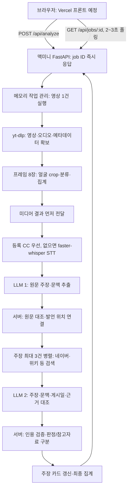

# 다음 기기·에이전트를 위한 현재 상태

기준일: 2026-09-12. `fix/midpoint-hardening`의 배포 준비 기록이다. 사용자가 백엔드 반영·정리를 요청했으며 docs PR #7 댓글은 직접 다음 날 마무리한다. 문서는 기존 브랜치에만 공유하고 새 docs PR을 만들지 않는다. 서버 명령은 조회도 대상·영향을 설명하고 사전 승인받는다. 이 문서 작성 시점에는 서버를 교체하지 않았다.

## 2026-09-12 배포 준비와 검증 범위

- 기존 보안·API 코드 커밋은 `e8176d8`, CI 커밋은 `729be26`이다. 자막 기본값 복원은 `5ed4441`이며 `manual`을 코드·Compose·신규 환경 예제에 일치시켰다. 명시적인 `off`·`any`는 유지한다. 기존 서버 `.env.home`은 읽거나 수정하지 않았다.
- 복원 후 전체 로컬 테스트는 **329 passed, 2 warnings (7.53초)**다. 모의 모델·제공자와 Python DNS/TCP 차단 fixture를 사용했다. 프로세스 전체의 OS 네트워크 격리나 실제 영상·모델·DeepSeek/NAVER·컨테이너 검증을 뜻하지 않는다. 이전 328건은 API 보완 당시 기록이다.
- 백엔드 PR에서 GitHub-hosted ARM64 빌드·격리 테스트를 확인한 뒤 main 반영을 진행한다. main CI는 검증한 이미지를 GHCR에 게시하지만 맥미니를 자동 교체하지 않는다. 실제 배포는 고정 이미지와 기존 `conan-staging` 프로젝트로만 진행하며 명령별 승인을 받는다.
- [FE 연동](frontend-integration.md)과 [API 계약](api-reference.md)에 루트 404와 `/health`·`/docs` 용도를 추가했다. 사용자는 이메일 인증 후 루트 404를 보고했다. 코드의 루트 미등록과 비인증 `/health`의 Access 로그인 이동만 확인했으며, 로그인 후 health·Swagger·실영상은 미검증이다.
- 기획 원본과 docs PR #7은 수정하지 않는다. 검색 제공자 간 병렬화, 여러 얼굴 분석, 전체 AI 생성 탐지 제외는 이번 배포에 추가하지 않는다. 댓글용 제안 문구는 팀 합의 완료나 구현 완료를 뜻하지 않는다.

## 먼저 읽을 것

이전 배포 기록: main 472aff7 이미지로 conan-staging을 기동하고 개발 API에 본인 이메일 한정 Access를 연결했다. 키 세 항목은 이후 배포 파일과 컨테이너에 반영했다. 사용자 보고로 맥북·맥미니의 도메인 접속도 해소됐으나 원인은 확정하지 않았다. 이번 점검에서 이를 서버 명령으로 재확인한 것은 아니다.

이전 실측: 키 반영 전 영상 cYRkZmBuDqI는 내부 API에서 25.1초에 completed였지만 STT 3단어·입력 길이 비율 100%·no_claims였다. 키 반영 후 실제 영상/DeepSeek/NAVER E2E와 판정 품질은 검증하지 않았다. 같은 영상으로 이번 수정의 효과를 실측한 것도 아니다.

수정 브랜치: YouTube 입력 경계·다운로드 전 metadata/TLS·bounded worker·오류/세션 노출·미디어 실패/부분 상태·임시 정리·STT 지표·근거/프롬프트 검증을 보완했다. 중간 점검 때 off로 바꿨던 자막 기본값은 배포 준비에서 기존 manual로 복원했다. 사용할 등록 CC가 없으면 STT로 넘어가며 불완전 CC 자동 판별은 미검증이다. 기획 본문과 리뷰의 최종 정리는 별도다. 전체 AI 모델·원문 수집·하드 타임아웃은 여전히 미구현이다.

CI는 네트워크 없는 테스트 이미지와 읽기 전용 test/main 전용 publish job으로 분리했다. 이 문서는 로컬 검증 후 PR·CI를 준비하는 시점의 기록이며 Actions 결과와 실제 배포 성공을 선기록하지 않는다. 기획 원본은 유지하고 docs 작업 복사본의 evaluations/2026-09-11-midpoint-review.md와 rfcs/public-mvp-readiness.md는 당시 분석·미승인 제안으로 보존한다. 일반 사용자 공개는 남은 보안·품질 검증 뒤 별도 승인한다.

1. [작업 규칙](../AGENTS.md)과 이 문서
2. [기획 PR #6](https://github.com/Dynamic-Juo/docs/pull/6), 특히 PR 머리의 PRD·evidence-policy·analysis-runtime·result-ui와 최신 리뷰
3. [프롬프트 평가](prompt-evaluation.md), [코드 흐름](pipeline.md)
4. [맥미니 배포](deployment-mac-mini.md), [작업 로그](worklog.md)
5. FE 전달 시 [연동 인수인계](frontend-integration.md), [요청·응답 API 계약](api-reference.md)

기획 본문 검토 기준은 docs `origin/main`의 aedf161이다. 과거 35df85c 검토와 구분한다. 9월 11일 점검 당시에는 PR 최신 댓글을 읽지 못했지만, 9월 12일 PR #7의 [수동 CC 활용 의견](https://github.com/Dynamic-Juo/docs/pull/7#discussion_r3958898775)을 추가 확인했다. 이 리뷰와 본문의 STT 기본 방침은 자동으로 같은 결정으로 간주하지 않는다. 기존 서버 설정을 보존하고 적용 정책을 합의해야 한다. [LLM 현재 사용 의견](https://github.com/Dynamic-Juo/docs/pull/7#discussion_r3989716198)도 당시 사용 기록이며 실제 env를 이번에 확인했다는 뜻은 아니다. 상세 정책 확인 항목은 docs 공유 브랜치의 [백엔드 인수인계](https://github.com/Dynamic-Juo/docs/blob/docs/midpoint-review/operations/backend-handoff.md)에 정리했다.

## 저장소와 공유 상태

| 저장소 | 역할과 기준 |
| --- | --- |
| docs | 팀 기획·결정·전체 평가. 변경 제안은 팀의 문서 운영 규칙을 따른다. |
| be | 현재 구현·테스트·실행 문서. DeepSeek 주장 추출·판정, NAVER API HUB 뉴스·백과 검색이 이미 구현됐다. |
| playground | 백엔드를 시작하기 위해 만든 초기 실험 저장소. 현행 API의 기준이 아니다. |
| fe | 아직 저장소·배포 주소 미확인. 조정준 팀장이 와이어프레임을 기준으로 만들고 Vercel에 배포할 예정이다. |

2026-09-12 배포 준비 시작 때 fetch로 확인한 원격 main은 `472aff7201a834102d6ec2c27096dabb22a5ae4f`다. `fix/prompt-handoff`는 PR #1로 main에 병합됐으며 DeepSeek·NAVER·배포 구성도 main에 포함된다. 과거 미공유·병합 대기 기록은 worklog에 당시 이력으로 보존한다. 실제 후속 병합 여부는 GitHub PR과 원격 커밋으로 확인한다.

이전 서버 점검 문서 브랜치는 `docs/mac-mini-readiness`다. 이번 수정은 그 브랜치의 e79a2eb에서 분기한 `fix/midpoint-hardening` 작업 복사본에 있다. 최신 코드·CI 커밋과 공유 범위는 문서 상단을 따른다. docs 저장소의 제안·평가는 aedf161에서 분기한 `docs/midpoint-review`에 있다. 이전 배포 기록은 main 472aff7 이미지의 staging 기동이며 이번에 서버 checkout이나 이미지를 확인·변경하지 않았다. 아래 명령은 개발 작업 복사본의 공유 상태 확인 예시다. 서버에서 실행하려면 조회도 먼저 승인받는다.

```bash
git status --short --branch
git log -5 --oneline
git remote -v
git fetch origin
git branch -vv
```

커밋되지 않은 변경은 다른 기기로 전달되지 않는다. 새 기기는 `.venv`를 복사하지 않고 환경을 다시 만든다. `.env`·`.env.home`과 모델 캐시는 Git에 포함하지 않으며 비밀값은 별도로 전달한다. 경로는 각 저장소 루트를 기준으로 사용한다.

## 개발 기기와 맥미니의 작업 분담

- 개발 기기에서는 후속 코드 수정을 별도 브랜치에서 진행한다. 다음 우선 작업은 원문 근거 수집·출처 검증과 공개 전 입력·실행 제한이다.
- 맥미니에서는 현재 배포 기준을 고정하고 환경·이미지·내부 API·Tunnel 연결·부하를 검증한다. 배포 중 개발 브랜치 최신 내용을 자동으로 pull하거나 운영 이미지를 자동 교체하지 않는다.
- 맥미니에서 수정할 필요가 생기면 로컬 변경을 보존하고 별도 브랜치로 기록한다. 배포 결과는 `docs/deployment-log.md`에 실제 커밋·이미지 ID·설정 이름·검증 결과를 남겨 개발 기기로 전달한다. 비밀값은 기록하지 않는다.
- 후속 코드가 검증되면 다음 배포 커밋을 명시해 갱신한다. 서버의 환경 조정과 코드의 동작 변경을 같은 작업으로 간주하지 않는다.

## 확인된 운영 환경

- 나정균 팀원은 맥북 에어·맥미니·맥북 프로를 오가며 개발한다.
- 배포 대상은 M4 맥미니·메모리 16GB·OrbStack이다. cloudflared, Laravel, 모니터링이 기존 Docker 컨테이너로 돌아간다. 사용자에게 직접 확인했다.
- 2026-09-10 실제 맥미니의 OrbStack·16GiB 메모리와 실행 서비스 7개를 확인한 이력이 있다. cloudflared 컨테이너 이름과 당시 관리 Compose·네트워크는 [배포 점검 기록](deployment-log.md)에 남겼다. 당시 미확인이던 API 도메인·Access는 이후 위 배포 기록대로 연결했다. Vercel 주소는 미정이다. 이번 중간 점검은 Docker 소켓과 SSH에 접근하지 않았다.
- 과거 개발 기기의 OrbStack에서 ARM64 빌드·모델 초기화·HTTP/CORS를 검증한 이력과 이번 Python 가상환경 모의 테스트는 구분한다. 이번 변경 이미지의 빌드·기동·부하는 검증하지 않았다.

## 현재 실행 흐름



위 도표의 LLM 단계는 LLM 사용을 선택한 경로다. 코드 자체의 기본값은 LLM 비활성·규칙 추출이며 DeepSeek을 사용하는 예제 설정과 구분한다. 실제 배포 env의 자막 정책·LLM 설정은 이번에 확인하거나 바꾸지 않았다. 파이프라인은 미디어 분석 후 전사·주장 검증으로 진행한다. 두 축을 병렬 실행한다고 가정하지 않는다. Google Fact Check 제공자를 켜도 수정 브랜치에서는 rating만으로 확정하지 않는다. 배포 예시는 해당 제공자를 제외했다. 진행 중 동일 URL은 옵션이 달라도 첫 요청의 작업을 재사용하며 완료 결과 캐시는 없다.

## 이번 변경의 API 계약

정확한 요청 옵션·기본값·예제·오류 및 FE 처리 기준은 [API 계약](api-reference.md)에 모았다. `/docs`·`/redoc`·`/openapi.json`은 예상 배포 경로이며 이번에 서버에서 재검증하지 않았다. 같은 API Origin의 Swagger 인증 성공과 Vercel 교차 출처 CORS·쿠키·OPTIONS 성공은 별도로 검증한다.

- `result.media`는 다운로드 후부터 전달되고 전사 후 `transcript_source` 등이 추가된다. 메타데이터만 도착한 것은 부분 분석 완료가 아니다.
- `job.status`는 작업 생명주기, `job.stage`는 현재 처리 단계다. `partially_completed`인 동안에도 stage는 갱신된다. 주장 카드가 준비됐는지는 claim_verification의 존재·상태로 확인한다.
- `elapsed_sec`는 호환성을 위해 접수 후 총 경과로 유지한다. 대기는 `queue_wait_sec`, 실제 분석 경과·지연 안내는 `processing_elapsed_sec`를 사용한다.
- 개별 주장은 pending → verifying → done/failed/timed_out 순서로 알림을 보낸다. 최종 summary에도 done/pending/verifying/failed/timed_out이 남는다. 미완료 표시에 failed도 포함한다.
- `claim.context`는 발언 전문에서 대조한 문맥이다. `video_title`·`video_published_at`은 판정 해석용이며 외부 근거가 아니다. 모델 입력·출력 점검은 프롬프트 평가 문서를 따른다.

## 다음 우선순위와 공개 전 남은 확인

| 항목 | 상태와 다음 작업 |
| --- | --- |
| 원문 수집·출처 독립성 | 원문·출처 검증 제공자는 미구현이다. 수정 브랜치는 확인된 원문과 출처 메타데이터 없이는 일치·불일치를 확정하지 못하도록 코드에서도 강제한다. 현재 검색 제공자는 그 정보를 만들지 않으므로 참고 자료/근거 부족이 된다. 원문 확보·출처별 검증·재전송 중복 제거를 구현하고 실측해야 한다. |
| 전문기관 판정 분기 | 수정 브랜치는 rating 직접 판정을 제거하고 주장 불일치·복수 판정 충돌을 검사한다. 검색 발췌와 rating은 원문을 대신하지 않는다. 맥미니 예시는 factcheck를 제외하며 재활성화·실측은 별도 승인 사항이다. |
| 입력 제한 | 수정 브랜치는 YouTube URL 정규화·다운로드 전 공개/연령/길이 검사를 추가했다. 실제 Shorts 분류·한국어 검사, CDN/리다이렉트/DNS 경계와 디스크 상한은 남는다. 배포본은 아직 이전 코드다. |
| 실행 상한 | 수정 브랜치에서 무제한 executor 대기를 제거했다. 600초는 여전히 실행 중인 다운로드·STT를 강제로 끊지 못한다. 공개 전 하드 타임아웃·요청별 자원 상한과 부하 검증이 필요하다. |
| 부분 실패 | 수정 브랜치는 미완료 주장·필수 축 누락을 부분 완료로 표시하고, 유효한 결과가 없으면 failed로 종료한다. FE와 새 상태 계약을 검증해야 한다. |
| 미디어 정확도 | 수정 브랜치에서 얼굴 없는 프레임은 점수에서 제외했다. 실제 오탐·STT 품질은 재검증하지 않았다. 전체 AI 생성 모델과 자가표기의 유형별 정책은 미해결이다. |
| 실제 영상 검수 | 고정한 기대 주장·판정·출처로 M-08을 검증해야 한다. 이번 가상 자료 11건을 실제 영상 정확도나 완결성 70% 기준으로 환산하지 않는다. |
| 배포 | 전용 Compose 파일을 준비한 기존 이력이 있다. 이번 변경의 기동·부하·YouTube 접근·Tunnel·Vercel CORS 확인은 별도다. 수정 브랜치는 전체 job/session 조회를 기본 비활성화했지만 개별 결과 접근 권한과 남용 방지는 남는다. |

각 항목은 구현 확인에서 나온 후속 작업이며 팀 제품 범위를 새로 결정한 것이 아니다. docs#7에 전달할 코드와 정책 차이는 [프롬프트 평가](prompt-evaluation.md)에 정리했다.
