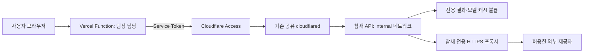

# 맥미니 현재 운영 구성 — 2026-09-15

이 문서는 07:38 KST 이후 실제 전환·검수 기록이다. 과거의 “472aff7 유지/미배포” 기록보다 우선한다. 프론트 저장소와 Vercel 설정은 변경하지 않았다.

## 실제 배포 결과

- API 원본: `https://chamsae-ai-api.dotseven.cloud`. 기존 `conan-api-dev.dotseven.cloud`는 호환 주소다.
- 실행 소스: `a26264e128ba80485192d7edab42b26414110e09`, main CI `34867911039`.
- 실행 이미지: `ghcr.io/dynamic-juo/be@sha256:6789f47a51d5fa879d7cf3e39e0b0711b49a9c9bee651262252b7c9166ca9a15`. 사전에 release/OCI 서명과 CI 신원을 검증한 digest로 교체했다.
- Compose project/service/container는 `conan-staging` / `deepcheck-api` / `conan-staging-deepcheck-api-1`로 유지해 기존 Tunnel 목적지를 보존했다.
- 기존 완료 결과 11건을 접수 차단·유휴 확인 후 백업하고 새 결과 볼륨으로 이관했다. 새 `/ready`에서 completed 11, inflight/backlog 0, `durable-terminal-v1`, `durable-api-drain-v1`, accepting을 확인했다.
- UID/GID 10001, read-only root, cap-drop ALL, no-new-privileges, PID 128, CPU 2, RAM 3GiB, 임시 공간 768MiB다. 호스트 포트·Docker socket·홈 디렉터리를 API에 마운트하지 않는다.
- public mode `gateway`, 영속 quota DB, Turnstile 및 전달 키를 설정했다. 전달 키 없이 `/api/jobs`는 404다. 과거 결과는 보존됐지만 새 공개 조회 토큰이 과거 사용자에게 자동 발급되는 것은 아니다.

## 연결 경계

- API는 `chamsae-ai-private` internal 네트워크에만 연결된다. 프록시는 같은 내부망과 `chamsae-ai-outbound`에 연결된다. 프록시 내부 IP는 `192.168.155.2`로 고정했다.
- 프록시는 CONNECT/443 및 지정 도메인만 허용하고 사설·loopback·link-local·Tailscale 주소를 거절한다. 실제 API에서 맥미니 Tailscale SSH, 내부 gateway SSH, 직접 공용 IP 443 연결 차단을 확인했다.
- 기존 cloudflared에 새 내부망을 연결하고 기존 Compose에 영속화했다. 터널과 Laravel·모니터링은 재시작하지 않았고 다른 7개 컨테이너는 계속 Up이었다.
- **공유 cloudflared, 동일 OrbStack VM/커널, 동일 macOS 로그인 UID는 남은 신뢰 경계다.** 독립 VM·전용 서비스 계정·전용 터널로 완전히 분리한 상태가 아니다. Access 인증을 서버 격리 완료로 표현하지 않는다.

## 서버 파일과 재개 방법

서버 기준 루트 `B=/Users/dotseven/srv/ConanAi`다. 로컬 개발 머신 경로가 아니다.

| 목적 | 서버 경로·대상 |
| --- | --- |
| 고정 controller | `B/ops-controller/a26264e` |
| controller 설정 | 위 디렉터리의 `host-config.json` (schema 5) |
| API Compose | 위 디렉터리의 `compose.runtime.yml` |
| 프록시 Compose/ACL | 위 디렉터리의 `egress.json`, `squid.conf` |
| 환경/인증 | `B/ops-secrets` (0700, 비밀 파일 0600) |
| durable 배포 상태 | `B/ops-state/chamsae-ai` |
| 이관·시험 증거 | `B/ops-backups/migration-20260915-073732` (비공개) |
| 원본 캐시 | `conan-staging_model-cache` — 보존 |
| 이관 캐시 | `chamsae-ai-cache-ready-20260915` |
| 결과 볼륨 | `chamsae-ai-results` |

고정 helper는 a26264e의 scripts를 사용하며 `b7abf03`의 Python 3.9 호환 수정 두 줄을 적용했다. `helper-patch.json`에 base/patch/hash를 남겼다. 시스템 `/usr/bin/python3`를 유지했고 새 Python·Node·runner 패키지는 설치하지 않았다. 기존 Docker/Compose/gh 실행 파일의 보호 경로 복사본을 사용한다. 앞선 작업의 Homebrew gh 설치와 이번 파일 복사를 구분한다.

컨트롤러 `initialize`는 성공했다. **상시 자동 배포는 꺼져 있다(`enabled=false`), launchd도 설치하지 않았다.** 자동 승인 검토가 향후 원격 릴리스를 지속적으로 적용할 명시적 승인이 없다는 이유로 활성화를 거부해 사용자 승인을 요청했다. 거부된 명령은 실행되지 않았다. 승인 전 설정을 켜거나 우회 실행하지 않는다.

최초 전환이 끝났으므로 다음 교체는 [보안 런북](development-cd-runbook.md)의 controller 경로로 한다. 임의 `compose up`, state 삭제·재초기화, 오래된 `.env.home` 덮어쓰기로 되돌리지 않는다. 장애 시 현재 state/journal과 `recover`를 먼저 확인한다. 원본 env/Compose/결과/이미지 신원은 백업돼 있지만 초기화 후 구버전으로 수동 롤백하면 controller 상태와 불일치하므로 별도 사고 복구 검토가 필요하다.

## 검수 결과와 제한

| 검사 | 실제 결과 |
| --- | --- |
| 외부 `/health` | 정상 Service Token 200, 미인증·변조 토큰 302 (redirect 미추적, 동일 UA) |
| 실행 컨테이너 | healthy, `/ready` ready, 완료 결과 11건 복원 |
| 실영상 `cYRkZmBuDqI` | 자막 off, 17.3초; 다운로드·8프레임·얼굴/분류기·STT·정리 성공 |
| 실영상 판정 | `partial`: 검증 주장 0건, 전체 AI 생성 모델 미선정으로 unavailable |
| 실제 DeepSeek·NAVER | 고정 가상 문장으로 주장 1건 추출, NAVER 뉴스/백과 각 2건 검색, 판정 경로 완료 |
| 가상 문장 판정 | 검색 발췌만 있고 원문 provenance가 미검증이어서 `unverified/weak_source`. 실제 영상의 사실 검증 성공으로 세지 않음 |
| Python 호환 수정 | 로컬 배포 상태/controller/watcher 검사 221 passed, 실제 서버 initialize 성공 |

실영상 CLI의 exit 0만으로 전체 성공을 선언하지 않았다. Matplotlib의 `/home/app/.config` 쓰기 경고는 read-only root에서 발생했고 임시 디렉터리 fallback 후 영상 처리는 완료됐다. 이후 환경 변경 검토 때 `MPLCONFIGDIR`를 writable 임시 경로로 지정할 수 있다.

공개 전 남은 조건은 정상 브라우저 Turnstile 토큰과 Vercel Function E2E, 강제로 종료할 수 있는 분석 작업 시간 제한, 원문 확보·provenance 검증 및 전체 AI 생성 모델 미선정 사항의 기획 정리다. `PUBLIC_GATEWAY_ENABLED=false`를 유지한다. 프론트 작업은 [FE 인수 문서](frontend-integration.md)를 팀장이 반영한다. API health 성공을 일반 사용자 공개 완료로 표현하지 않는다.
