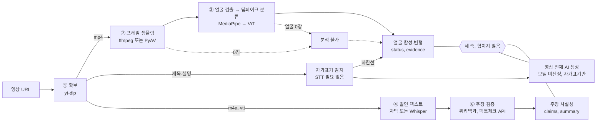
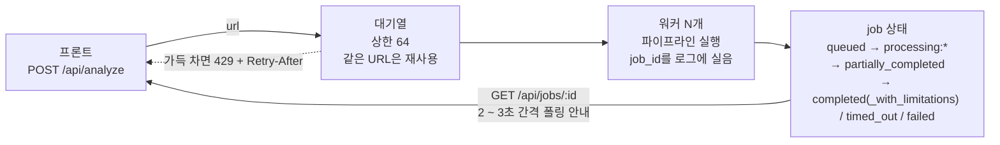

# 파이프라인 해부도

영상 URL 하나가 들어와서 두 갈래의 분석 결과가 나오기까지, 무엇이 무엇에게 무엇을 넘기는지 정리한다.
각 단계에서 쓰는 라이브러리와, 그 라이브러리를 갈아끼우려면 어디를 건드려야 하는지도 함께 적는다.

- 구현 설명 기준: 2026-09-13 `be` main `38bd16263afbf79daffd67878277c3af0a4a5d51`.
- 기획 비교 기준: `docs` main `8d07ff36e127012a4cb67adeea7ef45292bd85c0`. 근거 정책만 `Accepted`이고 PRD·MVP·파이프라인·런타임·UI 문서는 `Draft`이므로 문서 안의 `확정` 표기와 저장소 승인 상태를 구분한다.
- 리뷰 비교 기준: 열려 있는 [docs PR #7](https://github.com/Dynamic-Juo/docs/pull/7)의 질문·제안. 승인 리뷰나 main 병합이 아니며 과거 `be` `cfe37fc`에 대한 구현 평가는 현재 사실로 재사용하지 않는다.
- 이번 검증: 외부 연결·실제 모델 없이 네트워크 차단 fixture로 전체 모의 테스트 `329 passed, 2 warnings`. 실제 영상 정확도와 제공자·배포 연동은 검증하지 않았다.
- 아래 라이브러리 버전과 실측 표: 2026-09-08 문서에 남긴 당시 기록(Docker, CPU 전용, Python 3.12). 현재 설치 버전·배포 성능으로 재확인한 값이 아니다.

요구사항별 소스 근거·리뷰 의견·우선순위·완료 조건은 [최신 기획 대비 소스 감사](source-audit.md), API·Swagger 계약은 [API 계약](api-reference.md)을 따른다. 이번 감사에서 서버 설정·배포·프런트엔드·환경 파일은 변경하지 않았다.

## 동작 원리

구현이 지켜야 할 원칙과 현재 한계를 구분한다.

1. **세 축을 합치지 않는다.** 실제 인물이 나온 영상에도 허위 주장이 있을 수 있고, AI로 만든 영상의 발언이 사실일 수도 있다. 얼굴 합성·변형, 영상 전체 AI 생성, 주장 사실성은 끝까지 별도의 결과로 남는다.
2. **못 한 것과 정상을 구분한다.** 프레임을 못 뽑았거나 얼굴을 못 찾았을 때 "뚜렷한 조작 징후 없음"이라고 답하면 실패가 무죄 판정으로 둔갑한다. 이런 경우 상태는 `unavailable`("분석 불가")이다.
3. **하지 않은 판단을 하지 않는다.** 근거를 못 찾은 것은 거짓의 근거가 아니다. 전문 기관의 검색 `rating`도 직접 옮기지 않으며, 일치·불일치는 검증된 원문·출처 충분성·인용 조건을 통과해야 한다. 현재 실제 검색 경로는 원문 검증이 없어 이 조건을 충족하지 못한다.
4. **숫자로 확신을 과장하지 않는다.** 미디어 조작 두 축은 연속 점수를 계산하고 raw API의 `signals`에도 포함한다. 현재 UI 계약은 `조작 의심`/`뚜렷한 조작 징후 없음`/`판단 보류`/`분석 불가` 네 범주만 보여주는 방향이다. API 소비자까지 숫자가 비공개라고 표현하면 안 되며, 외부 계약에서 제거할지는 승인할 항목이다.

## 전체 흐름

논리적으로 픽셀을 보는 경로와 말을 읽는 경로를 구분한다. 실제 실행은 다운로드 → 프레임·얼굴 분석 → 발언 확보 → 주장 검증 순서이며 아래 연결을 동시 실행으로 읽으면 안 된다. 세 축은 서로의 판정을 전제하지 않고 각자의 블록으로 응답에 실린다.



실선은 처리 경로, 점선은 분석 불가 경로다. 자가표기는 제목·설명만 보므로 STT 전에 계산하고 미디어 결과를 먼저 통지한다. 단순 키워드가 얼굴·전체 AI 두 축에 동시에 작용하는 현재 자가표기 정책은 정확성 한계가 있으며 변경 승인이 필요하다. 명시적 제작 고지를 검증한 결과라고 해석하지 않는다.

## 단계별 상세

### ① 영상, 오디오, 자막 확보

현재 main은 YouTube 영상 ID를 정규화한 URL만 수집하고 영상·오디오 스트림을 나눠 받는다. 다운로드 전 메타데이터로 공개 상태·연령 제한·길이·실시간 여부를 검사한다. 실제 Shorts 분류와 한국어 여부는 검증하지 않는다. 현재 main의 자막 기본값은 `manual`이라 등록 CC를 별도 수집하며, 이는 docs main과 2026-09-13 최신 결정인 “기본 `off`, `manual`·`any` 선택 사용”과 다르다. 별도 `fix/captions-opt-in` 브랜치의 `58a51cf`가 이 변경을 구현했다는 전달은 받았지만 이 문서의 소스 판정은 main에 고정한다. TLS 인증서 검증은 켜 둔다.

| 항목 | 내용 |
| --- | --- |
| 라이브러리 | `yt-dlp` 2026.8.19 (Unlicense) |
| 입력 → 출력 | YouTube URL → `.v.mp4`(720p 이하), `.a.m4a`, 선택적 자막, 메타데이터 |
| 실패하면 | 영상 실패는 분석 중단(`download_failed`, 재시도 가능). 오디오만 실패하면 영상 컨테이너를 STT 입력으로 대체하고 경고 로그를 남긴다 |
| 교체 지점 | `downloader.download()`, 해상도 상한 `DEEPCHECK_MAX_VIDEO_HEIGHT` |

### ② 프레임 샘플링

duration을 알면 영상 길이를 기준으로 균등한 목표 시각을 계산한다. 시스템 ffmpeg가 있으면 seek 기반으로 뽑고, 실패하거나 없으면 PyAV로 폴백한다. PyAV도 duration이나 frame 수를 알 때는 간격을 계산하지만 둘 다 알 수 없으면 앞에서부터 제한된 프레임만 디코딩할 수 있어 영상 전체 균등 샘플링을 보장하지 못한다. 실제 샘플 시각도 결과에 보존하지 않는다.

| 항목 | 내용 |
| --- | --- |
| 라이브러리 | `ffmpeg`(있으면) → `PyAV` 18.1.0 폴백, `Pillow` 12.3.0 |
| 입력 → 출력 | mp4 → `frame_000.jpg` 등 기본 8장 (480px 폭) |
| 실패하면 | 한 장씩 실패는 흡수하고 개수를 로그에 남긴다. 0장이면 영상 축은 판단 불가. ffmpeg 호출에는 프레임별 타임아웃이 있지만 PyAV 디코딩에는 wall-clock 중단이 없다 |
| 교체 지점 | `downloader.extract_frames()`, 장수 `DEEPCHECK_MAX_FRAMES` |

### ③ 얼굴 검출과 딥페이크 분류

현재 분류기의 입력은 얼굴 crop이다. MediaPipe가 돌려준 detection 중 면적이 가장 큰 얼굴 하나를 찾아 35% 여백을 붙여 잘라낸 뒤 분류기에 넣는다. 얼굴을 못 찾은 프레임은 분류와 영상 점수 집계에서 제외한다. 여러 인물의 모든 얼굴, 사람 추적, 인물별 결과를 분석하는 구현은 아니다. [PR #7 다중 얼굴 댓글](https://github.com/Dynamic-Juo/docs/pull/7/files#r3958648232)은 “여러 명 중 한 명이라도 잡혀 추출되면 충분한가”라는 질문일 뿐 “한 얼굴이라도 이상이면 전체 의심”이라는 판정 규칙이 아니다. docs main도 처리·집계를 미정으로 두므로 사용자 확인 전 판정 규칙을 바꾸지 않는다.

| 항목 | 내용 |
| --- | --- |
| 라이브러리 | `MediaPipe` 1.0.1 BlazeFace short-range, `transformers` 5.16.1 + `torch` 2.14.0+cpu |
| 모델 | `dima806/deepfake_vs_real_image_detection` (ViT 이미지 분류), `blaze_face_short_range.tflite` 230KB |
| 입력 → 출력 | 기본 프레임 8장 중 얼굴 crop 분류 성공 점수 0-1, 라벨, crop 적용 여부 |
| 실패하면 | 얼굴·유효 분류 점수가 없으면 시각 신호는 분석 불가. 휴리스틱으로 정상 판정하지 않으며 탐지기 생성·실행 오류가 나도 발언 분석은 계속 |
| 교체 지점 | `deepfake.DeepfakeDetector`, 모델 `DEEPCHECK_CLASSIFIER_MODEL`, 얼굴 검출은 `face.crop_face()` |

기존 Dockerfile은 `libegl1`과 `libgles2`를 설치한다. 얼굴 모델 파일 존재만으로 사용 가능하다고 보고하지 않고 실제 로딩 상태를 구분한다. 알 수 없는 라벨이나 비정상 범위 점수도 fake 확률로 대체하지 않는다. 현재 분류기 모델 페이지에는 라이선스 표시는 있으나 데이터셋·도메인·성능을 MVP 입력에 적용할 충분한 근거가 없어 정확성은 미검증이다. Docker의 현재 실행 상태도 이번에 검사하지 않았다.

### ④ 발언 텍스트 확보

감사 기준 main의 기본값은 `manual`이다. 업로더 등록 CC를 우선 파싱하고 사용할 CC가 없으면 STT로 넘어간다. 자동 생성 CC는 제외하며 영상 속 글자의 OCR은 아니다. `off`는 항상 STT, `any`는 자동 CC도 허용하는 명시적 옵션이다. 자막을 사용한 결과에는 `transcript_source=caption`, STT 결과에는 `stt`를 남기고 manual/automatic 세부값은 stage detail에만 남는다. 등록 CC의 정확성·전문 여부나 불완전 CC의 자동 탐지가 검증됐다는 뜻은 아니다.

목표 계약은 2026-09-13 확정된 `off` 기본과 `manual`·`any` 선택 사용이다. PR #7의 등록 CC 조건부 긍정보다 최신 지시와 docs main 방향이 우선한다. 이 감사 브랜치는 구현 코드를 바꾸지 않으며, 별도 자막 구현 커밋이 main에 통합되면 설정·API·compose·테스트를 함께 다시 확인한다.

| 항목 | 내용 |
| --- | --- |
| 라이브러리 | 자막은 직접 파싱(의존성 없음), STT는 `faster-whisper` 1.2.1 + `CTranslate2` 4.8.2 |
| 실행 조건 | CPU `int8`, CUDA가 있으면 `float16`. CTranslate2는 Apple MPS를 지원하지 않아 맥에서도 CPU 경로다 |
| 입력 → 출력 | vtt 또는 m4a → 전체 텍스트, 타임스탬프 세그먼트, 언어 |
| 실패하면 | STT 실패는 분석을 멈추지 않는다. 텍스트 없이 영상 축만 응답하고 `stages.transcript`에 실패가 남아 무음 영상과 구분된다 |
| 교체 지점 | `pipeline._collect_transcript()`, 정책 `DEEPCHECK_CAPTION_POLICY`, 모델 크기 `DEEPCHECK_WHISPER_MODEL_SIZE` |

기존 `coverage_pct`/`stt_coverage_pct`는 STT의 입력 오디오 길이 또는 마지막 자막 시점을 영상 길이로 나눈 값이다. 100%여도 발언을 모두 정확히 인식했다는 뜻이 아니다. 현재 main은 `coverage_basis`, 텍스트가 있는 타임스탬프의 합집합 비율 `segment_coverage_pct`, 한계 설명을 제공한다. 이 구간 비율도 정확도·발언 완전성 지표는 아니다. 3단어 전사 사례의 실제 인식 품질은 별도 검증이 필요하다.

### ⑤ 텍스트 신호 추출

현재는 제목·설명에 "AI로 제작", "패러디", "딥페이크" 같은 문자열이 있는지 검사한다. 제작자가 사실대로 고지했는지 검증하는 기능은 아니며, 교육 영상의 단순 언급이나 부정문도 오탐할 수 있다. 이 신호가 두 미디어 축에 작용하는 기존 정책은 이번에 바꾸지 않았다. 유형별 명시적 고지와 단순 언급을 구분하는 변경은 승인 후 다룬다. 클릭베이트·주장 강도·합성음성 신호는 미디어 조작 점수에 넣지 않는다.

| 항목 | 내용 |
| --- | --- |
| 라이브러리 | 없음. 정규식과 키워드 사전 |
| 입력 → 출력 | 제목, 설명, 전사 텍스트 → 자가표기 0-100, 합성음성 의심 0-100, 요약, 키워드 |
| 교체 지점 | `analyzer.detect_self_disclosure()`, 키워드 사전은 같은 파일 상단 |

### ⑥ 주장 추출, 근거 검색, 판정

주장 추출은 설정으로 선택한다. 기본 `rule`은 수치·연도 등 규칙으로 문장을 고른다. `llm`은 발언 전문의 주장·문맥을 구조화하고 서버가 원문을 대조한다. 명시적 LLM 모드의 제공자·호출·JSON·검증 실패는 규칙 결과로 조용히 바꾸지 않으며, 정상적인 빈 `claims` 배열과 실패를 구분한다. 다만 유한 상한을 채우면 뒤 LLM 항목은 검증하지 않고, 판정 LLM 장애는 `done/not_direct`로 접히는 등 실패 의미가 일관되지는 않다. 이 검증은 원문의 주장을 빠짐없이 찾았다는 보증도 아니다.

문장을 그대로 검색하면 매칭이 안 되므로 조사를 떼고 식별력 높은 낱말 6개로 질의를 만든다.

| 항목 | 내용 |
| --- | --- |
| 검색 수단 | Google Fact Check Tools(키 필요), NAVER API HUB 검색 — 뉴스·백과사전(키 필요), 위키백과 ko·en(키 불필요), GDELT(기본 off, 과거 기록에 16초 이상·429가 남음) |
| 입력 → 출력 | 전사 텍스트와 세그먼트 → 주장 후보(기본 개수 상한 없음), 첫 발언 위치, 근거 링크와 출처 유형, 판정과 이유 |
| 실패하면 | 정상 검색의 빈 결과는 `no_source`. 제공자 실패 때문에 자료 유무를 확인할 수 없으면 카드 `failed`로 구분하고 가능한 나머지 분석은 계속. 전체 시간 초과 시 미시작 주장은 `timed_out` |
| 교체 지점 | `claims.select_extractor()`, `claims.EvidenceProvider`, `llm.LLMProvider`, 수단 `DEEPCHECK_EVIDENCE_PROVIDERS` |

현재 main 기본값 `max_claims=0`은 개수 상한을 두지 않는다. docs Draft 내부의 M-04는 “검증 가능한 주장을 모두 검증”으로 기록하지만, [PR #7 후속 질문](https://github.com/Dynamic-Juo/docs/pull/7/files#r3958833798)은 상한을 추후 미팅으로 유보했다. 최종 상한은 기준 문서 승격 과정에서 정리해야 한다. 코드가 상한을 없애도 규칙·LLM 추출의 recall을 측정하지 않았으므로 “모든 주장”을 보증하지 않는다.

주장 카드는 기본 설정에서 3건까지 병렬로 검증한다. 이 병렬성은 **서로 다른 주장 사이**에만 적용된다. `DEEPCHECK_CLAIM_WORKERS`에는 3의 강제 상한이 없어 환경값을 키우면 그만큼 worker가 열린다. 주장 하나의 Google Fact Check, Naver, Wikipedia 등 제공자는 설정 순서대로 호출하며, 같은 호스트는 전역 lock으로 더 직렬화된다. API orchestration은 `DEEPCHECK_EVIDENCE_BUDGET_SEC=30`을 사용하지 않고 전체 600초 deadline을 주장 시작 전에만 확인한다. 이미 시작한 제공자나 LLM 호출을 끊는 claim 전용 예산은 없다.

## 미디어 조작 두 축이 정해지는 방식

내부적으로는 여전히 연속 점수를 계산한다. raw API는 `signals`에 이 숫자를 포함하고 현재 UI 설계만 네 범주를 보여준다. 얼굴 합성·변형과 영상 전체 AI 생성은 서로 다른 함수로 만든다.

기본 집계는 `trimmed_mean`이다. 얼굴 crop 분류 성공 점수가 3개 이상이면 최솟값·최댓값 하나씩을 제외한 평균, 그보다 적으면 평균을 사용한다. `blend`를 명시한 경우에만 `max(평균, 평균×0.6 + 최댓값×0.4)`를 사용한다. 두 방식의 계수·임계값은 이번에 변경하지 않았다.

기존 자가표기 점수가 50 이상이면 얼굴 축에는 `max(시각 점수, 표기×0.9)` 하한선을 적용한다. 70 이상은 `조작 의심`, 45 이상은 `판단 보류`, 그 미만은 `뚜렷한 조작 징후 없음`이다. 시각 신호와 자가표기 모두 없으면 `분석 불가`다. 이 숫자는 검증된 확률이 아니며 자가표기 정책의 오탐 한계는 위에서 설명했다.

**합성음성(TTS) 의심은 이 계산에 들어가지 않는다.** docs Draft는 음성 합성 탐지를 MVP에서 제외한다고 기록한다. 블렌드 가중치와 플로어 계수는 검증된 최적값이 아니다. 과거 기록에는 블렌드가 8장 중 한 장 98.4% 사례의 점수를 13.1에서 47.2로 높였다고 남아 있지만, 이번 감사의 새 실측이 아니며 기본 집계도 블렌드가 아니다.

클릭베이트와 주장 강도는 이 계산에 들어가지 않는다. 자극적인 제목의 진짜 영상이 AI 가짜 쪽으로 밀리는 것을 막기 위해 조작 축에서 분리했다.

**영상 전체 AI 생성 탐지는 전용 모델이 없다.** 현재 코드는 자가표기 점수 50 이상이면 `조작 의심`, 없으면 `분석 불가`로 표시한다. 해당 축이 `unavailable`이면 필수 축 누락으로 전체 결과도 `partial`이다. 모델 미선정을 완전한 분석 성공으로 처리하지 않는다.

## 주장 검증 흐름

우리가 내는 판정은 주장의 진위가 아니라 **주장과 근거의 관계**다. `근거와 일치`는 "이 주장은 참이다"가 아니라 "우리가 찾은 근거는 이 주장과 일치한다"는 뜻이다 — 주어가 주장이 아니라 근거다.

LLM 추출 결과를 원문과 대조한 뒤 관련 자료를 검색한다. 전문기관 판정이 같은 주장에 관한 것인지 보수적으로 비교하고 충돌하면 유보하지만, 단일 `rating`을 현재 판정으로 직접 옮기지는 않는다. LLM의 일치·불일치 제안은 검증된 원문, 출처 충분성, 인용 대조를 모두 통과해야 한다. 실패 시 자료를 참고로 남기고 유보한다.

### 인용을 코드로 대조한다

현재 검색 제공자의 자료는 `content_scope=search_excerpt`인 제목·요약문이다. 기사 원문 수집·출처 대응·독립 출처 검증기는 미구현이다. 서버가 요구하는 `content_scope=original`, `provenance_verified=true` 및 원문 본문 조건을 현재 실제 검색 경로가 충족하지 못하므로 일치·불일치를 확정하지 않는다. [프롬프트 평가](prompt-evaluation.md)의 한계를 함께 읽는다.

LLM을 판정에 넣으면 근거가 부실해도 그럴듯한 판정을 만들어낼 위험이 생긴다. 허위 정보를 다루는 서비스가 그러면 우리가 막으려던 것과 같은 일을 하게 된다.

LLM의 인용 번호·문장을 검증하고 지목한 자료에서 문자열을 대조한다. `cite_reason`은 비어 있지 않은지만 검사한다. 잘못된 인용이 하나라도 있으면 판정을 버린다. 이것만으로는 충분하지 않다. 인용한 모든 자료의 원문·출처 대응이 확인돼야 하며, 검증된 1차 출처 하나 또는 서로 다른 원문 계보 두 개 이상을 요구한다. LLM 답변이나 출처 유형 문자열만으로 검증 상태를 부여하지 않는다. 인용 문자열 일치 자체가 관련성·시점·의미 정확성을 보증하지는 않는다.

현재 양성 fixture에는 원문 “상승률은 6.0%로 집계됐다”와 주장 “상승률은 6.0%를 넘었습니다”를 `SUPPORTED`로 기대하는 모순이 있다. 프롬프트 지시와 달리 서버 gate는 비교 연산자의 의미 차이를 잡지 못한다. 실제 provider가 원문 근거를 만들지 못해 현재 기본 경로에서는 잠복해 있지만, 원문 collector보다 먼저 고쳐야 할 거짓 양성 경계다.

주장 추출도 주장·문맥이 발언 전문에 있는지 대조한다. 비어 있지 않은 추출 응답의 항목 검증이 실패하면 `unavailable`로 드러낸다. 잘못된 항목을 버린 뒤 정상적인 "주장 없음"으로 바꾸지 않는다.

대조는 공백과 인용부호 차이를 무시한다. 모델이 줄바꿈이나 따옴표를 바꿔 옮기는 것은 흔한 일이고, 지어낸 것과는 다르다.

### 근거 부족은 사유를 구분한다

`근거 부족`은 하나가 아니다. 왜 판정하지 못했는지에 따라 사용자가 할 수 있는 일이 다르다.

| 사유 | 언제 |
| --- | --- |
| `no_source` | 검색했지만 관련 자료를 찾지 못함 |
| `not_direct` | 자료는 있으나 주장을 직접 확인하지 못함 |
| `timeout` | 시간 내 확인하지 못함 |
| `time_mismatch` | 주장과 자료의 기준 시점이 다름 |
| `source_conflict` | 신뢰할 수 있는 출처들이 서로 충돌 |
| `weak_source` | 출처의 내용이 판정에 충분하지 않음 |
| `partial` | 복합 주장의 일부만 확인됨 |

코드는 검색의 정상 빈 결과·제공자 장애·시작 전 deadline 경과·알려진 팩트체크 rating 충돌·원문 충분성 실패를 일부 구분하고, LLM의 부족 사유도 허용된 코드만 받는다. 그러나 판정 LLM 장애는 `done/not_direct`, 예상 밖 claim 예외는 상세 사유 없는 `failed`, 이미 시작한 호출 timeout은 일반 실패나 부족으로 접힐 수 있다. 일반 원문 충돌·시점·부분 확인은 대부분 모델 출력에 의존한다.

`time_mismatch`가 특히 중요하다. 2022년 발언을 2019년 자료와 대조해 수치가 다르다는 이유로 `근거와 불일치`를 내면 그건 틀린 판정이다. 시점이 다른 것뿐이기 때문이다.

### 한 영상에 여러 내용이 나올 때

영상 하나에 검증할 사실이 여럿이고, 뉴스처럼 여러 꼭지가 붙은 영상은 주제도 여럿이다. 세 가지로 대응한다.

- **분산 선택**: 규칙 추출에서 유한한 개수 상한을 명시한 실험 경로는 구간 분산 선택을 한다. 기본 `max_claims=0`은 개수 제한 없음이며, 이 보조 선택 기능이 "모든 주장 추출"을 보증하지는 않는다.
- **중복 제거**: 핵심어가 70% 이상 겹치면 같은 사실로 보고 하나만 남긴다. “늘렸다/줄였다”처럼 반대 의미도 합칠 수 있고 반복 횟수·위치는 보존하지 않아 의미 중복기로는 미완성이다.
- **발언 위치**: 주장 앞 12자가 포함된 첫 자막·전사 세그먼트를 우선 붙인다. 이 조건만으로 `exact`가 될 수 있고 모든 언급 위치를 남기지 않으므로 사용자의 원문 확인 요구를 아직 충족하지 않는다.

**문맥을 넘는 주장**은 규칙 기반의 구조적 한계였다. "그는 작년에 3조원을 썼다고 밝혔습니다"에서 "그"가 누구인지는 앞 문장에 있는데, 문장 단위로 뽑으면 주어 없는 주장을 그대로 들고 가게 된다. 종결어미를 아무리 보강해도 이건 못 잡는다.

LLM 추출(`DEEPCHECK_CLAIM_EXTRACTOR=llm`)은 대명사가 가리키는 대상을 문맥에서 찾아 함께 기록하도록 요청한다. 서버는 주장과 문맥이 전문 어딘가에 있는지만 검사해 서로 인접한지, 실제로 대명사를 해소하는지는 확인하지 않는다. 주장 문장 자체를 원문 그대로 두라는 지시는 환각 위험을 줄이지만 부분 문자열·먼 문맥·모델이 적은 repeat까지 막지는 못한다.

두 개의 필터가 있다. **미래 전망**("조만간 7%도 넘어설 것으로 보입니다")은 규칙 경로가 코드로 제외하지만 LLM 경로는 프롬프트 지시일 뿐이다. **관련성 필터**는 검색 엔진이 돌려준 무관한 문서를 줄인다. 주장의 상위 핵심어 하나만 제목이나 인용문에 있어도 통과할 수 있어 같은 연도만 공유하는 다른 주제 자료도 남는다. 결과가 없으면 "근거를 찾지 못했다"고 말하지만 이 필터를 직접성 검증으로 해석하면 안 된다.

키워드 겹침은 무관한 자료를 줄이는 최소 필터일 뿐 참·거짓 판정 기준은 아니다. LLM 판정을 끄면 검색 `rating`만으로 지지·반박을 대신 결정하지 않고 유보한다. 명시적 LLM 추출 실패와 규칙 모드 선택은 별개다.

## 요청이 처리되는 방식

현재 main은 실행 워커와 실제 대기열을 분리했다. 기본 동시 실행 영상 1건, 대기열 상한 64건이다. 입력별 사용량·외부 공개 요청 제한과 하드 실행 중단은 별도 공개 전 과제로 남는다.

분석 한 건이 수십 초에서 수 분이라 요청 스레드에서 돌릴 수 없다. 작은 워커 풀과 상한 있는 대기열로 받고, 클라이언트는 job을 폴링한다.



현재 구조에서 uvicorn은 단일 워커 프로세스여야 한다. job 상태를 프로세스 메모리에 들고 있어서 프로세스가 여럿이면 조회가 무작위로 404가 날 수 있다. 동시 실행은 `DEEPCHECK_WORKERS`로 조절한다. job은 메모리 보관 상한 200건이며 새 작업 접수 때 완료 작업만 개수 기준으로 정리한다. TTL과 영속화가 없어 재시작하면 사라진다. 실제 배포 프로세스 수는 이번에 확인하지 않았다.

현재 중복 처리 키는 URL만 비교한다. 같은 영상의 다른 모델·자막 옵션 요청도 진행 중인 첫 작업을 재사용하는 한계가 있으며, 옵션까지 포함한 중복 키는 아직 구현하지 않았다. `session_id`는 인증된 브라우저 식별자가 아니라 클라이언트가 고르는 문자열이고, 없으면 요청마다 새 UUID가 생긴다. 세션당 1건 제한을 보안·쿼터로 볼 수 없으며 job 조회도 ID 소유권을 검사하지 않는다.

### 공개 실행과 보안 경계

대기열 상한과 CORS는 공개 API의 인증·인가·비용 제한을 대신하지 않는다. 현재 요청자는 STT 모델, 프레임 수, VLM 모델 등 비용이 큰 옵션을 고를 수 있고 Pydantic의 알 수 없는 추가 필드는 기본적으로 무시된다. job ID를 아는 요청자는 소유권 확인 없이 결과를 조회할 수 있다. 공개 전에 서버 발급 사용자·세션, job ownership, 사용자/IP별 rate·동시성·일일 비용 quota, 허용 모델·옵션 목록을 계약으로 고정해야 한다.

다운로드는 YouTube host와 ID를 정규화하고 TLS를 확인하지만 실제 body byte·디스크·자막·전사 길이의 전체 상한은 없다. redirect마다 DNS 결과와 private/reserved IP를 재검증하는 egress 정책도 없다. 지금은 provider가 돌려준 원문 URL을 서버가 다시 가져오지 않지만, 원문 수집기를 추가할 때 scheme·host allowlist, A/AAAA public IP, redirect, content type, 압축 해제 후 크기를 함께 제한해야 한다.

클라이언트 오류 응답은 일반화하지만 내부 exception과 traceback에는 signed URL·로컬 경로·외부 응답 일부가 들어갈 수 있다. VLM 오류 문자열은 base URL·model·raw reason을 stage evidence를 통해 job 응답에 노출할 가능성이 있고 `session_id`는 길이만 제한한 채 로그 label에 쓰인다. credential·URL query·제어문자·파일 경로를 중앙에서 redaction하고 사용자 응답은 고정 오류 코드만 내보내야 한다.

### 점진적 결과 전달

`job.result`는 완성되는 대로 갱신되는 mutable dict다. 미디어 조작 두 축은 준비되는 즉시, 주장은 개수가 확정되면 카드를 전부 대기 상태로 만들어 통지하고 하나씩 검증하며 갱신한다. `Harness.get()`은 lock 안에서 Job 참조만 꺼내고 API가 lock 밖에서 직렬화하므로, 갱신과 폴링이 겹친 순간의 immutable snapshot은 보장하지 않는다. revision을 둔 lock 내부 복사와 동시 read/write 시험이 필요하다. 아래는 이전 버전의 폴링 로그(20분 영상 예시)이며 현재 MVP 입력 범위의 성능 측정이 아니다.

```
t=4s   status=processing:collecting        result={}
t=40s  status=partially_completed          result에 face_manipulation, whole_video_generation, claim_verification 등장
                                            claim_verification.claims의 status가 done/pending 혼재
t=44s  status=completed                    모든 카드가 done, 나머지 최상위 키(media, stages, ...)도 채워짐
```

메타데이터를 제외한 첫 분석 부분 결과가 도착하는 순간 `queued`/`processing:*`에서 `partially_completed`로 전환하고, 그 뒤로는 세부 단계 태그(`processing:transcribing` 등)를 다시 밟지 않는다. 현재 처리 단계는 별도 `job.stage`로 계속 갱신한다. 경과 시간은 `processing_elapsed_sec`와 `queue_wait_sec`로 나누며, 이전 `elapsed_sec`는 접수 후 총 경과로 유지한다.

`DEEPCHECK_MAX_PROCESSING_SEC` 기본 600초는 하드 타임아웃이 아니다. claim 시작 전 deadline을 확인하고 파이프라인 함수가 돌아온 뒤 총 경과가 넘었으면 job을 `timed_out`으로 바꿀 뿐이다. 다운로드 일부와 ffmpeg에는 개별 timeout이 있지만 Whisper·모델 로드·분류기·PyAV·이미 시작한 future를 강제로 끊는 경계는 없다. 서버 종료도 대기 작업만 취소하고 실행 중 작업은 끝나기를 기다린다.

## 갈아끼우기

바꾸고 싶은 것이 생겼을 때 어디를 건드리면 되는지. 대부분은 코드를 고치지 않고 환경변수로 끝난다.

| 바꾸고 싶은 것 | 건드릴 곳 | 코드 수정 |
| --- | --- | --- |
| 딥페이크 분류 모델 | `DEEPCHECK_CLASSIFIER_MODEL`. 얼굴 crop 입력·라벨 의미·출력 범위·라이선스와 성능을 재검증해야 함 | 모델에 따라 필요 |
| STT 엔진 | `transcriber.transcribe()`. `Transcript`(텍스트, 언어, 세그먼트, 길이)만 맞추면 된다 | 필요 |
| STT 모델 크기 | `DEEPCHECK_WHISPER_MODEL_SIZE` (tiny, base, small, medium, large-v3) | 불필요 |
| 얼굴 검출기 | `face.crop_face()`. crop 이미지 경로 또는 `None`만 반환하면 된다 | 필요 |
| VLM 제공자 | `DEEPCHECK_VLM_PROVIDER`. 새 제공자는 `vlm.VLMProvider` 구현 후 등록 | 등록만 |
| 근거 검색 수단 | `DEEPCHECK_EVIDENCE_PROVIDERS`. 새 수단은 `claims.EvidenceProvider` 구현 후 `_build_provider`에 추가 | 등록만 |
| 주장 추출 방식 | `DEEPCHECK_CLAIM_EXTRACTOR=rule/llm`, LLM은 제공자 설정 필요. 새 방식은 `claims.select_extractor()` | 기존 방식 전환은 불필요 |
| 점수 가중치와 범주 경계 | `DEEPCHECK_FRAME_MEAN_WEIGHT`, `DEEPCHECK_FRAME_PEAK_WEIGHT`, `DEEPCHECK_LEVEL_HIGH` 등 | 불필요 |
| 영상 전체 AI 생성 탐지 모델 | 아직 없음. `report.build_whole_video_generation()`이 붙일 자리 | 필요 (신규 구현) |
| 자막 사용 정책 | `DEEPCHECK_CAPTION_POLICY` (manual, any, off) | 불필요 |
| 동시 실행 수와 대기열 | `DEEPCHECK_WORKERS`, `DEEPCHECK_BACKLOG` | 불필요 |
| 전체 처리 시간 예산 | `DEEPCHECK_MAX_PROCESSING_SEC` (기본 600초). 하드 중단 기능과는 다름 | 예산값은 불필요, 하드 중단은 구현 필요 |

모델을 바꾸면 `tests/test_report.py`의 degraded 경로 테스트가 여전히 통과하는지 확인한다. "얼굴을 못 찾으면 판단을 유보한다"는 규칙은 지금 분류기가 얼굴 crop 모델이라는 전제에 기대고 있어서, 전체 프레임으로 학습된 모델로 바꾸면 이 규칙도 함께 손봐야 한다.

## 과거 실측 성능 (현재 main 재검증 아님)

2026-09-08 문서에 남긴 맥북 Docker(CPU 전용, 워커 2) 측정값이다. 당시 코드·설정·영상의 기록으로 유지하며, 현재 기본 워커 1 또는 맥미니 배포 성능으로 환산하지 않는다. 20분 영상은 현재 MVP 입력 범위 밖이다.

| 구간 | 26초 영상, 자막 없음 | 20분 영상, 자막 있음 | 메모 |
| --- | --- | --- | --- |
| 다운로드 | 4.9초 | 약 15초 | 네트워크와 영상 길이에 비례 |
| 프레임 추출 | 0.6초 | 4.2초 | 영상 길이와 무관하게 장수에 비례 |
| 얼굴 검출과 분류 | 25.1초 | 약 20초 | 지배적 구간, CPU 성능에 직결 |
| 발언 텍스트 | 11.7초 | 0.0초 | 자막이 있으면 통째로 사라진다 |
| 주장 검증 | 0.0초 | 9.0초 | 주장 수 곱하기 검색 수단, 예산 30초 |
| 합계 | 약 45초 | 약 50초 | 첫 실행은 모델 다운로드로 더 걸린다 |

당시 컨테이너 메모리 약 1.08GB, 이미지 1.89GB(arm64)로 기록됐다. 현재 이미지 크기·피크 메모리·최소 장비 사양을 재검증한 결과는 아니다.

### 한국어 STT 실측

아래도 당시 한국어 뉴스 표본의 STT 기록이다. 이번 감사에서 모델을 재실행하지 않았고 고정 정답 전사에 대한 정량 평가도 아니다.

| 모델 | 영상 길이 | STT 소요 | 전사 품질 |
| --- | --- | --- | --- |
| `small` | 2분 | 88.6초 | 대체로 정확. "외환위기"를 "외환 외기"로 옮기는 정도의 오류 |
| `tiny` | 2분 23초 | 53.1초 | "7월"을 "18월", "물가"를 "물건", "이창용"을 "2장용"으로 옮김 |

당시 `tiny` 표본의 수치·고유명사 오류는 후속 주장 검증을 오염시킬 수 있다. 이 표만으로 모델의 일반 한국어 성능을 확정하거나 기능을 끄기로 결정하지 않는다. 자막도 오기·발언 불일치가 있을 수 있으며, CC 경로의 실측과 STT 경로의 품질·시간 검수는 구분한다.

## 임시 파일과 정리

기본 요청은 자동 생성한 전용 임시 디렉토리에 영상·오디오·프레임·얼굴 crop을 두고 성공·예외 종료 모두 `finally`에서 그 디렉토리만 정리한다. 현재 모의 테스트는 이 경로와 정리 실패의 `stages.cleanup=failed`·`partial` 표출, 원래 분석 예외 보존을 확인한다.

CLI가 `workdir` 또는 `keep_workdir`를 명시한 경우에는 의도적으로 보존한다. 모델 캐시는 요청별 영상 파일과 별개다. 프로세스 강제 종료 후 잔여 파일 정리와 배포본의 실제 파일 상태는 이번에 검사하지 않았다.
