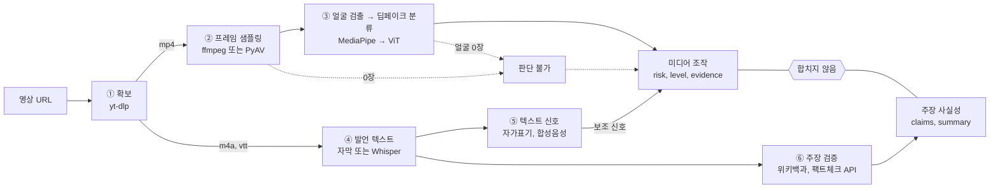
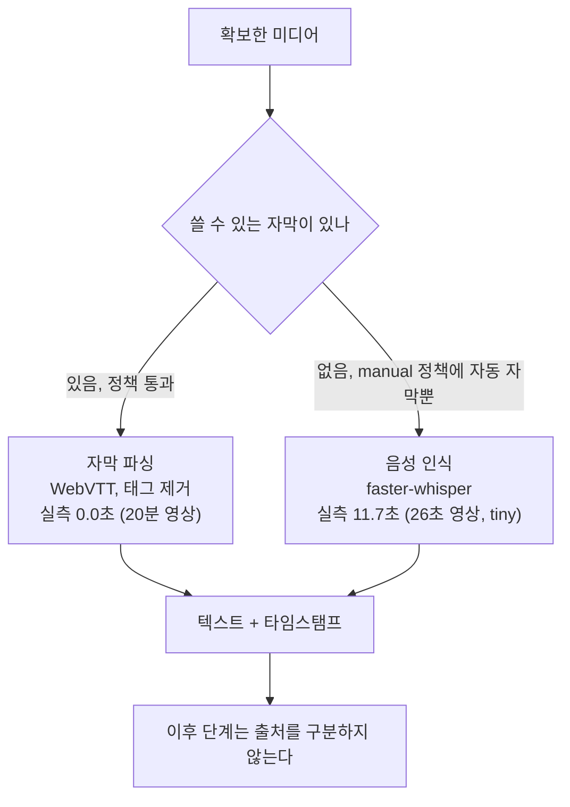
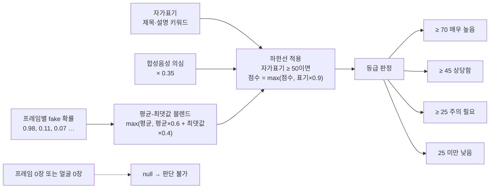
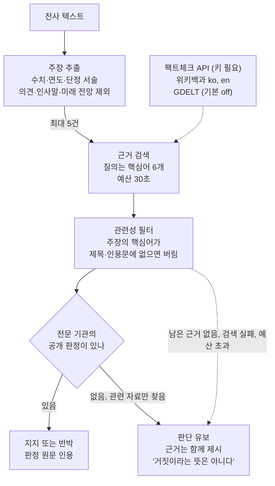
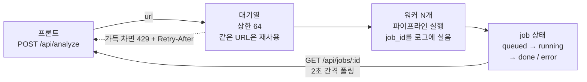

# 파이프라인 해부도

영상 URL 하나가 들어와서 두 갈래의 분석 결과가 나오기까지, 무엇이 무엇에게 무엇을 넘기는지 정리한다.
각 단계에서 쓰는 라이브러리와, 그 라이브러리를 갈아끼우려면 어디를 건드려야 하는지도 함께 적는다.

- 기준 커밋: `2e3f3e6`
- 확인일: 2026-09-07
- 실행 환경: Docker, CPU 전용, Python 3.12
- 제품 요구사항과 설계 기준은 [docs 레포](https://github.com/Dynamic-Juo/docs)의 `project/prd.md`와 `design/ai-pipeline.md`를 따른다.

## 동작 원리

구현 전체가 아래 세 규칙을 코드로 옮긴 것이다.

1. **두 축을 합치지 않는다.** 실제 인물이 나온 영상에도 허위 주장이 있을 수 있고, AI로 만든 영상의 발언이 사실일 수도 있다. 미디어 조작과 주장 사실성은 끝까지 별도의 결과로 남는다.
2. **못 한 것과 정상을 구분한다.** 프레임을 못 뽑았거나 얼굴을 못 찾았을 때 위험도 0점을 주면 실패가 무죄 판정으로 둔갑한다. 이런 경우 점수는 `null`, 상태는 `unavailable`, 등급은 `판단 불가`다.
3. **하지 않은 판단을 하지 않는다.** 근거를 못 찾은 것은 거짓의 근거가 아니다. 지지와 반박은 전문 기관이 이미 공개한 판정을 찾았을 때만 선언한다.

## 전체 흐름

다운로드 직후 경로가 둘로 갈라진다. 위쪽은 픽셀을 보는 경로, 아래쪽은 말을 읽는 경로다. 두 경로는 서로의 판정을 전제하지 않고, 마지막에도 합쳐지지 않은 채 각자의 블록으로 응답에 실린다.

실선은 정상 경로, 점선은 강등 경로다. 강등 경로를 탄 결과도 응답에 실리지만 점수 대신 판단 불가와 그 사유가 담긴다.

## 단계별 상세

### ① 영상, 오디오, 자막 확보

유튜브는 영상과 오디오를 분리된 스트림으로 제공한다. 결합본을 받으려면 JS 런타임과 ffmpeg가 필요해서, 각 스트림을 따로 받아 필요한 단계에 나눠 넣는다. 자막은 별도 요청으로 내려받되 파일만 받고 영상 재다운로드는 건너뛴다.

| 항목 | 내용 |
| --- | --- |
| 라이브러리 | `yt-dlp` 2026.8.19 (Unlicense) |
| 입력 → 출력 | URL → `.v.mp4`(720p 이하), `.a.m4a`, `.sub.ko.vtt`, 메타데이터 |
| 실패하면 | 영상 실패는 분석 중단(`download_failed`, 재시도 가능). 오디오만 실패하면 영상 컨테이너를 STT 입력으로 대체하고 경고 로그를 남긴다 |
| 교체 지점 | `downloader.download()`, 해상도 상한 `DEEPCHECK_MAX_VIDEO_HEIGHT` |

### ② 프레임 샘플링

영상 길이를 기준으로 균등 간격으로 뽑는다. 앞부분만 보면 뒤에서 시작하는 조작을 놓친다. 시스템 ffmpeg가 있으면 seek 기반으로 뽑고, 없으면 PyAV로 디코딩하며 목표 시점을 지나칠 때마다 저장한다.

| 항목 | 내용 |
| --- | --- |
| 라이브러리 | `ffmpeg`(있으면) → `PyAV` 18.1.0 폴백, `Pillow` 12.3.0 |
| 입력 → 출력 | mp4 → `frame_000.jpg` 등 기본 8장 (480px 폭) |
| 실패하면 | 한 장씩 실패는 흡수하고 개수를 로그에 남긴다. 0장이면 영상 축은 판단 불가. 프레임 하나의 타임아웃이 파이프라인 전체를 죽이지 않는다 |
| 교체 지점 | `downloader.extract_frames()`, 장수 `DEEPCHECK_MAX_FRAMES` |

### ③ 얼굴 검출과 딥페이크 분류

분류기가 얼굴 crop 이미지로 학습된 모델이라 전체 프레임을 그대로 넣으면 정확도가 떨어진다. MediaPipe로 가장 큰 얼굴을 찾아 35% 여백을 붙여 잘라낸 뒤 분류기에 넣는다. 얼굴을 못 찾으면 전체 프레임으로 분류는 하되 그 점수를 근거로 쓰지 않는다.

| 항목 | 내용 |
| --- | --- |
| 라이브러리 | `MediaPipe` 1.0.1 BlazeFace short-range, `transformers` 5.16.1 + `torch` 2.14.0+cpu |
| 모델 | `dima806/deepfake_vs_real_image_detection` (ViT 이미지 분류), `blaze_face_short_range.tflite` 230KB |
| 입력 → 출력 | 프레임 8장 → 프레임별 fake 확률 0-1, 라벨, 얼굴 crop 적용 여부 |
| 실패하면 | 분류기 미로드 시 Pillow 휴리스틱만으로 임시 점수. 얼굴 0장이면 영상 신호 자체를 판단 불가로 돌린다 |
| 교체 지점 | `deepfake.DeepfakeDetector`, 모델 `DEEPCHECK_CLASSIFIER_MODEL`, 얼굴 검출은 `face.crop_face()` |

컨테이너에서 MediaPipe는 `libegl1`과 `libgles2`를 필요로 한다. 빠지면 얼굴 검출기 로드가 조용히 실패하고 전체 프레임으로 분류하게 되므로 Dockerfile에서 함께 설치한다.

### ④ 발언 텍스트 확보

여기서 가장 큰 시간 차이가 난다. 자막이 이미 달려 있으면 파싱만 하면 되고, 없을 때만 음성 인식을 돌린다.

기본값이 `manual`인 이유는 자동 생성 자막이 결국 다른 STT의 출력이라 품질 우위를 장담할 수 없어서다. 속도가 급하면 `any`로 바꾼다.

| 항목 | 내용 |
| --- | --- |
| 라이브러리 | 자막은 직접 파싱(의존성 없음), STT는 `faster-whisper` 1.2.1 + `CTranslate2` 4.8.2 |
| 실행 조건 | CPU `int8`, CUDA가 있으면 `float16`. CTranslate2는 Apple MPS를 지원하지 않아 맥에서도 CPU 경로다 |
| 입력 → 출력 | vtt 또는 m4a → 전체 텍스트, 타임스탬프 세그먼트, 언어 |
| 실패하면 | STT 실패는 분석을 멈추지 않는다. 텍스트 없이 영상 축만 응답하고 `stages.transcript`에 실패가 남아 무음 영상과 구분된다 |
| 교체 지점 | `pipeline._collect_transcript()`, 정책 `DEEPCHECK_CAPTION_POLICY`, 모델 크기 `DEEPCHECK_WHISPER_MODEL_SIZE` |

### ⑤ 텍스트 신호 추출

제목과 설명에 "AI로 제작", "패러디" 같은 표기가 있으면 그것이 가장 신뢰도 높은 근거다. 업로더 본인이 밝힌 사실이라 우리 분류기의 픽셀 추론보다 확실하다. 반면 클릭베이트와 주장 강도는 조작의 근거가 아니므로 점수에서 제외하고 참고 정보로만 남긴다.

| 항목 | 내용 |
| --- | --- |
| 라이브러리 | 없음. 정규식과 키워드 사전 |
| 입력 → 출력 | 제목, 설명, 전사 텍스트 → 자가표기 0-100, 합성음성 의심 0-100, 요약, 키워드 |
| 교체 지점 | `analyzer.detect_self_disclosure()`, 키워드 사전은 같은 파일 상단 |

### ⑥ 주장 추출, 근거 검색, 판정

전사 문장 중 수치, 연도, 수량이 있고 단정적으로 서술한 것을 검증 대상으로 고른다. 문장을 그대로 검색하면 매칭이 안 되므로 조사를 떼고 식별력 높은 낱말 6개로 질의를 만든다.

| 항목 | 내용 |
| --- | --- |
| 검색 수단 | 위키백과 API(키 불필요), Google Fact Check Tools(키 필요), GDELT(기본 off, 실측 16초 이상에 429가 잦음) |
| 입력 → 출력 | 전사 텍스트와 세그먼트 → 주장 최대 5건, 발언 위치, 근거 링크, 판정 |
| 실패하면 | 검색 실패나 시간 초과는 해당 주장만 유보 처리. 전체 예산 30초를 넘기면 남은 주장은 검색 없이 유보한다 |
| 교체 지점 | `claims.extract_claims()`, `claims.EvidenceProvider`, 수단 `DEEPCHECK_EVIDENCE_PROVIDERS` |

## 미디어 조작 점수가 정해지는 방식

프레임별 확률이 하나의 점수가 되는 과정에 두 개의 보정이 들어간다. 둘 다 강한 신호가 평균에 묻히는 것을 막기 위한 것이다.

블렌드 가중치(0.6/0.4)와 플로어 계수(0.9)는 실측으로 튜닝해야 할 판단값이지 검증된 최적값이 아니다. 블렌드는 실제 사례에서 8장 중 1장이 98.4%일 때 최종 점수를 13.1에서 47.2로 끌어올렸다.

클릭베이트와 주장 강도는 이 계산에 들어가지 않는다. 자극적인 제목의 진짜 영상이 AI 가짜 쪽으로 밀리는 것을 막기 위해 조작 축에서 분리했다.

## 주장 검증 흐름

이 축에서 가장 중요한 것은 어디서 멈추는가다. 우리가 지지와 반박을 선언할 수 있는 지점은 한 곳뿐이고 나머지 경로는 모두 유보로 수렴한다.

### 한 영상에 여러 내용이 나올 때

영상 하나에 검증할 사실이 여럿이고, 뉴스처럼 여러 꼭지가 붙은 영상은 주제도 여럿이다. 세 가지로 대응한다.

- **분산 선택**: 점수 상위만 뽑으면 숫자가 몰린 한 대목이 슬롯을 다 차지하고 영상 뒷부분이 통째로 누락된다. 전사를 구간으로 나눠 각 구간에서 먼저 한 건씩 뽑고, 남는 자리를 점수순으로 채운다. 결과는 영상에 나온 순서대로 돌려준다.
- **중복 제거**: 뉴스는 앵커가 말한 것을 기자가 다시 말한다. 핵심어가 70% 이상 겹치면 같은 사실로 보고 한 번만 센다.
- **발언 위치**: 주장마다 자막·전사 세그먼트에서 시각을 찾아 붙인다. 사용자가 원문을 직접 확인할 수 있어야 하기 때문이다.

여전히 남는 한계는 **문맥을 넘는 주장**이다. "그는 작년에 3조원을 썼다고 밝혔습니다"에서 "그"가 누구인지는 앞 문장에 있어서, 문장 단위로 뽑는 지금 방식은 주어 없는 주장을 그대로 들고 간다. 이걸 제대로 풀려면 문맥을 이해해 주장을 자립적인 문장으로 다시 쓰는 단계가 필요하고, 그건 LLM의 일이다. `extract_claims()` 하나만 교체하면 되도록 분리해 두었다.

두 개의 필터가 있다. **미래 전망**("조만간 7%도 넘어설 것으로 보입니다")은 아직 일어나지 않은 일이라 어떤 근거로도 판정할 수 없으므로 애초에 주장으로 뽑지 않는다. **관련성 필터**는 검색 엔진이 돌려준 무관한 문서를 걸러낸다. 실측에서 물가 상승률 주장에 "주기율표" 문서가 근거로 딸려온 적이 있는데, 무관한 자료를 근거라고 보여주는 것은 사실상 거짓 근거다. 주장의 핵심어가 제목이나 인용문에 하나도 없으면 버리고, 그 결과 남는 근거가 없으면 "근거를 찾지 못했다"고 말한다.

키워드가 겹친다는 이유로 참과 거짓을 단정하면 그럴듯한 오답을 만들어낼 뿐이라 의도적으로 좁혔다. 팩트체크 API 키가 없으면 실질적으로 모든 주장이 유보로 남는다.

## 요청이 처리되는 방식

분석 한 건이 수십 초에서 수 분이라 요청 스레드에서 돌릴 수 없다. 작은 워커 풀과 상한 있는 대기열로 받고, 클라이언트는 job을 폴링한다.

uvicorn은 반드시 단일 워커 프로세스로 띄운다. job 상태를 프로세스 메모리에 들고 있어서 프로세스가 여럿이면 조회가 무작위로 404가 난다. 동시 실행은 `DEEPCHECK_WORKERS`로 조절한다. job은 메모리 보관 상한 200건이며 재시작하면 사라진다. 영속화는 아직 없다.

## 갈아끼우기

바꾸고 싶은 것이 생겼을 때 어디를 건드리면 되는지. 대부분은 코드를 고치지 않고 환경변수로 끝난다.

| 바꾸고 싶은 것 | 건드릴 곳 | 코드 수정 |
| --- | --- | --- |
| 딥페이크 분류 모델 | `DEEPCHECK_CLASSIFIER_MODEL`. HF image-classification 규약을 따르는 모델이면 그대로 동작한다 | 불필요 |
| STT 엔진 | `transcriber.transcribe()`. `Transcript`(텍스트, 언어, 세그먼트, 길이)만 맞추면 된다 | 필요 |
| STT 모델 크기 | `DEEPCHECK_WHISPER_MODEL_SIZE` (tiny, base, small, medium, large-v3) | 불필요 |
| 얼굴 검출기 | `face.crop_face()`. crop 이미지 경로 또는 `None`만 반환하면 된다 | 필요 |
| VLM 제공자 | `DEEPCHECK_VLM_PROVIDER`. 새 제공자는 `vlm.VLMProvider` 구현 후 등록 | 등록만 |
| 근거 검색 수단 | `DEEPCHECK_EVIDENCE_PROVIDERS`. 새 수단은 `claims.EvidenceProvider` 구현 후 `_build_provider`에 추가 | 등록만 |
| 주장 추출 방식 | `claims.extract_claims()`. 규칙 기반을 LLM으로 바꾸려면 이 함수만 교체한다 | 필요 |
| 점수 가중치와 등급 경계 | `DEEPCHECK_FRAME_MEAN_WEIGHT`, `DEEPCHECK_FRAME_PEAK_WEIGHT`, `DEEPCHECK_LEVEL_HIGH` 등 | 불필요 |
| 자막 사용 정책 | `DEEPCHECK_CAPTION_POLICY` (manual, any, off) | 불필요 |
| 동시 실행 수와 대기열 | `DEEPCHECK_WORKERS`, `DEEPCHECK_BACKLOG` | 불필요 |

모델을 바꾸면 `tests/test_report.py`의 degraded 경로 테스트가 여전히 통과하는지 확인한다. "얼굴을 못 찾으면 판단을 유보한다"는 규칙은 지금 분류기가 얼굴 crop 모델이라는 전제에 기대고 있어서, 전체 프레임으로 학습된 모델로 바꾸면 이 규칙도 함께 손봐야 한다.

## 실측 성능

맥북 Docker(CPU 전용, 워커 2)에서 측정한 값이다. 배포 대상의 CPU 성능이 곧 응답 시간이다.

| 구간 | 26초 영상, 자막 없음 | 20분 영상, 자막 있음 | 메모 |
| --- | --- | --- | --- |
| 다운로드 | 4.9초 | 약 15초 | 네트워크와 영상 길이에 비례 |
| 프레임 추출 | 0.6초 | 4.2초 | 영상 길이와 무관하게 장수에 비례 |
| 얼굴 검출과 분류 | 25.1초 | 약 20초 | 지배적 구간, CPU 성능에 직결 |
| 발언 텍스트 | 11.7초 | 0.0초 | 자막이 있으면 통째로 사라진다 |
| 주장 검증 | 0.0초 | 9.0초 | 주장 수 곱하기 검색 수단, 예산 30초 |
| 합계 | 약 45초 | 약 50초 | 첫 실행은 모델 다운로드로 더 걸린다 |

컨테이너 실행 중 메모리는 약 1.08GB, 이미지는 1.89GB(arm64)다. 메모리 1GB 이하 인스턴스에서는 뜨지 않는다.

### 한국어 STT 실측

자막이 없는 한국어 영상은 STT 구간이 통째로 살아난다. 2분 남짓한 뉴스 영상 기준이다.

| 모델 | 영상 길이 | STT 소요 | 전사 품질 |
| --- | --- | --- | --- |
| `small` | 2분 | 88.6초 | 대체로 정확. "외환위기"를 "외환 외기"로 옮기는 정도의 오류 |
| `tiny` | 2분 23초 | 53.1초 | "7월"을 "18월", "물가"를 "물건", "이창용"을 "2장용"으로 옮김 |

**한국어에서 `tiny`는 주장 검증을 오염시킨다.** 주장 추출이 수치와 고유명사를 근거로 문장을 고르기 때문에, STT가 숫자를 틀리면 존재하지 않는 주장을 만들어 검증하게 된다. 속도를 위해 `tiny`를 쓰려면 주장 검증을 끄는 편이 정직하다.

데모에서는 자막이 있는 영상을 쓰는 것이 가장 빠르고 정확하다. STT 구간이 0초가 되고 전사 오류도 없다.
