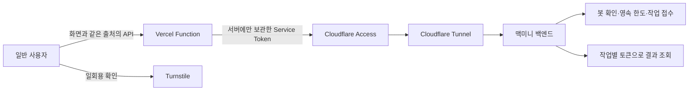

# 일반 사용자 공개 전환

2026-09-15 실제 운영은 main `a26264e`의 public mode `gateway`다. 이미지 교체·결과 이관·내부망/전용 프록시 적용 및 Service Auth 검수를 완료했다. [현재 운영 구성](mac-mini-runtime.md)에 실제 시험과 남은 보안 경계를 기록했다. FE/Vercel은 변경하지 않았고, 정상 브라우저 Turnstile+Function E2E 및 작업 강제 시간 제한 검토 전에는 공개 Function을 켜지 않는다.

아래는 공개 API 구현 계약이다. 이메일 정책은 유지하고 특정 Service Token 인증 경로를 함께 적용했다. 제품 미결 사항은 [docs의 추적표](https://github.com/Dynamic-Juo/docs/blob/docs/implementation-audit/project/project-plan.md)에서 관리한다.

## 연결 구조

프론트 주소는 `https://chamsae-ai.vercel.app`, 최종 API 원본 주소는 `https://chamsae-ai-api.dotseven.cloud`다. 사용자 확정에 따라 `ai`를 포함하고 `dev`를 제외한다. 기존 `https://conan-api-dev.dotseven.cloud`는 전환 기간 호환 주소이며 인증 보호를 유지한다. 새 주소의 실제 연결 완료 여부는 [현재 인수 상태](handoff.md)를 확인한다. API 표시명은 `참새 AI API`다. 내부 DeepCheck 모듈·Docker 프로젝트·볼륨과 공유 Tunnel 식별자는 데이터·다른 서비스 영향을 피하기 위해 별도 마이그레이션 없이 바꾸지 않는다.

**이 주소는 Vercel 서버의 원본 주소다.** 공개 모드에서 사용자 브라우저는 Vercel의 같은 출처 API를 호출한다. CORS나 `Origin` 헤더는 서버 인증을 대신하지 않는다. “Vercel만 허용”은 Vercel 전체 IP나 도메인을 신뢰한다는 뜻이 아니라, 우리 프로젝트 서버에만 보관한 Cloudflare Service Token과 백엔드 전달 키를 함께 검증한다는 뜻이다. 비밀값을 가진 다른 클라이언트도 접근할 수 있으므로 유출 시 폐기·교체해야 한다.

일반 사용자는 이메일 Access 로그인이 필요하지 않다. Vercel 서버가 Service Auth로 접근한다. 관리자용 이메일 정책은 유지하고 **Everyone Allow/Bypass로 앱 전체를 공개하지 않는다**. Service Token은 서버 간 인증이며 개별 사용자를 인증하지 않는다. 사용자 입력과 접근 빈도는 별도로 제한한다. [Cloudflare Service Token 문서](https://developers.cloudflare.com/cloudflare-one/access-controls/service-credentials/service-tokens/)

## 준비한 코드와 계약

- `backend/public_access.py`: 명시적인 공개 모드, 전달 키 확인, Siteverify, SQLite 요청 한도, 작업별 만료 토큰.
- `deploy/public-gateway/gateway.mjs`: FE에 전달할 Vercel Node Function. 분석 접수와 작업 조회만 전달한다. FE 저장소에 설치하거나 실제 Vercel에서 실행한 상태는 아니다.
- `deploy/public-gateway/vercel.json.example`: 기존 FE 설정에 병합할 두 rewrite 예제다. 기존 SPA rewrite보다 앞에 놓고 다른 설정을 덮어쓰지 않는다.

공개 모드는 기본 `off`다. `gateway`를 켜면 누락된 필수 설정이나 SQLite 초기화 실패 시 시작을 중단한다. API 요청별 검증·상태 저장 실패도 분석을 허용하지 않는다. `off`에서는 기존 개발 API 계약을 유지한다.

| 요청 | 공개 계약 |
| --- | --- |
| POST `/api/analyze` | `url`, 선택 `session_id`, 필수 `turnstile_token`만 허용. 모델 크기·프레임 수 등 고급 옵션은 거절 |
| 접수 응답 | 기존 200 응답에 `job_access_token` 추가 |
| GET `/api/jobs/{job_id}` | `Authorization: Bearer <job_access_token>` 필요. 다른 작업·만료·변조 토큰은 404 |
| 관리·문서·전체 목록 | 공개 Function에서 전달하지 않음. `/internal/*`도 전달하지 않음 |

조회 토큰은 24시간 유효하다. 작업 ID와 서명으로 묶이며 키 교체 시 기존 토큰도 폐기된다. 토큰 소유자는 결과를 조회할 수 있으므로 URL·로그·분석 도구에 넣지 않는다. FE는 마지막 작업 ID·조회 토큰을 `localStorage`에 함께 보관해 탭 종료 후에도 재방문할 수 있게 한다. [재방문 복원 계약](frontend-resume.md)의 저장 실패·만료·404 처리를 따른다. 24시간은 토큰 유효기간이며 결과 보존 보장은 아니다. 세션 ID는 인증 수단이 아니다. 기존 실행 중 동일 영상 재사용은 유지하므로 사용자별 소유권 계정 시스템은 아니다. 원문 영상 정보 외 개인정보를 요청에 추가하지 않는다.

Turnstile은 `action=analyze`, 호스트 `chamsae-ai.vercel.app`로 사용한다. 서버가 success·hostname·action을 검사한다. 토큰은 단일 사용·5분 만료이므로 실패 후 재접수 때 새 토큰을 얻는다. 자동으로 같은 분석 POST를 재시도하지 않는다. [Siteverify 공식 계약](https://developers.cloudflare.com/turnstile/get-started/server-side-validation/)

## 요청 한도와 비용 경계

초기 공개 체험용 보수적인 코드 기본값이며 운영량·부하 실측으로 검토할 값이다. 전체 분석 접수는 UTC 일자당 30회, IP 기반 익명 식별자당 시간당 3회다. 봇 확인 시도는 전체 일자당 1,000회·식별자당 분당 10회, 조회는 전체 일자당 20,000회·식별자당 분당 90회다. 429의 `Retry-After`를 따른다. 분석 접수 직후 큐 포화·실패·중복 작업 재사용도 접수 한도를 소비하며 환급하지 않는다.

SQLite 트랜잭션으로 동시 요청을 합산하고 재시작에도 유지한다. 과거 버킷은 요청 때 정리하며 일자 경계 반올림을 포함해 최대 약 3일의 식별자가 남는다. 원본 IP 대신 Vercel이 덮어쓴 `X-Forwarded-For`의 단일 IP를 HMAC 처리한다. 이 Function을 일반 프록시 뒤에 그대로 설치하지 않는다. 공용 NAT의 사용자들은 한도를 공유하고 IP 교체로 개인별 한도를 피할 수 있으므로 전체 한도도 함께 둔다. [Vercel 요청 헤더 계약](https://vercel.com/docs/headers/request-headers)

이 한도는 LLM 비용의 금액 상한이나 완전한 DDoS 방어가 아니다. Vercel Function 호출 자체와 Cloudflare·Turnstile 플랜 제약, 한 영상의 다운로드·분석 자원은 따로 관리한다. gateway는 POST 본문 8 KiB, 원본 응답 2 MiB, 원본 요청 15초를 제한한다. 분석 완료를 기다리지 않고 job을 반환한다.

## 설정 인수인계

아래 표에는 값 자체가 아닌 설정 이름만 기록한다. 비밀값은 Git·PR·브라우저 번들·`VITE_*`에 넣지 않는다.

| 위치 | 설정 |
| --- | --- |
| Vercel 서버 | `PUBLIC_GATEWAY_ENABLED=false`로 먼저 설치, `PUBLIC_FRONTEND_ORIGIN=https://chamsae-ai.vercel.app`, `PRIVATE_API_ORIGIN=https://chamsae-ai-api.dotseven.cloud` |
| Vercel 비밀 환경변수 | `CF_ACCESS_CLIENT_ID`, `CF_ACCESS_CLIENT_SECRET`, `PUBLIC_GATEWAY_KEY` |
| 맥미니 비밀 환경변수 | `DEEPCHECK_PUBLIC_GATEWAY_KEY`는 Vercel 키와 동일한 무작위 32바이트 이상의 hex 문자열, `DEEPCHECK_TURNSTILE_SECRET` |
| 맥미니 일반 설정 | `DEEPCHECK_PUBLIC_MODE=gateway`, `DEEPCHECK_TURNSTILE_HOSTNAME=chamsae-ai.vercel.app`, `DEEPCHECK_PUBLIC_STATE_FILE=/var/lib/deepcheck-results/public/quota.sqlite3` |
| 프론트 번들 | Turnstile의 공개 site key만 포함. API base URL은 같은 출처 `/api` 계약에 맞게 설정 |

상태 파일은 **지속되는 전용 볼륨 내부**여야 한다. 경로가 절대 경로인지 코드가 확인하지만 볼륨 마운트까지 보장하지 않는다. 현행 CD Compose의 `job-results`가 해당 경로의 상위에 마운트된다. 현재 운영은 새 Compose와 전용 결과 볼륨으로 전환했고 결과 11건 복원과 쓰기 권한을 검수했다. 다음 배포에서도 런북에 따라 마운트를 보존한다. 기존 `.env` 전체를 출력하거나 교체하지 않는다.

FE 담당자는 Function 설치 외에 요청에 Turnstile 토큰 추가, 응답 토큰 보관, 결과 조회 Authorization, 403 재확인·429 대기·404 종료 안내를 구현해야 한다. 기존 `credentials: include`만으로 새 공개 계약이 구현되지 않는다. 프론트 코드·Vercel 설정은 조정준 팀장 담당이다. BE 담당은 해당 저장소·관리 설정을 수정하지 않고 이 문서의 계약과 검수 조건을 전달한다.

## 공개 활성화 순서와 미완료 조건

1. **적용 완료:** 새 서명 이미지, 영속 결과/한도 볼륨, UID·read-only·PID 제한, 내부망과 지정 호스트 HTTPS 프록시. 공유 VM/UID·공유 Tunnel의 잔여 경계와 강제 실행 제한은 [현재 운영 구성](mac-mini-runtime.md)을 따른다.
2. **적용 완료:** 특정 Service Token의 Service Auth와 기존 이메일 정책 유지, Turnstile 호스트 고정 및 잘못된 토큰 거절 검수.
3. **프론트 담당:** Vercel Function·FE 계약·서버 환경변수와 [재방문 복원](frontend-resume.md)을 연결한다. Preview에 운영 비밀값을 무조건 공유하지 않는다.
4. **공개 전 검수:** 강제 실행 제한 등 남은 운영 조건을 해결하고 실제 Vercel에서 접수/조회·탭 종료 후 재방문·봇 토큰 실패/재사용·위조 헤더·만료/다른 작업 토큰·원본 직접 접근 차단·부하를 확인한 뒤 공개한다. 검수 전 `PUBLIC_GATEWAY_ENABLED=false`를 유지한다.

긴급 중지는 우선 Vercel의 `PUBLIC_GATEWAY_ENABLED=false`와 전용 Service Token 폐기로 공개 입구를 닫는다. 진행 중 분석은 별도 drain 절차로 관리한다. **백엔드 공개 모드만 off로 바꾸어 접근 제한을 없애는 것을 긴급 중지로 사용하지 않는다.**

로컬 검증은 외부 통신을 막은 Python 테스트와 모의 원본을 사용한 Node 테스트다. 실제 Cloudflare 정책·Vercel 런타임·Turnstile·실영상 검증과 구분한다.
