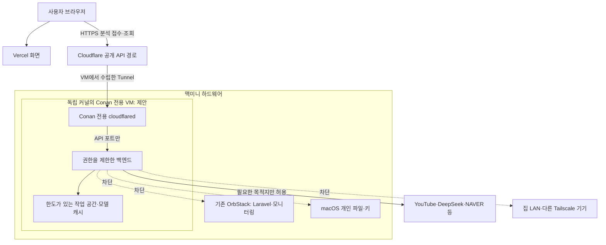

# 맥미니 홈서버 격리 가이드라인

> 2026-09-15 최신 실제 상태는 [현재 운영 구성](mac-mini-runtime.md)을 우선한다. a26264e 이미지 전환·결과 11건 이관·controller 초기화는 완료했으며, 상시 자동 배포는 승인 대기로 꺼져 있다. 아래 과거 미배포/472aff7 기록과 구분한다. 프론트·Vercel은 변경하지 않았다.

작성일: 2026-09-13. 상태: **설계 제안·구현 및 격리 검증 전**. 이 문서 작성으로 서버·VM·방화벽·Tunnel을 변경하지 않았다. 기획 범위를 바꾸는 문서가 아니라 공개 배포의 운영 조건을 정한다.

최신 증거: [2026-09-13 배포환경 1차 점검](deployment-isolation-audit-2026-09-13.md). ISO-01 일부를 확인했으며 VM 이전은 아직 결정하지 않았다. 현재 Docker 보완과 실제 네트워크 경계 검사를 먼저 진행한다.

## 목표와 현재 상태

목표는 **Conan 백엔드가 침해되더라도 개인 파일, SSH 키, 기존 Laravel·모니터링과 집 내부망으로 피해가 확산되는 경로를 차단하는 것**이다. 취약점이 절대 없다는 보증이나 물리적 완전 격리를 뜻하지 않는다.

| 영역 | 확인된 상태 | 증거 범위 |
| --- | --- | --- |
| Vercel | 프론트 배포 완료 | 사용자가 최종 결과 화면까지 연동 성공을 보고함. 에이전트가 영상 품질을 독립 검수한 것은 아님 |
| Cloudflare | 개발 API Tunnel·Access·OPTIONS 적용 완료 | 미인증 health 302, Vercel OPTIONS 200, 미허용 Origin OPTIONS 400 |
| 맥미니 | M4 16GB, OrbStack, Conan 및 기존 서비스 구동 | 2026-09-13 실제 조회에서 Conan healthy, 다른 7개 컨테이너 Up |
| 배포 코드 | conan-be:472aff7 유지, CORS 환경값만 변경 | 최신 main과 실행 이미지는 다름. [배포 기록](deployment-log.md) 참고 |
| 서버 격리 | 아직 검증하지 않음 | 인증·healthy·별도 Compose 프로젝트를 격리 완료의 증거로 사용하지 않음 |

Access는 요청자를 제한한다. CORS는 브라우저의 응답 사용을 제한한다. 둘 다 백엔드 프로세스의 파일·네트워크 권한을 제한하지 않는다. 다운로드·영상 파서·의존성 취약점, 잘못된 URL 처리와 자격증명 유출을 고려한다.

## 제안하는 공개 배포 구조

맥미니를 계속 쓰는 경우 **독립 커널을 가진 Conan 전용 Linux VM**을 공개 배포의 목표로 제안한다. VM 제품과 자원값은 선정·실측 전이며, 설치를 승인하거나 실행한 상태가 아니다. 기존 OrbStack의 Laravel·모니터링은 그대로 유지한다.

Conan 전용 Tunnel·커넥터를 목표로 하여 기존 여러 서비스에 연결된 cloudflared와 자격증명을 공유하지 않는다. 같은 Cloudflare 계정은 사용할 수 있지만, 커넥터에는 Conan Tunnel 실행에 필요한 자격증명만 준다. 기존 Tunnel 교체나 전체 재시작 없이 Conan 경로만 검증 후 전환한다.

**OrbStack의 Linux machine 추가는 이 문서의 독립 VM 조건을 충족하지 않는다.** 공식 문서는 모든 머신·컨테이너가 하나의 VM 커널을 공유한다고 설명한다. Isolated machine은 통합 기능을 줄이는 중간 개선책이며 독립 커널 경계를 대신하지 않는다. 설치 버전의 지원 여부도 확인해야 한다. [OrbStack 구조](https://docs.orbstack.dev/architecture), [Isolated machines의 보안 모델](https://docs.orbstack.dev/machines/isolated)

전용 VM도 같은 하드웨어·호스트 관리자·전원·디스크를 공유한다. 호스트 침해와 모든 가상화 취약점을 제거하지 못한다. 이 잔여 위험까지 줄이는 것이 최우선이면 외부 프로젝트 전용 서버 또는 별도 물리 장비로 분리한다.

## 반드시 지킬 경계

### 1. 파일·권한

- VM에 macOS 홈 폴더·Desktop·Downloads·SSH 디렉터리·기존 서비스 디렉터리를 공유하지 않는다. 자동 파일 공유·SSH agent forwarding·불필요한 장치 통합을 끈다.
- 앱에는 Docker 소켓·관리 API·호스트 PID/네트워크·privileged 권한을 주지 않는다. 운영 앱에서 Docker를 제어하지 않는다.
- 백엔드는 non-root로 실행하고 cap_drop ALL, no-new-privileges와 기본 seccomp 제한을 유지한다. 최신 CD Compose에는 일부 설정이 있지만 실행 중인 구형 이미지에 적용됐다고 가정하지 않는다. [Docker 보안 지침](https://docs.docker.com/engine/security/)
- 루트 파일시스템은 읽기 전용을 목표로 한다. 영상 임시 공간·결과 상태·모델 캐시만 별도 쓰기 경로로 둔다. 현재 /root/.cache 의존과 admission/result 저장 경로를 먼저 수정·검증한다. 단순 user/read_only 옵션 추가로 배포하지 않는다.
- 모델은 가능한 한 빌드·준비 단계에 확보하고 런타임 캐시 쓰기를 줄인다. 필요한 런타임 쓰기는 범위와 이유를 기록한다.

### 2. 네트워크

정책은 **앱이 침해돼도 우회할 수 없는 VM 경계 또는 상위 방화벽**에서 적용한다. 앱 내부 URL 검증은 추가 방어다. NAT나 Docker 네트워크 이름만으로 차단됐다고 판단하지 않는다.

| 출발 → 목적지 | 목표 정책 |
| --- | --- |
| Conan 커넥터 → API | 지정한 API 포트만 허용 |
| 앱 → macOS·기존 서비스·집 LAN·Tailscale | 신규 연결 차단. IPv4·IPv6·호스트 별칭·게이트웨이 경로 포함 |
| 앱 → 인터넷 | 필요한 제공자·다운로드 목적지와 포트만 허용. 나머지는 거부 |
| 앱 → DNS | 지정한 resolver만 허용. DNS 응답·리다이렉트가 내부 주소로 이어지는 경우 차단 |
| 관리자 → VM | 승인한 관리 기기에서 SSH만 허용. 응답 연결은 허용하되 VM에서 다른 관리 기기로 신규 연결은 차단 |
| 인터넷·집 LAN → API 직접 포트 | 직접 공개하지 않음. Tunnel 경로만 사용 |

실제 사설 대역, link-local, loopback, Tailscale, Docker/VM 대역 및 IPv6 ULA·link-local을 목록화한다. 필요한 DNS·관리 예외는 정확한 대상·포트·방향으로 한정한다. 로컬 loopback은 컨테이너 내부 health·제어에 필요하므로 주소 대역을 무조건 전역 차단하는 명령을 쓰지 않는다.

YouTube CDN·모델 다운로드·리다이렉트는 동적이므로 관찰한 목적지 목록과 회귀 검사로 허용 범위를 설계한다. 443 전체 허용은 목적지 제한을 대신하지 않는다. 도메인 필터가 필요하면 직접 통신을 막고 검증 가능한 egress proxy 등으로 강제한다. 자료 원문 수집을 추가할 때도 같은 경계를 적용한다. [OWASP SSRF 예방](https://cheatsheetseries.owasp.org/cheatsheets/Server_Side_Request_Forgery_Prevention_Cheat_Sheet.html)

Linux Docker 방화벽 문서를 macOS/OrbStack에 그대로 적용하지 않는다. 실제 패킷 경로와 방화벽 backend를 확인한 뒤 통제 위치를 정한다. 기존 호스트·Tunnel에 광역 차단 규칙을 즉시 적용하지 않는다. [Docker 방화벽](https://docs.docker.com/engine/network/firewall-iptables/)

### 3. 자격증명·관리

- 앱에는 Conan용 제공자 키만 전달한다. Cloudflare 계정 관리 토큰·GitHub 쓰기 키·개인 SSH 키는 넣지 않는다. Tunnel 토큰은 커넥터만 읽는다.
- 비밀 파일은 소유자만 읽도록 하고 로그·Git·이미지·프론트 번들에 넣지 않는다. 앱에 전달한 제공자 키는 앱 침해 시 노출될 수 있으므로 별도 키·한도·교체 절차를 둔다.
- 배포 제어는 앱 밖에서 실행하고 대상 VM·서비스·서명 이미지로 제한한다. 일반 로그인 사용자와 같은 권한으로 실행하는 에이전트를 별도 보안 경계로 간주하지 않는다.
- 관리용 VPN/SSH는 공개 API와 분리한다. 관리자 접속 차단을 피하도록 새 경로 검증 전 기존 관리 경로를 제거하지 않는다.

### 4. 자원·복구

- CPU·RAM·PID·디스크/영상 바이트·로그·임시 파일·실행 시간 상한을 둔다. VM 디스크의 호스트 실제 사용량도 제한·감시한다. 동적 디스크의 표시 용량과 사용량은 구분한다.
- 영상 worker 1개를 초기값으로 유지한다. 개발·공개 환경을 동시에 실행하면 합산 자원을 계산한다. 16GB 맥미니에서 VM RAM·CPU·디스크 수치는 기존 서비스 여유와 실영상 실측 후 확정한다.
- timeout에서 다운로드·전사 자식 프로세스가 실제 종료되는지 검증한다. 상태 문자열만 timed_out으로 바뀌는 것은 통과가 아니다.
- 결과·설정 백업은 작업 영역과 분리하고 복원 검사를 한다. 앱이 백업을 수정·삭제할 수 없게 한다. 비밀값은 별도로 관리한다.

## 작업 순서와 완료 기준

운영 담당은 BE/홈서버 담당자, FE 연동 검수는 팀장과 공동으로 진행한다. 모든 항목은 현재 미완료이며 연결 성공을 보안 검수 통과로 대체하지 않는다.

| 순서 | 작업 | 완료 증거 |
| --- | --- | --- |
| ISO-01 | 현재 실행 환경 읽기 전용 감사 | 이미지·사용자·권한·mount·socket·network·노출 포트·공유 폴더·자원·버전 목록. 환경 비밀값 제외 |
| ISO-02 | 독립 VM·통신 정책 설계 확정 | 독립 커널/daemon·비공유 저장소·관리 경로·방화벽 통제 위치·필요 통신표·자원 예산 |
| ISO-03 | 별도 환경 구성·앱 권한 축소 | non-root로 모델 초기화·임시 파일·결과 저장·drain/resume 정상. 개인 파일·관리 socket 접근 불가 |
| ISO-04 | 통신 경계 검증 | 허용 목적지는 성공, 승인한 내부 테스트 대상은 앱과 VM 양쪽에서 차단됨. IPv6·DNS·리다이렉트 우회 검사 |
| ISO-05 | 부하·복구 검증 | 시간/디스크/메모리 상한에서 종료·청소, 기존 서비스 영향 관찰, 결과 복원·이전 배포 복귀 성공 |
| ISO-06 | 제한된 도메인에서 인수 | Access 유지 상태로 실영상 최종 흐름 검증. 수정 이미지·정책·실측값 기록 |
| ISO-07 | 일반 공개 검토 | ISO-01~06 증거와 앱 접근/남용 방지·품질 과제를 함께 검토한 뒤 공개 여부 결정 |

격리 시험은 임의 내부망 스캔이나 취약점 공격이 아니다. 소유자가 정한 테스트 주소·포트와 무해한 canary 파일을 사용한다. 내부 대상이 살아 있는지 통제된 관리 경로에서 먼저 확인하고 앱에서 차단되는지 비교한다. timeout 하나만으로 방화벽 차단 성공을 선언하지 않는다.

기록 표에는 날짜, 테스트 출발점, 대상, 기대 허용/차단, 실제 결과, 정책/이미지 버전, 관찰 근거, 미검증 항목을 남긴다. 단순 TCP 실패와 정책 거부를 구분한다. 이번 문서 작업에서는 이 검사를 실행하지 않았다.

## 전환·중단 원칙

현재 팀 개발계 Access를 유지하면서 새 환경을 별도로 검증한다. 전환 전 활성 분석을 정리하고 결과·이전 이미지·Conan 경로를 보존한다. 기존 공유 Tunnel과 Laravel·모니터링은 재생성하지 않는다. 새 경로만 바꾸고 실패 시 Conan 경로만 이전 환경으로 되돌린다.

관리 접속 상실, 기존 서비스 영향, 예상 밖 내부 통신 허용, 메모리·디스크 여유 부족 중 하나가 발생하면 전환을 중단한다. 격리 실패한 새 환경은 공개하지 않는다. 시스템 전체 down/prune 또는 무조건적인 방화벽 초기화로 복구하지 않는다.

다음 실행 작업은 **ISO-01 현재 구성 감사**다. VM 설치·네트워크 변경은 감사 결과를 반영한 구체적 변경안으로 진행한다. [맥미니 배포 절차](deployment-mac-mini.md), [현재 인수 상태](handoff.md)를 함께 읽는다.
