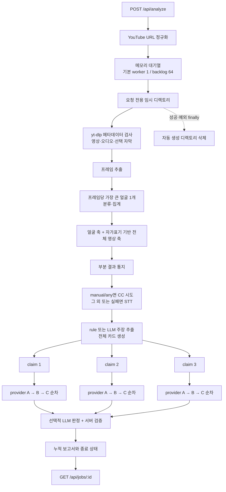

# 최신 기획 대비 소스 감사

이 문서는 문서 기록, 리뷰 의견, 실제 구현을 섞지 않고 비교한 2026-09-13 정적 감사 기록이다. 구현 설명은 `be` main `38bd16263afbf79daffd67878277c3af0a4a5d51`, 문서 비교는 `docs` main `8d07ff36e127012a4cb67adeea7ef45292bd85c0`, 리뷰는 열려 있는 [docs PR #7][PR7]의 원문을 기준으로 했다. PR #7은 과거 `be` `cfe37fc`를 평가한 문서이므로 그 구현 판정은 현재 상태로 재사용하지 않고, 리뷰어 의견만 별도 입력으로 다룬다.

감사 중 실제 YouTube, 유료 LLM, 검색 API, Docker, 배포 서버는 실행하지 않았다. 네트워크 연결을 막는 테스트 fixture 아래 현재 main 전체 테스트를 실행해 `329 passed, 2 warnings`를 확인했다. 이 결과는 코드 계약의 회귀 여부만 말하며 실제 영상 정확도·외부 서비스·동시성 부하·강제 중단을 증명하지 않는다.

## 판정 기준과 입력 우선순위

상태는 `충족`, `부분`, `미구현`, `불일치`, `미검증`, `결정 필요`로 구분한다. 코드가 존재해도 실제 모델·원문·운영 환경을 확인하지 않았으면 `충족`으로 올리지 않는다.

1. 2026-09-13 전달된 최신 제품 결정: 자막 기본값은 `off`, `manual`과 `any`는 선택 옵션으로 유지한다.
2. [docs 저장소 규칙][D-README]상 `Accepted`만 합의한 현재 기준이다. 이번 범위에서는 [근거 정책][D-EVID]만 `Accepted`이고 [PRD][D-PRD], MVP 검토, 프로젝트 계획, [AI 파이프라인][D-PIPE], [실행 구조][D-RUNTIME], [결과 UI][D-UI]는 모두 `Draft`다.
3. Draft 안의 `확정`·`결정 완료` 표기는 문서가 기록한 목표로 비교하되 저장소 차원의 최종 승인으로 확대하지 않는다. 구현 전에 기준 문서의 승인 상태를 정리해야 한다.
4. [docs PR #7][PR7]의 리뷰 질문·제안은 기준 문서에 반영된 경우에만 확정 결정으로 본다. 리뷰 의견만으로 제품 범위를 바꾸지 않는다.
5. 실행 사실은 고정한 `be` main 소스와 로컬 모의 테스트로 판단한다. 별도 `fix/captions-opt-in` 브랜치의 `58a51cf`가 자막 기본값 변경을 구현했다는 전달은 후속 통합 상태이며 이 감사의 main 판정에는 포함하지 않는다.

다중 얼굴에 관한 [PR #7 원문][PR7-FACE]은 “여러 명 중 한 명이라도 잡혀 추출만 되면 괜찮지 않나”라는 질문이다. “모든 얼굴을 검사해 하나라도 이상이면 영상 전체를 의심으로 판정”하라는 지시가 아니며 후속 확정 답변도 확인되지 않았다. 따라서 조건부 구현 승인의 전제가 성립하지 않고 그 결합 규칙은 `결정 필요`로 둔다.

## 요약

현재 main은 URL 정규화, 공개·연령·길이 검사, 제한된 대기열, 부분 결과, 주장 기본 3건 병렬, 보수적인 근거 판정 강등, 임시 파일 정리와 오류 응답 정규화를 구현했다. Accepted 근거 정책과 현재 Draft 범위를 그대로 릴리스 약속으로 삼는다면 완료를 막는 핵심은 다음 다섯 가지다.

- 기본 검색 제공자는 원문 본문과 검증된 출처 계보를 만들지 못하므로 실제 기본 경로에서 `근거와 일치`·`근거와 불일치`를 확정할 수 없다.
- 수동 원문 fixture에서는 `6.0%`와 `6.0% 초과`의 의미 차이도 서버가 잡지 못해, 원문 경로를 붙이면 거짓 양성이 활성화될 수 있다.
- 영상 전체 AI 생성 축은 영상 모델이 없고 제목·설명 자가표기 문자열만 본다.
- 10분 제한은 실행 중 작업을 끊는 제한이 아니라 함수가 돌아온 뒤 붙이는 상태다.
- 공개 요청을 사용자 단위로 제한할 인증·쿼터가 없고 다운로드 크기·디스크·모델 선택 비용의 상한도 충분하지 않다.

따라서 `329 passed`는 릴리스 완료 근거가 아니다. Accepted 원문 근거 정책은 미충족이고, Draft PRD의 전체 영상 AI 축·10분 종료·실제 영상 정확성 목표도 아직 충족하지 않는다.

## 요구사항 대조표

| 기준 | docs main 기록 | 현재 main 구현 | 판정 | 완료 조건 |
| --- | --- | --- | --- | --- |
| R-01 입력 | 공개 한국어 YouTube Shorts, 최대 3분, 비공개·연령 제한 제외 | [URL 정책][B-URL]이 YouTube ID와 호스트를 고정하고 [다운로더][B-DOWN]가 `public`, 비실시간, 연령 0, `0 < duration <= 180`을 확인한다. Shorts 분류와 주 사용 언어는 확인하지 않는다 | 부분 | 신뢰할 수 있는 Shorts 판별과 언어 정책·오류 코드를 정하고 경계 fixture와 승인된 실제 연동 시험을 통과한다 |
| R-02 세 축 분리 | 얼굴 합성·변형, 영상 전체 AI 생성, 주장 사실성을 분리 | [보고서][B-REPORT]와 응답 스키마는 세 축을 분리한다. 다만 전체 영상 축은 실질 탐지가 없다 | 부분 | 전체 영상 축 완료 조건은 R-06과 같다 |
| R-03 모든 주장 | Draft 내부에는 검증 가능한 주장을 모두 추출·중복 병합하고 모든 위치를 보관하며 우선순위는 순서에만 쓴다고 기록한다. [PR #7 의견][PR7-CAP]은 상한을 추후 미팅으로 유보했다 | [설정][B-CONFIG] 기본 `max_claims=0`은 개수 상한이 없다. 규칙 추출은 제한된 문장 형식만 찾고, LLM 추출도 완전성을 검증하지 못한다. 중복은 대표 하나만 남기며 모든 언급 위치를 보관하지 않는다 | 부분·결정 추적 필요 | 상한 정책을 승인 문서에 고정하고, 고정 전문의 필수 주장 목록으로 recall을 측정하며 의미 중복 그룹과 모든 위치를 보존하고 누락 주장을 결과에 드러낸다 |
| R-04·R-05 원문 근거와 판정 | 주장·위치·이유·원문 출처, 세 판정, 부족 사유·충돌 표시 | [근거 모델][B-CLAIMS]은 필드를 가지며 LLM 양성 판정에 원문·provenance·독립 계보를 강제한다. 그러나 기본 제공자는 검색 발췌와 팩트체크 메타데이터만 만든다 | 부분·기본 경로 차단 | 허용 원문 수집기, 원문 URL과 본문 대응, 발행 주체·시점·정정·독립 계보 검증, 직접성·충돌 검사를 구현하고 골든셋에서 인용과 이유를 대조한다 |
| R-06 미디어 두 축 | Draft 내부에는 얼굴 축과 영상 전체 AI 축을 각각 네 상태로 제공한다고 기록한다 | 얼굴 축은 프레임당 가장 큰 얼굴 하나를 분류한다. 전체 영상 축은 [자가표기만 사용][B-REPORT]하고 모델은 `None`이다 | 부분·범위 승인 필요 | 전체 영상 축을 유지하면 독립 입력·모델·근거·실패 격리와 실제·합성 골든셋을 마련한다. 제외하려면 기준 문서부터 승인·갱신한다 |
| R-07 단건 URL | 한 번에 URL 한 건 | API 요청은 URL 한 건만 받는다 | 충족 | 현 계약 회귀 테스트 유지 |
| R-08 분석 ID·시각 | 결과마다 사람이 확인할 ID와 분석 시각 | [Job 모델][B-HARNESS]이 내부 ID, 표시 ID, 생성·시작·완료 시각을 제공한다 | 충족(백엔드) | FE 표시와 피드백 연결은 FE 범위에서 별도 확인한다 |
| R-09 캐시·재분석 | 유효 캐시를 먼저 반환할 수 있고 캐시 표시와 다시 분석 제공 | 진행 중 같은 canonical URL만 재사용한다. 모델·자막·프레임 등 옵션이 다른 요청도 같은 작업을 공유하며 완료 캐시, 버전 키, TTL, 공개상태 재확인, 강제 재분석이 없다 | 미구현 | 의미 옵션·파이프라인·모델 버전을 포함한 키, TTL, 공개상태 재확인, cache 표식과 force reanalyze 계약을 테스트한다 |
| R-10 부분 결과·종료 | 가능한 축은 계속하고 제한·실패·10분 종료를 구분 | 부분 결과와 종료 상태는 구현했다. 그러나 실제 파이프라인은 미디어 뒤 주장 순서이고, [10분 판정][B-HARNESS]은 작업 반환 뒤 적용되어 이미 도는 단계는 멈추지 않는다 | 부분 | 각 축 실패 격리, 종료 가능한 프로세스 경계, 단계별 deadline·cancel, 10분 내 자원 회수와 종료 payload를 hang fixture로 증명한다 |
| T-02 자막 | docs main과 최신 결정 모두 기본 미사용, 선택 API 확장 | 감사 기준 main [설정][B-CONFIG]과 API는 `manual` 기본이며 등록 CC 우선·STT 폴백이다. 최신 목표와 불일치한다 | 불일치 | config·API·compose·예시·테스트를 `off`로 통일하고 `manual`·`any` 선택 경로와 폴백을 통합 시험한다. 후속 커밋 `58a51cf` 통합 후 재감사한다 |
| M-07·T-09 병렬성 | 영상 1건, 주장 최대 3건 병렬, 근거 수단도 병렬 방향 | 영상 worker 기본 1, 주장 카드는 [기본 3건 병렬][B-PIPE]이지만 환경값에 3의 강제 상한은 없다. 한 주장 안 제공자는 [순차 호출][B-CLAIMS]되고 동일 호스트 요청은 전역 lock으로 직렬화된다 | 부분 | 비용·호출 제한을 승인한 뒤 claim/provider fan-out 강제 상한, 전체/제공자 deadline, 취소, 결정적 병합 순서와 호출 수를 시험한다 |
| U-01 폴링·부분 전송 | 준비된 영역을 즉시 갱신하고 종료 뒤 요약 | 누적 결과와 카드 갱신을 반환한다. 서버 안내는 2 ~ 3초, docs 설계는 1 ~ 2초이며 서버가 간격을 강제하지 않는다. mutable Job을 lock 밖에서 직렬화해 동시 갱신 snapshot의 원자성이 없다 | 부분 | 클라이언트 간격 하나를 계약으로 정하고 lock 안 immutable snapshot·revision을 제공하며 동시 read/write stress test를 통과한다 |

## 실제 실행 흐름과 병렬 경계

아래 그림은 설계 희망이 아니라 [현재 orchestration][B-PIPE]을 나타낸다. 미디어와 주장 축은 판정상 독립이지만 계산은 병렬이 아니다.

기본 설정에서는 `C1` ~ `C3`가 동시에 실행된다. 모든 claim future를 한꺼번에 제출하고 `claim_workers=3`을 쓰지만 환경값에 3의 강제 상한은 없다. deadline은 각 작업 시작 전에만 검사한다. 이미 시작한 HTTP·LLM·STT·PyAV·분류기 실행은 이 deadline으로 중단되지 않는다. `DEEPCHECK_EVIDENCE_BUDGET_SEC=30`은 별도 helper에는 쓰이지만 위 API orchestration에는 연결되지 않아 현재 API의 claim 예산으로 설명하면 안 된다.

## 데이터 변환과 실패 경계

| 단계 | 입력 → 출력 변환 | 실패가 보이는 방식 | 남은 위험·미증명 |
| --- | --- | --- | --- |
| URL·수집 | 여러 YouTube URL 모양 → HTTPS watch canonical URL → 영상·오디오·메타데이터·선택 자막 | 지원하지 않는 URL은 접수 거절, 영상 수집 실패는 전체 실패, 오디오 실패는 영상 컨테이너로 폴백 | redirect별 DNS/IP, CDN egress, 실제 byte·disk quota, Shorts·언어 확인 없음 |
| 프레임 | 알려진 duration이면 균등 target timestamp → JPEG, ffmpeg 실패 시 PyAV | 일부 장 실패는 흡수, 0장은 얼굴 축 `unavailable` | duration·frame count가 없으면 PyAV가 앞부분만 읽을 수 있음. 샘플 timestamp를 결과에 보존하지 않음 |
| 얼굴 | detection 목록 → 면적 최대 bbox 하나 → 35% padding crop → fake score | 무얼굴·알 수 없는 label·비정상 score는 `unavailable`; 주장 경로는 계속 | 모든 얼굴·사람 추적 없음. 기본 trimmed mean은 단일 고점도 제거할 수 있음. 모델 도메인·임계값 정확도 미검증 |
| 발언 | manual/any CC 또는 audio → transcript text·segments → coverage | 자막 없음·파싱 실패는 STT, STT 실패는 주장 축 `unavailable` | 자막 전문성·정확도·대용량 상한, STT hard timeout·한국어 정확도 없음. coverage는 정확도 지표가 아님 |
| 주장 | transcript → rule/LLM claim·context·repeat → 위치 → 중복 제거 | 추출기 실패는 `unavailable`, 정상 빈 배열은 `no_claims` | 모든 주장 recall과 모든 언급 위치를 검증하지 못함. rule은 수치·형식 중심, LLM repeat는 모델 진술 |
| 근거 | claim query → 제공자별 제목·snippet·URL·rating → relevance filter | 정상 빈 결과는 `no_source`, 제공자 실패로 확인 불가면 claim `failed`, 일부 실패는 제한 설명 | default provider는 원문·검증 provenance·독립 계보를 만들지 않음. provider 호출은 claim 안에서 순차 |
| 판정 | claim·context·영상 메타데이터·근거 → LLM JSON → 서버 gate | JSON·인용·출처 충분성 실패 시 `근거 부족`, LLM 불가 시 판정 수단 없음 | 문자열 인용 존재는 의미 일치·직접성·신뢰성을 보증하지 않음. 실제 테스트도 `6.0%`와 `6.0% 초과`를 양성으로 고정하며 `cite_reason`은 비어 있지 않은지만 검사 |
| job·폴링 | stage callback → mutable 누적 dict → Job JSON | 가능한 결과가 있으면 limitations, 없으면 failed, 사후 시간 초과면 timed_out | snapshot 원자성·job ownership·TTL·영속성·사용자 취소 없음 |
| 정리 | 자동 임시 경로 → `finally` 재귀 삭제 | 결과가 이미 있으면 cleanup 실패를 partial stage로 남기고 원 예외는 보존 | crash·SIGKILL·disk full·native handle·재시작 뒤 잔여 파일 회수 미검증 |

## 보안·자원 경계

| 경계 | 현재 방어 | 남은 위험·완료 조건 |
| --- | --- | --- |
| 공개 API | Pydantic 형식·길이 검사, bounded queue, 응답 오류 정규화, CORS credentials 비허용 | 인증과 job ownership이 없고 `session_id`는 클라이언트 문자열이다. 사용자별 rate·concurrency·비용 quota와 서버 발급 주체가 필요하다 |
| 요청 옵션 | 프레임 수는 64 이하, 일부 timeout·응답 크기 상한 | 클라이언트가 STT/VLM 모델과 고비용 옵션을 고를 수 있다. 서버 allowlist·총 CPU/GPU/메모리·다운로드 byte/disk/caption/transcript 상한이 필요하다 |
| 외부 연결 | TLS 확인, YouTube host·ID 정규화, 결과 URL의 scheme·credential 검사 | redirect별 DNS/IP와 egress 제한이 없다. 향후 원문 fetch에는 SSRF 방어와 content type·decompression·size 상한이 필요하다 |
| 로그·오류 | HTTP 응답은 일반화하고 API key 값을 직접 싣지 않는다 | raw exception·traceback·VLM 오류·credential 포함 URL·제어문자 session label이 내부 로그나 stage evidence에 남을 수 있다. 중앙 redaction과 고정 오류 코드가 필요하다 |
| 작업 수명 | 자동 임시 디렉토리를 `finally`에서 정리, 종료 작업을 개수 기준 보관 | crash·SIGKILL·재시작 잔여 파일, TTL·영속성·취소·disk full 회수가 미검증이다 |

API가 추가 필드를 기본적으로 무시하고 job 조회가 ID 소유권을 검사하지 않는 점도 공개 전 계약으로 고정해야 한다. CORS 설정은 브라우저 출처 정책일 뿐 인증·권한·남용 방어가 아니다.

## PR #7 리뷰 의견과 현재 판단

PR #7은 2026-09-13 현재 open, Draft 아님, formal review는 `COMMENTED`이고 승인 리뷰가 없다. 확인한 root inline thread 37개 중 5개만 resolved이고 32개가 unresolved다. 리뷰의 질문·제안은 중요한 설계 입력이지만, 2026-09-12 [정리 원칙 의견][PR7-DOCS]도 평가 문서에서 제품 결정을 분리하고 결과가 제품에 영향을 주면 기준 문서를 갱신하라고 명시한다. 아래는 docs main 기록과 섞지 않은 상태다.

| 리뷰 원문 | 의견의 성격 | 최신 main·현재 코드와의 관계 |
| --- | --- | --- |
| [등록 CC면 작업 시간 단축에 괜찮지만 전문이 아닐 수 있음][PR7-CAPTION] | 조건부 긍정과 품질 우려 | 채택 명령은 아니다. docs main과 2026-09-13 최신 결정은 기본 `off`, 옵션 유지다. main 코드는 아직 `manual` 기본 |
| [여러 명 중 한 명이라도 잡혀 추출만 되면 괜찮지 않나][PR7-FACE] | 얼굴 crop 목적에 관한 질문 | 모든 얼굴 검사나 any-abnormal 집계 결정이 아니다. docs main도 여러 얼굴 기준을 미정으로 둔다 |
| [시간 단축을 위해 병렬이 좋아 보임][PR7-PARALLEL] | 병렬화를 선호한 질문 | docs main T-09도 제공자 병렬 방향을 기록했지만 비용·제한 뒤 범위를 정하도록 했다. 현재는 claim이 기본 3건 병렬이고 강제 상한은 없으며 provider는 순차 |
| [검증 주장 상한은 추후 미팅][PR7-CAP] | 결정을 유보한 의견 | Draft 문서는 “모든 검증 가능한 주장”을 기록하고 코드는 기본 무상한이지만, recall·모든 위치는 보장하지 않는다. 상한과 10분·비용·초과 표시를 기준 문서에서 결정해야 한다 |
| [STT 불확실성이 있으면 단정 판정 금지][PR7-STT] | 불확실성 표현 원칙 | coverage는 정확도가 아니며 STT 신뢰도 필드도 없다. 전사 불확실성을 판정 gate와 UI 사유로 연결하는 설계·평가가 필요하다 |
| [규칙을 실제 결과에 맞춰 조정][PR7-RULE] | 반복 평가 제안 | 임계값·키워드·중복 규칙은 실제 골든셋 검증 없이 조정하면 안 된다. 현재 모델·집계 정확성은 미검증이다 |
| [KOSIS 병렬 검색 제안][PR7-KOSIS]과 [LLM 사용 답글][PR7-KOSIS-REPLY] | 제공자 제안과 구현자 현황 보고 | KOSIS provider는 없고 “현재 LLM 사용” 답글은 모델·범위 승인이나 main 기본값 증거가 아니다. 기본은 rule/off이며 provider별 병렬도 없다 |
| [완전한 진짜·가짜 결론 대신 의심·신뢰 근거를 제공][PR7-VERDICT] | 제품 표현 원칙 | 현재의 “주장과 근거 관계” 판정 및 숫자 진실 점수 미제공과 맞는다. 이 의견이 원문·직접성 검증을 생략할 근거는 아니다 |
| [1차는 캐시 없이 진행][PR7-CACHE] | 일정상 범위 축소 의견 | 현재 완료 캐시가 없는 상태와 맞는다. docs main R-09도 캐시를 필수가 아닌 “반환할 수 있다”로 두므로 릴리스 범위는 기준 문서에 최종 기록해야 한다 |
| [한국어는 사전 판별이 애매하니 모델 한계와 UI 안내로 진행][PR7-LANG] | 현실적 우회 제안 | R-01은 여전히 한국어 지원 범위를 요구한다. 경고만으로 입력 보장을 충족했다고 보지 않는다 |
| [영상 전체 AI 축을 1차에서 뺄지 질문][PR7-WHOLE] | 범위 변경 제안 | docs main R-06·M-03에는 아직 포함이다. 기준 문서가 바뀌기 전에는 미구현 P0 갭이다 |

## PR #4·#5 결론 반영 초안

이 절은 공유 `docs`를 직접 수정하지 않고 통합 담당자가 반영할 정확한 초안만 남긴다. 두 PR은 평가 파일만 main에 병합됐으며, review가 resolved이거나 구현자가 답했다는 사실을 기술·제품 승인으로 확대하지 않는다.

| 입력 | 확인된 결론 | docs main 상태 | 통합 담당자 초안 |
| --- | --- | --- | --- |
| [PR #4 프레임 집계][PR4-AGG] | 프레임 점수의 의미는 설명됐고 팀장은 양 끝값 제외 평균 비교를 제안, 구현자는 시험을 약속 | 평가에는 임의 blend만 있고 비교 결과 없음. T-04 검증 중, T-05·AI pipeline 집계는 미정 | `project-plan`에 동일 표본·조건의 blend/trimmed mean 비교, 발의자 조정준·담당 나정균·원문 링크를 등록하고 결과 전에는 최종 모델·집계로 표기하지 않는다 |
| [PR #4 처리시간 정정][PR4-STT] | 약 45초는 자막 경로, 한국어 STT는 53 ~ 89초라는 구현자 정정 | 병합된 평가 본문은 아직 45초에 STT가 포함된 것으로 적어 오류 | 평가 본문을 댓글의 범위까지만 정정하고 측정 조건·반복 횟수는 확인 전 만들지 않는다. AI pipeline/T-04·T-05에서 평가 링크와 미결 상태를 연결한다 |
| PR #4 팩트체크·결과 분리 | 당시에는 미착수·결정 대기였으나 후속 Draft PRD/설계가 주장 축 포함과 세 축 분리를 기록 | 내용은 후속 기준 문서에 반영됐지만 문서 상태는 Draft | PR #4 댓글을 결정 근거로 쓰지 말고 후속 PRD·AI pipeline을 연결하며, 평가 시점의 관찰은 그대로 보존한다 |
| [PR #5 Fact Check key][PR5-TOOLS] | 팀장이 키 발급·연동 진행을 지시 | T-08/AI pipeline에는 여전히 후보·검토 필요로만 기록 | 비밀값 없이 “키 발급·target env·한국어 coverage·응답시간·호출제한·이용조건 검증”을 T-08과 project-plan에서 추적한다 |
| [PR #5 Naver·상한][PR5-CAP] | 구현자는 Naver 도입을 보고했고 팀장은 주장 상한을 추후 논의로 유보 | Naver는 후보, Draft는 모든 주장 처리로 기록하며 상한 미결표는 없음 | Naver 채택은 원문 확보·품질·제한 검증 뒤 결정한다. M-04를 `일부 결정`으로 두고 처리 대상 범위와 별개로 영상당 상한·초과 상태·10분/비용 관계를 미결표에 등록한다 |
| [PR #5 LLM 답글][PR5-LLM] | 구현자가 규칙에서 LLM 방향으로 변경했다고 보고 | 모델·추출/판정 역할·제공 방식은 Draft에서도 미정이고 현재 코드 기본은 rule/off | “구현 보고, 팀 결정 미확인”으로 project-plan에 두고 모델/provider·구조화 검증·비용·지연·환각·실패 처리를 T-07/T-11과 기술 설계에서 결정한다 |

`project/project-plan.md` 미결표에는 `발의자`와 `원문` 열을 추가해 각 질문의 owner와 정확한 discussion 링크를 보존한다. 기존 “평가 결과 대기” 행은 PR #4·#5 평가가 이미 병합됐다는 사실과 T-04·T-05·T-08·T-11의 후속 검증을 분리해 갱신한다. 평가 문서는 시점별 시험 기록으로 유지하고, 확정 결론만 PRD/MVP/설계에 반영한다.

## 우선순위와 완료 게이트

### P0 — Accepted 정책과 채택할 MVP 능력을 사용자에게 표시하기 전 필수

1. **판정 의미 gate**: 수치·단위·비교·부정·조건·시점을 결정적으로 대조하고 `cite_reason`을 검증해 현재 `6.0%`/`6.0% 초과` 거짓 양성 fixture를 반대 회귀 테스트로 바꾼다.
2. **원문 근거 경로**: 검색 결과 URL을 실제 원문과 안전하게 연결하고, 주장 요소·시점·정정·발행 주체·독립 계보·인용 이유를 검증한다. [NAVER 뉴스 API][O-NAVER]는 `originallink`와 `description`을, [Google Fact Check API][O-FACTCHECK]는 review URL·rating 등 메타데이터를, [MediaWiki search][O-MEDIAWIKI]는 snippet을 제공한다. 이것만으로 기사·문서 원문을 읽었다고 볼 수 없다.
3. **영상 전체 AI 생성 탐지**: 자가표기와 별개인 영상 입력·모델·집계·실패 상태를 구현하고 실제·합성·무얼굴·자가표기 오탐 골든셋을 통과한다. 모델을 못 고르면 기준 문서에서 MVP 범위를 먼저 변경해야 한다.
4. **하드 종료와 자원 상한**: 다운로드 byte·disk·caption·transcript·모델 선택 상한을 두고, 10분 deadline에 subprocess·모델 작업을 종료하거나 격리 프로세스를 폐기하며 정리를 확인한다. Python `Future`의 대기 timeout이나 `cancel()`은 이미 실행 중인 작업을 멈추지 않는다는 [공식 동작][O-FUTURE]을 전제로 설계한다.
5. **공개 API 남용 경계**: 클라이언트 문자열인 `session_id` 대신 신뢰할 수 있는 주체·job ownership·rate/concurrency quota를 사용하고 허용 모델 목록을 서버에서 제한한다. CORS는 인증·rate limit이 아니다.

### P1 — MVP 정확성·일관성·운영성

1. 자막 기본 `off` 변경 커밋을 통합하고 세 정책의 실제 흐름을 다시 감사한다.
2. Shorts·한국어 정책, 모든 주장 recall·모든 위치, 옵션 인식 dedupe/cache를 구현한다.
3. 다중 얼굴의 분석 단위와 결합 규칙을 기준 문서에서 결정한다. “한 사람이라도 잡히면 crop 성공”과 “한 얼굴이라도 고위험이면 전체 의심”은 서로 다른 결정이다.
4. API orchestration에 evidence budget을 연결하고 provider 병렬 범위·호출 수·비용·rate limit을 승인 뒤 구현한다.
5. immutable polling snapshot·revision, job TTL·영속성·재시도·사용자 취소를 정한다.
6. raw VLM/provider 오류, credential이 섞인 URL, 제어문자가 든 session label이 응답·로그에 남지 않도록 중앙 redaction과 고정 오류 코드를 둔다.

### P2 — 방어 심화와 설명 정확성

1. 프롬프트 입력을 구조적으로 분리하고 JSON·인용 gate를 유지하되, remote content 정규화·instruction-like text 표시, `cite_reason` 의미 대조, 모니터링과 adversarial corpus를 추가한다. [OWASP prompt injection 지침][O-PROMPT]상 현재 방어는 일부 계층일 뿐 완전한 차단이 아니다.
2. 향후 원문 URL을 가져올 때는 redirect마다 scheme·host·A/AAAA·public IP를 확인하고 egress를 제한한다. 현재 출력 링크 검사는 fetch 보호가 아니며 [OWASP SSRF 지침][O-SSRF]의 allowlist·redirect·DNS 통제를 별도로 적용해야 한다.
3. API가 내부 `signals` 숫자를 반환하면서 UI만 숨기는 현재 경계를 명시하고, 외부 계약에서 숫자를 제거할지 승인받는다.

## 검증한 것과 검증하지 않은 것

| 실행 | 결과 | 해석 |
| --- | --- | --- |
| 전체 `pytest -q` | 329 passed, 경고 2건, 7.59초 | mock·고정 fixture 계약 회귀 통과 |
| 네트워크 차단 확인 | session autouse fixture가 DNS와 IPv4/IPv6 socket connect를 거부 | Python 경로의 우발 외부 호출 방지. subprocess network namespace 보장은 아님 |
| 소스 정적 추적 | API → queue → pipeline → providers/LLM → report → cleanup | 실제 호출 순서·상태·데이터 변환 확인 |
| 공식 문서 대조 | Naver, Google Fact Check, MediaWiki, yt-dlp, faster-whisper/CTranslate2, Python, OWASP | 외부 API 필드·런타임·보안 가정 보정 |

실제 YouTube 다운로드, 실 CC/STT 정확도, MediaPipe·ViT·VLM·전체 영상 모델 정확도, 유료 LLM, 제공자 API 키, redirect/DNS/CDN, 부하·race, SIGKILL·재시작 cleanup, 서버 배포 상태는 검증하지 않았다. 이 항목은 승인된 별도 환경에서 고정 입력·버전·비용·시간·원시 결과를 남기는 시험이 필요하다.

[D-README]: https://github.com/Dynamic-Juo/docs/blob/8d07ff36e127012a4cb67adeea7ef45292bd85c0/README.md#L161-L170
[D-PRD]: https://github.com/Dynamic-Juo/docs/blob/8d07ff36e127012a4cb67adeea7ef45292bd85c0/project/prd.md#L63-L72
[D-EVID]: https://github.com/Dynamic-Juo/docs/blob/8d07ff36e127012a4cb67adeea7ef45292bd85c0/design/evidence-policy.md#L37-L50
[D-PIPE]: https://github.com/Dynamic-Juo/docs/blob/8d07ff36e127012a4cb67adeea7ef45292bd85c0/design/ai-pipeline.md#L53-L98
[D-RUNTIME]: https://github.com/Dynamic-Juo/docs/blob/8d07ff36e127012a4cb67adeea7ef45292bd85c0/design/analysis-runtime.md#L49-L87
[D-UI]: https://github.com/Dynamic-Juo/docs/blob/8d07ff36e127012a4cb67adeea7ef45292bd85c0/design/result-ui.md#L25-L35
[PR7]: https://github.com/Dynamic-Juo/docs/pull/7
[PR7-DOCS]: https://github.com/Dynamic-Juo/docs/pull/7#issuecomment-5637145547
[PR7-CAPTION]: https://github.com/Dynamic-Juo/docs/pull/7/files#r3958898775
[PR7-CAP]: https://github.com/Dynamic-Juo/docs/pull/7/files#r3958833798
[PR7-FACE]: https://github.com/Dynamic-Juo/docs/pull/7/files#r3958648232
[PR7-PARALLEL]: https://github.com/Dynamic-Juo/docs/pull/7/files#r3958919452
[PR7-VERDICT]: https://github.com/Dynamic-Juo/docs/pull/7/files#r3958570053
[PR7-CACHE]: https://github.com/Dynamic-Juo/docs/pull/7/files#r3958840302
[PR7-LANG]: https://github.com/Dynamic-Juo/docs/pull/7/files#r3958811161
[PR7-WHOLE]: https://github.com/Dynamic-Juo/docs/pull/7/files#r3958912896
[PR7-STT]: https://github.com/Dynamic-Juo/docs/pull/7/files#r3958739084
[PR7-RULE]: https://github.com/Dynamic-Juo/docs/pull/7/files#r3958746220
[PR7-KOSIS]: https://github.com/Dynamic-Juo/docs/pull/7/files#r3958534220
[PR7-KOSIS-REPLY]: https://github.com/Dynamic-Juo/docs/pull/7/files#r3989716198
[PR4-AGG]: https://github.com/Dynamic-Juo/docs/pull/4#discussion_r3975137433
[PR4-STT]: https://github.com/Dynamic-Juo/docs/pull/4#discussion_r3970133929
[PR5-TOOLS]: https://github.com/Dynamic-Juo/docs/pull/5#discussion_r3958432578
[PR5-CAP]: https://github.com/Dynamic-Juo/docs/pull/5#discussion_r3983806451
[PR5-LLM]: https://github.com/Dynamic-Juo/docs/pull/5#discussion_r3970017676
[B-URL]: https://github.com/Dynamic-Juo/be/blob/38bd16263afbf79daffd67878277c3af0a4a5d51/deepcheck/url_policy.py#L18-L46
[B-DOWN]: https://github.com/Dynamic-Juo/be/blob/38bd16263afbf79daffd67878277c3af0a4a5d51/deepcheck/downloader.py#L74-L205
[B-CONFIG]: https://github.com/Dynamic-Juo/be/blob/38bd16263afbf79daffd67878277c3af0a4a5d51/deepcheck/config.py#L88-L171
[B-PIPE]: https://github.com/Dynamic-Juo/be/blob/38bd16263afbf79daffd67878277c3af0a4a5d51/deepcheck/pipeline.py#L107-L227
[B-CLAIMS]: https://github.com/Dynamic-Juo/be/blob/38bd16263afbf79daffd67878277c3af0a4a5d51/deepcheck/claims.py#L1039-L1329
[B-REPORT]: https://github.com/Dynamic-Juo/be/blob/38bd16263afbf79daffd67878277c3af0a4a5d51/deepcheck/report.py#L191-L303
[B-HARNESS]: https://github.com/Dynamic-Juo/be/blob/38bd16263afbf79daffd67878277c3af0a4a5d51/backend/harness.py#L108-L365
[O-NAVER]: https://developers.naver.com/docs/serviceapi/search/news/news.md
[O-FACTCHECK]: https://developers.google.com/fact-check/tools/api/reference/rest/v1alpha1/claims
[O-MEDIAWIKI]: https://www.mediawiki.org/wiki/API:Search
[O-FUTURE]: https://docs.python.org/3.12/library/concurrent.futures.html
[O-PROMPT]: https://cheatsheetseries.owasp.org/cheatsheets/LLM_Prompt_Injection_Prevention_Cheat_Sheet.html
[O-SSRF]: https://cheatsheetseries.owasp.org/cheatsheets/Server_Side_Request_Forgery_Prevention_Cheat_Sheet.html
